课件地址：http://heavy_code_industry.gitee.io/code_heavy_industry/

课程代码：[code_heavy_industry: 代码重工，码云重生 (gitee.com)](https://gitee.com/heavy_code_industry/code_heavy_industry)

CSDN较全笔记：https://blog.csdn.net/weixin_42469070/category_11864525.html?spm=1001.2014.3001.5482

CSDN笔记：https://blog.csdn.net/weixin_42469070/article/details/125177675

<!-- START doctoc generated TOC please keep comment here to allow auto update -->
<!-- DON'T EDIT THIS SECTION, INSTEAD RE-RUN doctoc TO UPDATE -->
**Table of Contents**  *generated with [DocToc](https://github.com/thlorenz/doctoc)*

- [1.maven简介](#1maven%E7%AE%80%E4%BB%8B)
  - [1.1 工作机制 & 应用场景](#11-%E5%B7%A5%E4%BD%9C%E6%9C%BA%E5%88%B6--%E5%BA%94%E7%94%A8%E5%9C%BA%E6%99%AF)
  - [1.2 依赖管理工具](#12-%E4%BE%9D%E8%B5%96%E7%AE%A1%E7%90%86%E5%B7%A5%E5%85%B7)
  - [1.3 构建管理工具](#13-%E6%9E%84%E5%BB%BA%E7%AE%A1%E7%90%86%E5%B7%A5%E5%85%B7)
  - [1.4 安装配置](#14-%E5%AE%89%E8%A3%85%E9%85%8D%E7%BD%AE)
- [2.命令行环境使用Maven](#2%E5%91%BD%E4%BB%A4%E8%A1%8C%E7%8E%AF%E5%A2%83%E4%BD%BF%E7%94%A8maven)
  - [2.1 Maven中的坐标](#21-maven%E4%B8%AD%E7%9A%84%E5%9D%90%E6%A0%87)
  - [2.2 在 Maven 工程中编写代码](#22-%E5%9C%A8-maven-%E5%B7%A5%E7%A8%8B%E4%B8%AD%E7%BC%96%E5%86%99%E4%BB%A3%E7%A0%81)
  - [2.3 执行 Maven 的构建命令](#23-%E6%89%A7%E8%A1%8C-maven-%E7%9A%84%E6%9E%84%E5%BB%BA%E5%91%BD%E4%BB%A4)
  - [2.4 创建 Maven 版的 Web 工程](#24-%E5%88%9B%E5%BB%BA-maven-%E7%89%88%E7%9A%84-web-%E5%B7%A5%E7%A8%8B)
  - [2.5 Web 工程依赖 Java 工程](#25-web-%E5%B7%A5%E7%A8%8B%E4%BE%9D%E8%B5%96-java-%E5%B7%A5%E7%A8%8B)
  - [2.6 依赖范围](#26-%E4%BE%9D%E8%B5%96%E8%8C%83%E5%9B%B4)
  - [2.7 依赖的传递性](#27-%E4%BE%9D%E8%B5%96%E7%9A%84%E4%BC%A0%E9%80%92%E6%80%A7)
  - [2.8 依赖的排除](#28-%E4%BE%9D%E8%B5%96%E7%9A%84%E6%8E%92%E9%99%A4)
  - [2.9 继承](#29-%E7%BB%A7%E6%89%BF)
  - [2.10 聚合](#210-%E8%81%9A%E5%90%88)
- [3.其他核心概念](#3%E5%85%B6%E4%BB%96%E6%A0%B8%E5%BF%83%E6%A6%82%E5%BF%B5)
  - [3.1 生命周期](#31-%E7%94%9F%E5%91%BD%E5%91%A8%E6%9C%9F)
  - [3.2 插件和目标](#32-%E6%8F%92%E4%BB%B6%E5%92%8C%E7%9B%AE%E6%A0%87)
  - [3.3 仓库](#33-%E4%BB%93%E5%BA%93)
- [4.POM 深入与强化](#4pom-%E6%B7%B1%E5%85%A5%E4%B8%8E%E5%BC%BA%E5%8C%96)
  - [4.1 重新认识Maven](#41-%E9%87%8D%E6%96%B0%E8%AE%A4%E8%AF%86maven)
  - [4.2 POM的四个层次](#42-pom%E7%9A%84%E5%9B%9B%E4%B8%AA%E5%B1%82%E6%AC%A1)
      - [4.2.1 超级 POM](#421-%E8%B6%85%E7%BA%A7-pom)
      - [4.2.2 父 POM](#422-%E7%88%B6-pom)
      - [4.2.3 有效 POM](#423-%E6%9C%89%E6%95%88-pom)
      - [4.2.4 小结](#424-%E5%B0%8F%E7%BB%93)
  - [4.3 属性的声明与引用](#43-%E5%B1%9E%E6%80%A7%E7%9A%84%E5%A3%B0%E6%98%8E%E4%B8%8E%E5%BC%95%E7%94%A8)
    - [4.3.1 help 插件的各个目标](#431-help-%E6%8F%92%E4%BB%B6%E7%9A%84%E5%90%84%E4%B8%AA%E7%9B%AE%E6%A0%87)
    - [4.3.2 使用 help:evaluate 查看属性值](#432-%E4%BD%BF%E7%94%A8-helpevaluate-%E6%9F%A5%E7%9C%8B%E5%B1%9E%E6%80%A7%E5%80%BC)
    - [4.3.3 通过 Maven 访问系统属性](#433-%E9%80%9A%E8%BF%87-maven-%E8%AE%BF%E9%97%AE%E7%B3%BB%E7%BB%9F%E5%B1%9E%E6%80%A7)
        - [① Java 系统属性一览](#%E2%91%A0-java-%E7%B3%BB%E7%BB%9F%E5%B1%9E%E6%80%A7%E4%B8%80%E8%A7%88)
        - [②使用 Maven 访问系统属性](#%E2%91%A1%E4%BD%BF%E7%94%A8-maven-%E8%AE%BF%E9%97%AE%E7%B3%BB%E7%BB%9F%E5%B1%9E%E6%80%A7)
    - [4.3.4 访问系统环境变量](#434-%E8%AE%BF%E9%97%AE%E7%B3%BB%E7%BB%9F%E7%8E%AF%E5%A2%83%E5%8F%98%E9%87%8F)
    - [4.3.5 访问 project 属性](#435-%E8%AE%BF%E9%97%AE-project-%E5%B1%9E%E6%80%A7)
        - [①含义](#%E2%91%A0%E5%90%AB%E4%B9%89)
        - [②访问一级标签](#%E2%91%A1%E8%AE%BF%E9%97%AE%E4%B8%80%E7%BA%A7%E6%A0%87%E7%AD%BE)
        - [③访问子标签](#%E2%91%A2%E8%AE%BF%E9%97%AE%E5%AD%90%E6%A0%87%E7%AD%BE)
        - [④访问列表标签](#%E2%91%A3%E8%AE%BF%E9%97%AE%E5%88%97%E8%A1%A8%E6%A0%87%E7%AD%BE)
    - [4.3.6 访问 settings 全局配置](#436-%E8%AE%BF%E9%97%AE-settings-%E5%85%A8%E5%B1%80%E9%85%8D%E7%BD%AE)
    - [4.3.7 用途](#437-%E7%94%A8%E9%80%94)
  - [4.4 build 标签详解](#44-build-%E6%A0%87%E7%AD%BE%E8%AF%A6%E8%A7%A3)
    - [4.4.1 简介](#441-%E7%AE%80%E4%BB%8B)
    - [4.4.2 build 标签组成](#442-build-%E6%A0%87%E7%AD%BE%E7%BB%84%E6%88%90)
      - [①定义约定的目录结构](#%E2%91%A0%E5%AE%9A%E4%B9%89%E7%BA%A6%E5%AE%9A%E7%9A%84%E7%9B%AE%E5%BD%95%E7%BB%93%E6%9E%84)
      - [②备用插件管理](#%E2%91%A1%E5%A4%87%E7%94%A8%E6%8F%92%E4%BB%B6%E7%AE%A1%E7%90%86)
      - [③生命周期插件](#%E2%91%A2%E7%94%9F%E5%91%BD%E5%91%A8%E6%9C%9F%E6%8F%92%E4%BB%B6)
    - [4.4.3 典型应用：指定 JDK 版本](#443-%E5%85%B8%E5%9E%8B%E5%BA%94%E7%94%A8%E6%8C%87%E5%AE%9A-jdk-%E7%89%88%E6%9C%AC)
      - [①提出问题](#%E2%91%A0%E6%8F%90%E5%87%BA%E9%97%AE%E9%A2%98)
      - [②暂时取消 settings.xml 配置](#%E2%91%A1%E6%9A%82%E6%97%B6%E5%8F%96%E6%B6%88-settingsxml-%E9%85%8D%E7%BD%AE)
      - [③编写源文件代码](#%E2%91%A2%E7%BC%96%E5%86%99%E6%BA%90%E6%96%87%E4%BB%B6%E4%BB%A3%E7%A0%81)
      - [④配置构建过程](#%E2%91%A3%E9%85%8D%E7%BD%AE%E6%9E%84%E5%BB%BA%E8%BF%87%E7%A8%8B)
      - [⑤再次执行编译命令](#%E2%91%A4%E5%86%8D%E6%AC%A1%E6%89%A7%E8%A1%8C%E7%BC%96%E8%AF%91%E5%91%BD%E4%BB%A4)
      - [⑥两种配置方式比较](#%E2%91%A5%E4%B8%A4%E7%A7%8D%E9%85%8D%E7%BD%AE%E6%96%B9%E5%BC%8F%E6%AF%94%E8%BE%83)
      - [⑦补充说明](#%E2%91%A6%E8%A1%A5%E5%85%85%E8%AF%B4%E6%98%8E)
    - [4.4.4 典型应用：SpringBoot定制化打包](#444-%E5%85%B8%E5%9E%8B%E5%BA%94%E7%94%A8springboot%E5%AE%9A%E5%88%B6%E5%8C%96%E6%89%93%E5%8C%85)
      - [①需求](#%E2%91%A0%E9%9C%80%E6%B1%82)
      - [②示例代码](#%E2%91%A1%E7%A4%BA%E4%BE%8B%E4%BB%A3%E7%A0%81)
      - [③插件的七个目标](#%E2%91%A2%E6%8F%92%E4%BB%B6%E7%9A%84%E4%B8%83%E4%B8%AA%E7%9B%AE%E6%A0%87)
    - [4.4.5 典型应用：Mybatis 逆向工程](#445-%E5%85%B8%E5%9E%8B%E5%BA%94%E7%94%A8mybatis-%E9%80%86%E5%90%91%E5%B7%A5%E7%A8%8B)
    - [4.4.6 小结](#446-%E5%B0%8F%E7%BB%93)
  - [4.5 依赖配置补充](#45-%E4%BE%9D%E8%B5%96%E9%85%8D%E7%BD%AE%E8%A1%A5%E5%85%85)
    - [4.5.1 依赖范围`<scope>`](#451-%E4%BE%9D%E8%B5%96%E8%8C%83%E5%9B%B4scope)
        - [①import](#%E2%91%A0import)
        - [②system](#%E2%91%A1system)
        - [③runtime](#%E2%91%A2runtime)
    - [4.5.2 可选依赖](#452-%E5%8F%AF%E9%80%89%E4%BE%9D%E8%B5%96)
    - [4.5.3 版本仲裁](#453-%E7%89%88%E6%9C%AC%E4%BB%B2%E8%A3%81)
        - [①最短路径优先](#%E2%91%A0%E6%9C%80%E7%9F%AD%E8%B7%AF%E5%BE%84%E4%BC%98%E5%85%88)
        - [②路径相同时先声明者优先](#%E2%91%A1%E8%B7%AF%E5%BE%84%E7%9B%B8%E5%90%8C%E6%97%B6%E5%85%88%E5%A3%B0%E6%98%8E%E8%80%85%E4%BC%98%E5%85%88)
        - [③小结](#%E2%91%A2%E5%B0%8F%E7%BB%93)
  - [4.6 Maven 自定义插件](#46-maven-%E8%87%AA%E5%AE%9A%E4%B9%89%E6%8F%92%E4%BB%B6)
    - [4.6.1 本节定位](#461-%E6%9C%AC%E8%8A%82%E5%AE%9A%E4%BD%8D)
    - [4.6.2 插件开发](#462-%E6%8F%92%E4%BB%B6%E5%BC%80%E5%8F%91)
        - [①创建工程](#%E2%91%A0%E5%88%9B%E5%BB%BA%E5%B7%A5%E7%A8%8B)
        - [②设定打包方式](#%E2%91%A1%E8%AE%BE%E5%AE%9A%E6%89%93%E5%8C%85%E6%96%B9%E5%BC%8F)
        - [③引入依赖](#%E2%91%A2%E5%BC%95%E5%85%A5%E4%BE%9D%E8%B5%96)
        - [④创建 Mojo 类](#%E2%91%A3%E5%88%9B%E5%BB%BA-mojo-%E7%B1%BB)
    - [4.6.3 插件配置](#463-%E6%8F%92%E4%BB%B6%E9%85%8D%E7%BD%AE)
        - [①Mojo 类中的配置](#%E2%91%A0mojo-%E7%B1%BB%E4%B8%AD%E7%9A%84%E9%85%8D%E7%BD%AE)
        - [②安装插件](#%E2%91%A1%E5%AE%89%E8%A3%85%E6%8F%92%E4%BB%B6)
        - [③注册插件](#%E2%91%A2%E6%B3%A8%E5%86%8C%E6%8F%92%E4%BB%B6)
    - [4.6.4 使用插件](#464-%E4%BD%BF%E7%94%A8%E6%8F%92%E4%BB%B6)
        - [①识别插件前缀：](#%E2%91%A0%E8%AF%86%E5%88%AB%E6%8F%92%E4%BB%B6%E5%89%8D%E7%BC%80)
        - [②在命令行直接用](#%E2%91%A1%E5%9C%A8%E5%91%BD%E4%BB%A4%E8%A1%8C%E7%9B%B4%E6%8E%A5%E7%94%A8)
        - [③配置到 build 标签里](#%E2%91%A2%E9%85%8D%E7%BD%AE%E5%88%B0-build-%E6%A0%87%E7%AD%BE%E9%87%8C)
  - [4.7 profile 详解](#47-profile-%E8%AF%A6%E8%A7%A3)
    - [4.7.1 profile 概述](#471-profile-%E6%A6%82%E8%BF%B0)
        - [①单词释义](#%E2%91%A0%E5%8D%95%E8%AF%8D%E9%87%8A%E4%B9%89)
        - [②项目的不同运行环境](#%E2%91%A1%E9%A1%B9%E7%9B%AE%E7%9A%84%E4%B8%8D%E5%90%8C%E8%BF%90%E8%A1%8C%E7%8E%AF%E5%A2%83)
        - [③profile 声明和使用的基本逻辑](#%E2%91%A2profile-%E5%A3%B0%E6%98%8E%E5%92%8C%E4%BD%BF%E7%94%A8%E7%9A%84%E5%9F%BA%E6%9C%AC%E9%80%BB%E8%BE%91)
        - [④默认 profile](#%E2%91%A3%E9%BB%98%E8%AE%A4-profile)
    - [4.7.2 profile 配置](#472-profile-%E9%85%8D%E7%BD%AE)
        - [①外部视角：配置文件](#%E2%91%A0%E5%A4%96%E9%83%A8%E8%A7%86%E8%A7%92%E9%85%8D%E7%BD%AE%E6%96%87%E4%BB%B6)
        - [②内部实现：具体标签](#%E2%91%A1%E5%86%85%E9%83%A8%E5%AE%9E%E7%8E%B0%E5%85%B7%E4%BD%93%E6%A0%87%E7%AD%BE)
    - [4.7.3 激活 profile](#473-%E6%BF%80%E6%B4%BB-profile)
      - [①默认配置默认被激活](#%E2%91%A0%E9%BB%98%E8%AE%A4%E9%85%8D%E7%BD%AE%E9%BB%98%E8%AE%A4%E8%A2%AB%E6%BF%80%E6%B4%BB)
      - [②基于环境信息激活](#%E2%91%A1%E5%9F%BA%E4%BA%8E%E7%8E%AF%E5%A2%83%E4%BF%A1%E6%81%AF%E6%BF%80%E6%B4%BB)
      - [③命令行激活](#%E2%91%A2%E5%91%BD%E4%BB%A4%E8%A1%8C%E6%BF%80%E6%B4%BB)
        - [[1]列出活动的 profile](#1%E5%88%97%E5%87%BA%E6%B4%BB%E5%8A%A8%E7%9A%84-profile)
        - [[2]指定某个具体 profile](#2%E6%8C%87%E5%AE%9A%E6%9F%90%E4%B8%AA%E5%85%B7%E4%BD%93-profile)
    - [4.7.4 操作举例](#474-%E6%93%8D%E4%BD%9C%E4%B8%BE%E4%BE%8B)
      - [①编写 Lambda 表达式代码](#%E2%91%A0%E7%BC%96%E5%86%99-lambda-%E8%A1%A8%E8%BE%BE%E5%BC%8F%E4%BB%A3%E7%A0%81)
      - [②配置 profile](#%E2%91%A1%E9%85%8D%E7%BD%AE-profile)
      - [③执行构建命令](#%E2%91%A2%E6%89%A7%E8%A1%8C%E6%9E%84%E5%BB%BA%E5%91%BD%E4%BB%A4)
    - [4.7.5 资源属性过滤](#475-%E8%B5%84%E6%BA%90%E5%B1%9E%E6%80%A7%E8%BF%87%E6%BB%A4)
      - [①简介](#%E2%91%A0%E7%AE%80%E4%BB%8B)
      - [②操作演示](#%E2%91%A1%E6%93%8D%E4%BD%9C%E6%BC%94%E7%A4%BA)
        - [[1]配置 profile](#1%E9%85%8D%E7%BD%AE-profile)
        - [[2]创建待处理的资源文件](#2%E5%88%9B%E5%BB%BA%E5%BE%85%E5%A4%84%E7%90%86%E7%9A%84%E8%B5%84%E6%BA%90%E6%96%87%E4%BB%B6)
        - [[3]执行处理资源命令](#3%E6%89%A7%E8%A1%8C%E5%A4%84%E7%90%86%E8%B5%84%E6%BA%90%E5%91%BD%E4%BB%A4)
        - [[4]找到处理得到的资源文件](#4%E6%89%BE%E5%88%B0%E5%A4%84%E7%90%86%E5%BE%97%E5%88%B0%E7%9A%84%E8%B5%84%E6%BA%90%E6%96%87%E4%BB%B6)
        - [[5]延伸](#5%E5%BB%B6%E4%BC%B8)
- [5.生产实践](#5%E7%94%9F%E4%BA%A7%E5%AE%9E%E8%B7%B5)
  - [5.1 搭建 Maven 私服：Nexus](#51-%E6%90%AD%E5%BB%BA-maven-%E7%A7%81%E6%9C%8Dnexus)
    - [5.1.1 Nexus 安装](#511-nexus-%E5%AE%89%E8%A3%85)
      - [①下载地址](#%E2%91%A0%E4%B8%8B%E8%BD%BD%E5%9C%B0%E5%9D%80)
      - [②上传、解压](#%E2%91%A1%E4%B8%8A%E4%BC%A0%E8%A7%A3%E5%8E%8B)
      - [③启动 Nexus](#%E2%91%A2%E5%90%AF%E5%8A%A8-nexus)
      - [④查看端口占用情况](#%E2%91%A3%E6%9F%A5%E7%9C%8B%E7%AB%AF%E5%8F%A3%E5%8D%A0%E7%94%A8%E6%83%85%E5%86%B5)
      - [⑤访问 Nexus 首页](#%E2%91%A4%E8%AE%BF%E9%97%AE-nexus-%E9%A6%96%E9%A1%B5)
  - [5.2 初始设置](#52-%E5%88%9D%E5%A7%8B%E8%AE%BE%E7%BD%AE)
  - [5.3 对接 Nexus](#53-%E5%AF%B9%E6%8E%A5-nexus)
    - [①通过 Nexus 下载 jar 包](#%E2%91%A0%E9%80%9A%E8%BF%87-nexus-%E4%B8%8B%E8%BD%BD-jar-%E5%8C%85)
      - [[1]了解 Nexus 上的各种仓库](#1%E4%BA%86%E8%A7%A3-nexus-%E4%B8%8A%E7%9A%84%E5%90%84%E7%A7%8D%E4%BB%93%E5%BA%93)
      - [[2]使用空的本地仓库](#2%E4%BD%BF%E7%94%A8%E7%A9%BA%E7%9A%84%E6%9C%AC%E5%9C%B0%E4%BB%93%E5%BA%93)
      - [[3]指定 Nexus 服务器地址](#3%E6%8C%87%E5%AE%9A-nexus-%E6%9C%8D%E5%8A%A1%E5%99%A8%E5%9C%B0%E5%9D%80)
      - [[4]效果](#4%E6%95%88%E6%9E%9C)
    - [②将 jar 包部署到 Nexus](#%E2%91%A1%E5%B0%86-jar-%E5%8C%85%E9%83%A8%E7%BD%B2%E5%88%B0-nexus)
      - [[1]配置 Maven 工程](#1%E9%85%8D%E7%BD%AE-maven-%E5%B7%A5%E7%A8%8B)
      - [[2]执行部署命令](#2%E6%89%A7%E8%A1%8C%E9%83%A8%E7%BD%B2%E5%91%BD%E4%BB%A4)
    - [③引用别人部署的 jar 包](#%E2%91%A2%E5%BC%95%E7%94%A8%E5%88%AB%E4%BA%BA%E9%83%A8%E7%BD%B2%E7%9A%84-jar-%E5%8C%85)
      - [[1]提出问题](#1%E6%8F%90%E5%87%BA%E9%97%AE%E9%A2%98)
      - [[2]配置 Maven 工程](#2%E9%85%8D%E7%BD%AE-maven-%E5%B7%A5%E7%A8%8B)
  - [5.4 修改仓库配置](#54-%E4%BF%AE%E6%94%B9%E4%BB%93%E5%BA%93%E9%85%8D%E7%BD%AE)
- [6.jar 包冲突问题](#6jar-%E5%8C%85%E5%86%B2%E7%AA%81%E9%97%AE%E9%A2%98)
  - [6.1 谁需要面对 jar 包冲突？](#61-%E8%B0%81%E9%9C%80%E8%A6%81%E9%9D%A2%E5%AF%B9-jar-%E5%8C%85%E5%86%B2%E7%AA%81)
  - [6.2 表现形式](#62-%E8%A1%A8%E7%8E%B0%E5%BD%A2%E5%BC%8F)
      - [①抛异常：找不到类](#%E2%91%A0%E6%8A%9B%E5%BC%82%E5%B8%B8%E6%89%BE%E4%B8%8D%E5%88%B0%E7%B1%BB)
      - [②抛异常：找不到方法](#%E2%91%A1%E6%8A%9B%E5%BC%82%E5%B8%B8%E6%89%BE%E4%B8%8D%E5%88%B0%E6%96%B9%E6%B3%95)
      - [③没报错但结果不对](#%E2%91%A2%E6%B2%A1%E6%8A%A5%E9%94%99%E4%BD%86%E7%BB%93%E6%9E%9C%E4%B8%8D%E5%AF%B9)
  - [6.3 本质](#63-%E6%9C%AC%E8%B4%A8)
      - [①同一jar包的不同版本](#%E2%91%A0%E5%90%8C%E4%B8%80jar%E5%8C%85%E7%9A%84%E4%B8%8D%E5%90%8C%E7%89%88%E6%9C%AC)
      - [②不同jar包中包含同名类](#%E2%91%A1%E4%B8%8D%E5%90%8Cjar%E5%8C%85%E4%B8%AD%E5%8C%85%E5%90%AB%E5%90%8C%E5%90%8D%E7%B1%BB)
  - [6.4 解决办法](#64-%E8%A7%A3%E5%86%B3%E5%8A%9E%E6%B3%95)
    - [①概述](#%E2%91%A0%E6%A6%82%E8%BF%B0)
    - [②IDEA 的 Maven Helper 插件](#%E2%91%A1idea-%E7%9A%84-maven-helper-%E6%8F%92%E4%BB%B6)
    - [③Maven 的 enforcer 插件](#%E2%91%A2maven-%E7%9A%84-enforcer-%E6%8F%92%E4%BB%B6)
      - [[1]引入 netty 依赖](#1%E5%BC%95%E5%85%A5-netty-%E4%BE%9D%E8%B5%96)
      - [[2]配置 enforcer 插件](#2%E9%85%8D%E7%BD%AE-enforcer-%E6%8F%92%E4%BB%B6)
      - [[3]测试](#3%E6%B5%8B%E8%AF%95)
  - [6.5 体系外 jar 包引入](#65-%E4%BD%93%E7%B3%BB%E5%A4%96-jar-%E5%8C%85%E5%BC%95%E5%85%A5)
    - [① 提出问题](#%E2%91%A0-%E6%8F%90%E5%87%BA%E9%97%AE%E9%A2%98)
    - [② 解决办法](#%E2%91%A1-%E8%A7%A3%E5%86%B3%E5%8A%9E%E6%B3%95)
      - [[1] 准备一个体系外 jar 包](#1-%E5%87%86%E5%A4%87%E4%B8%80%E4%B8%AA%E4%BD%93%E7%B3%BB%E5%A4%96-jar-%E5%8C%85)

<!-- END doctoc generated TOC please keep comment here to allow auto update -->

## 1.maven简介

Maven 是 Apache 软件基金会组织维护的一款专门为Java 项目提供构建和依赖管理支持的工具

Maven官网：https://maven.apache.org/

### 1.1 工作机制 & 应用场景

Maven 的工作机制：

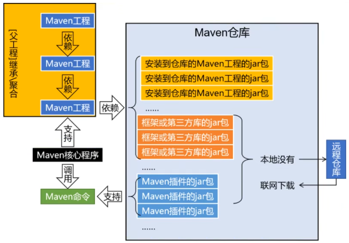

应用场景一：自动部署

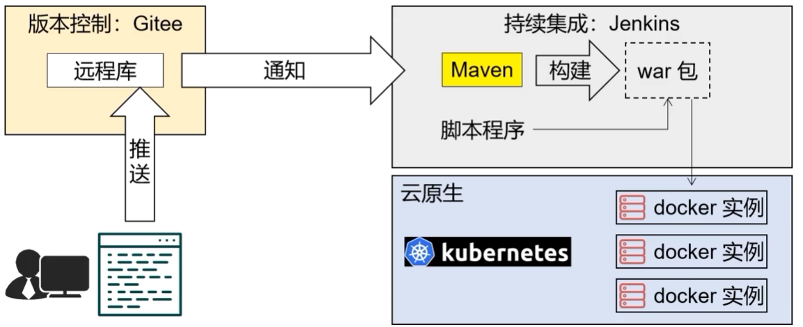

应用场景二：私有仓库

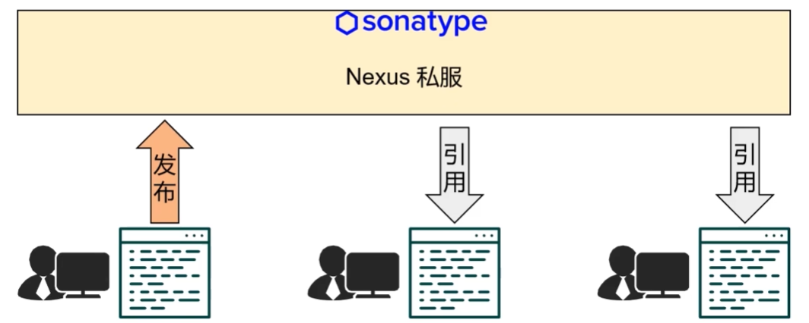

### 1.2 依赖管理工具

如果A工程里面用到了B工程的类、接口、配置文件等等这样的资源，那么就可以说A依赖B。例如：

- junit-4.12 依赖 hamcrest-core-1.3
- thymeleaf-3.0.12.RELEASE 依赖 ognl-3.1.26
  - ognl-3.1.26 依赖 javassist-3.20.0-GA
- thymeleaf-3.0.12.RELEASE 依赖 attoparser-2.0.5.RELEASE
- thymeleaf-3.0.12.RELEASE 依赖 unbescape-1.1.6.RELEASE
- thymeleaf-3.0.12.RELEASE 依赖 slf4j-api-1.7.26

依赖管理中要解决的具体问题：

- jar 包的下载：使用 Maven 之后，jar 包会从规范的远程仓库下载到本地
- jar 包之间的依赖：通过依赖的传递性自动完成
- jar 包之间的冲突：通过对依赖的配置进行调整，让某些jar包不会被导入

Maven 作为依赖管理工具：

- jar 包的规模：

  - 随着使用越来越多的框架，或者框架封装程度越来越高，项目中使用的jar包也越来越多。项目中，一个模块里面用到上百个jar包是非常正常的

  - 比如下面的例子，只用到 SpringBoot、SpringCloud 框架中的三个功能: Nacos 服务注册发现、Web 框架环境、图模板技术 Thymeleaf。最终却导入了 106 个jar 包

- jar 包的来源：

  - jar包所属技术的官网通常是英文界面，网站的结构又不尽相同，甚至找到下载链接还发现需要通过特殊的工具下载
  - 第三方网站提供下载。问题是不规范，在使用过程中会出现各种问题：jar包的名称、jar包的版本、jar包内的具体细节
  - 使用 Maven 后，依赖对应的 jar 包能够自动下载，方便、快捷又规范

- jar 包之间的依赖关系：
  - 框架中使用的jar 包，不仅数量庞大，而且彼此之间存在错综复杂的依赖关系。依赖关系的复杂程度，已经上升到了完全不能靠人力手动解决的程度。另外，jar包之间有可能产生冲突，进一步增加了在jar包使用过程中的难度

### 1.3 构建管理工具

Java 项目开发过程中，构建指的是使用原材料生产产品的过程：

- 原材料：
  - 基于 HTML 的 Thymeleaf文件
  - 图片
  - 配置文件
- 产品：
  - 一个可以在服务器上运行的项目

构建过程包含的主要的环节：

- 清理：删除上一次构建的结果，为下一次构建做好准备
- 编译：java源程序编译成*.class字节码文件
- 测试：运行提前准备好的测试程序
- 报告：针对刚才测试的结果生成一个全面的信息
- 打包：
  - Java工程：jar包
  - Web工程：war包
- 部署：
  - 部署 jar 包：把一个jar 包部署到 Nexus 私服服务器上
  - 部署 war 包：借助相关 Maven 插件(例如 cargo)，将 war 包部署到 Tomcat 服务器上


Maven 作为构建管理工具：

- 可以不使用 Maven，但是构建必须要做。当我们使用 IDEA 进行开发时，构建是 IDEA 替我们做的
- 脱离 IDE 环境仍需构建

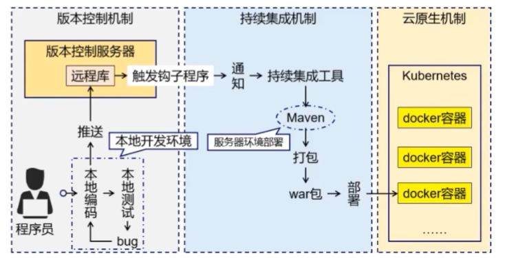

结论：

- 管理规模庞大的jar 包，需要专门工具
- 脱离 IDE环境执行构建操作，需要专门工具

### 1.4 安装配置

> Maven官网：https://maven.apache.org/
>
> Maven下载链接：https://maven.apache.org/download.cgi

核心程序压缩包：apache-maven-3.8.4-bin.zip，解压到非中文、没有空格的目录

在解压目录中，需要着重关注 Maven 的核心配置文件：conf/settings.xml

指定本地仓库：本地仓库默认值是用户home目录`/.m2/repository`。建议将 Maven 的本地仓库放在其他盘符下。`conf/settings.xml`配置方式如下：

```xml
  <!-- localRepository
   | The path to the local repository maven will use to store artifacts.
   |
   | Default: ${user.home}/.m2/repository
  <localRepository>/path/to/local/repo</localRepository>
  -->  
  
  <localRepository>D:\develop_tools\maven\apache-maven-3.8.4-bin\maven_respository</localRepository>
```

配置阿里云提供的镜像仓库：Maven 下载 jar 包默认访问境外的中央仓库，而国外网站速度很慢。改成阿里云提供的镜像仓库，访问国内网站可以让 Maven 下载jar 包的时候速度更快。配置的方式是：将下面 mirror 标签整体复制到 settings.xml 文件的 mirrors 标签的内部

```xml
<mirrors>
    <mirror>
      <id>nexus-aliyun</id>
      <name>Nexus aliyun</name>
      <url>https://maven.aliyun.com/nexus/content/groups/public/</url>
      <mirrorOf>central</mirrorOf>
    </mirror>
</mirrors>

或者：

  <mirrors>
	 <mirror>
        <id>alimaven</id>
        <mirrorOf>central</mirrorOf>
        <name>aliyun maven</name>        
        <url>http://maven.aliyun.com/nexus/content/repositories/central/</url>
     </mirror>
  </mirrors>
```

配置 Maven 工程的基础 JDK 版本：如果按照默认配置运行，java 工程使用的默认JDK 版本是 1.5，而我们熟悉和常用的是JDK1.8版本。修改配置的方式是：将 profile 标签整个复制到 settings.xml 文件的 profiles 标签内

```xml
  <profiles>
	<profile>
      <id>jdk-1.8</id>
      <activation>
        <activeByDefault>true</activeByDefault>
        <jdk>1.8</jdk>
      </activation>
 
      <properties>
        <maven.compiler.source>1.8</maven.compiler.source>
        <maven.compiler.target>1.8</maven.compiler.target>
        <maven.compiler.compilerVersion>1.8</maven.compiler.compilerVersion>
      </properties>
    </profile>
  </profiles>
```

配置环境变量：

- 配置环境变量的规律：XXX_HOME 通常指向的是 bin 目录的上一级。PATH 指向的是 bin 目录
- 检查 JAVA HOME 配置是否正确。Maven 是一个用Java 语言开发的程序，它必须基于JDK 来运行，需要通过JAVA_HOME 来找到JDK 的安装位置

```shell
C:\Users\develop>echo %JAVA_HOME%
D:\develop_tools\jdk\jdk-8u261-windows-x64
```

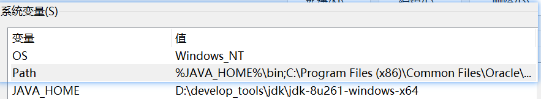

- 配置 MAVEN HOME

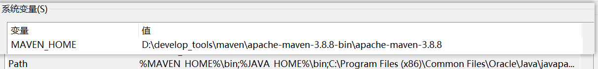

## 2.命令行环境使用Maven

### 2.1 Maven中的坐标

Maven中的坐标：使用三个向量在[Maven的仓库中唯一的定位到一个 jar包

- groupld：公司或组织的 id。公司或组织域名的倒序，通常也会加上项目名称
- artifactld：一个项目或者是项目中的一个模块的 id。模块的名称，将来作为 Maven 工程的工程名
- version：版本号。模块的版本号，根据需要设定
  - 例如：SNAPSHOT表示快照版本，正在迭代过程中，不稳定的版本
  - 例如：RELEASE 表示正式版本

坐标和仓库中 jar 包的存储路径之间的对应关系：

```xml
<groupId>javax.servlet</groupId>
<artifactId>servlet-api</artifactId>
<version>2.5</version>
```

可以根据坐标到本地仓库中找到对应的jar 包。上面坐标对应的 jar 包在 Maven 本地仓库中的位置：

```
Maven本地仓库根目录\javax\servlet\servlet-api\2.5\servlet-api-2.5.jar
```

`mvn archetype:generate` 命令：

- `mvn archetype:generate` 是 Maven 提供的快速创建项目骨架的工具，能够帮助开发者节省大量配置和目录结构搭建的时间
- 通过合理选择 Archetype，开发者可以快速启动不同类型的项目


- 运行`mvn archetype:generate` 命令：

```sh
PS D:\maven-workspace\space-01> mvn archetype:generate
[INFO] Scanning for projects...
[INFO]
[INFO] ------------------< org.apache.maven:standalone-pom >-------------------
[INFO] Building Maven Stub Project (No POM) 1
[INFO] --------------------------------[ pom ]---------------------------------
[INFO]
[INFO] >>> maven-archetype-plugin:3.2.1:generate (default-cli) > generate-sources @ standalone-pom >>>
[INFO]
[INFO] <<< maven-archetype-plugin:3.2.1:generate (default-cli) < generate-sources @ standalone-pom <<<
[INFO]
[INFO]
[INFO] --- maven-archetype-plugin:3.2.1:generate (default-cli) @ standalone-pom ---
[INFO] Generating project in Interactive mode
[WARNING] No archetype found in remote catalog. Defaulting to internal catalog
[INFO] No archetype defined. Using maven-archetype-quickstart (org.apache.maven.archetypes:maven-archetype-quickstart:1.0)
Choose archetype:
1: internal -> org.apache.maven.archetypes:maven-archetype-archetype (An archetype which contains a sample archetype.)
2: internal -> org.apache.maven.archetypes:maven-archetype-j2ee-simple (An archetype which contains a simplifed sample J2EE application.)
3: internal -> org.apache.maven.archetypes:maven-archetype-plugin (An archetype which contains a sample Maven plugin.)
4: internal -> org.apache.maven.archetypes:maven-archetype-plugin-site (An archetype which contains a sample Maven plugin site.
      This archetype can be layered upon an existing Maven plugin project.)
5: internal -> org.apache.maven.archetypes:maven-archetype-portlet (An archetype which contains a sample JSR-268 Portlet.)
6: internal -> org.apache.maven.archetypes:maven-archetype-profiles ()
7: internal -> org.apache.maven.archetypes:maven-archetype-quickstart (An archetype which contains a sample Maven project.)
8: internal -> org.apache.maven.archetypes:maven-archetype-site (An archetype which contains a sample Maven site which demonstrates
      some of the supported document types like APT, XDoc, and FML and demonstrates how
      to i18n your site. This archetype can be layered upon an existing Maven project.)
9: internal -> org.apache.maven.archetypes:maven-archetype-site-simple (An archetype which contains a sample Maven site.)
10: internal -> org.apache.maven.archetypes:maven-archetype-webapp (An archetype which contains a sample Maven Webapp project.)
Choose a number or apply filter (format: [groupId:]artifactId, case sensitive contains): 7: 7
Define value for property 'groupId': com.sin.maven
Define value for property 'artifactId': pro01-maven
Define value for property 'version' 1.0-SNAPSHOT: :
Define value for property 'package' com.sin.maven: :
Confirm properties configuration:
groupId: com.sin.maven
artifactId: pro01-maven
version: 1.0-SNAPSHOT
package: com.sin.maven
 Y: : y
[INFO] ----------------------------------------------------------------------------
[INFO] Using following parameters for creating project from Old (1.x) Archetype: maven-archetype-quickstart:1.1
[INFO] ----------------------------------------------------------------------------
[INFO] Parameter: basedir, Value: D:\maven-workspace\space-01
[INFO] Parameter: package, Value: com.sin.maven
[INFO] Parameter: groupId, Value: com.sin.maven
[INFO] Parameter: artifactId, Value: pro01-maven
[INFO] Parameter: packageName, Value: com.sin.maven
[INFO] Parameter: version, Value: 1.0-SNAPSHOT
[INFO] project created from Old (1.x) Archetype in dir: D:\maven-workspace\space-01\pro01-maven
[INFO] ------------------------------------------------------------------------
[INFO] BUILD SUCCESS
[INFO] ------------------------------------------------------------------------
[INFO] Total time:  41.801 s
[INFO] Finished at: 2024-09-21T11:22:07+08:00
[INFO] ------------------------------------------------------------------------
```

Maven 默认生成的工程，对junit 依赖的是较低的 3.8.1 版本，可以改成较适合的 4.12 版本。自动生成的 App.java 和 AppTest.java 可以删除

自动生成的`pom.xml`解读：

```xml
<!--根标签:project，表示对当前工程进行配置、管理 -->
<project xmlns="http://maven.apache.org/POM/4.0.0" xmlns:xsi="http://www.w3.org/2001/XMLSchema-instance"
  xsi:schemaLocation="http://maven.apache.org/POM/4.0.0 http://maven.apache.org/xsd/maven-4.0.0.xsd">
    
   <!-- modelVersion 标签:从Maven 2开始就固定是 4.0.0。 -->
   <!-- 代表当前 pom.xml 所采用的标签结构。 -->
  <modelVersion>4.0.0</modelVersion>

  <!-- 坐标信息  -->
  <!-- groupId 标签: 坐标向量之一;代表公司或组织开发的某一个项目 -->   
  <groupId>com.sin.maven</groupId>
  <!-- artifactId 标签:坐标向量之一;代表项目下的某一个模块 -->
  <artifactId>pro01-maven</artifactId>
  <!--  version 标签:坐标向量之一;代表当前模块的版本-->
  <version>1.0-SNAPSHOT</version>
  <!-- packaging 标签:打包方式-->
  <!--取值 war:生成 war 包，说明这是一个 web 工程。-->  
  <!--取值 pom:说明这个工程是用来管理其它工程的工程。 -->  
  <packaging>jar</packaging>
  <!-- 项目名称 -->
  <name>pro01-maven</name>
  <!-- maven官网地址 -->
  <url>http://maven.apache.org</url>

    
  <!--  -->  
  <!-- properties 标签: 在 Maven 中定义属性值 -->  
  <properties>
    <!--在构建过程中读取源码时使用的字符集 -->  
    <project.build.sourceEncoding>UTF-8</project.build.sourceEncoding>
  </properties>

  <!-- dependencies 标签:配置具体依赖信息-->
  <dependencies>
    <!-- dependency 标签:配置一个具体的依赖信息 -->
    <dependency>
      <!-- 坐标信息:导入哪个 jar 包，就配置它的坐标信息即可 -->   
      <groupId>junit</groupId>
      <artifactId>junit</artifactId>
      <version>4.12</version>
       <!-- scope 标签:配置当前依赖的范围-->
      <scope>test</scope>
    </dependency>
  </dependencies>
</project>
```

Maven核心概念：POM

- POM：Project Obiect Model，项目对象模型。和POM 类似的是：DOM(Document Object Model)，文档对象模型。它们都是模型化思想的具体体现
- 模型化思想：POM 表示将工程抽象为一个模型，再用程序中的对象来描述这个模型。这样就可以用程序来管理项目了。在开发过程中，最基本的做法就是将现实生活中的事物抽象为模型，然后封装模型相关的数据作为一个对象，这样就可以在程序中计算与现实事物相关的数据
- 对应的配置文件：POM 理念集中体现在 Maven 工程根目录下 pom.xml这个配置文件中。所以这个 pom.xml 配置文件就是Maven 工程的核心配置文件，学习 Maven 就是学这个文件怎么配置，各个配置有什么用


Maven核心概念：约定的目录结构

-  target 目录专门存放构建操作输出的结果
- 约定目录结构的意义：Maven 为了让构建过程能够尽可能自动化完成，所以必须约定目录结构的作用。例如：Maven 执行编译操作，必须先去Java 源程序目录读取Java 源代码，然后执行编译，最后把编译结果存放在 target 目录
- 约定大于配置：Maven 对于目录结构这个问题，没有采用配置的方式，而是基于约定。这样会让我们在开发过程中非常方便。如果每次创建 Maven 工程后，还需要针对各个目录的位置进行详细的配置，那肯定非常麻烦。目前开发领域的技术发展趋势就是：约定大于配置，配置大于编码


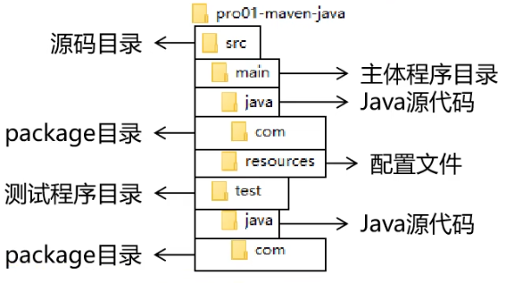

### 2.2 在 Maven 工程中编写代码

主体程序：主体程序指的是被测试的程序，同时也是将来在项目中真正要使用的程序

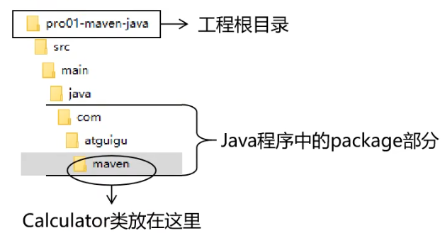

```java
package com.atguigu.maven;
public class Calculator {
    public int sum(int i, int j){
        return i + j;
    }
}
```

测试程序：

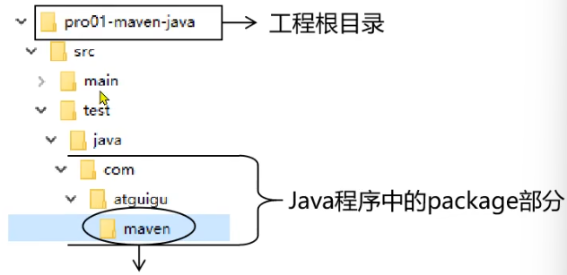

```java
package com.atguigu.maven;
import org.junit.Test;
import com.atguigu.maven.Calculator;

// 静态导入的效果是将Assert类中的静态资源导入当前类
// 这样一来，在当前类中就可以直接使用Assert类中的静态资源，不需要写类名
import static org.junit.Assert.*;

public class calculatorTest{
    
        @Test
        public void testsum(){
            //1.创建calculator对象
            Calculator calculator =new calculator();
            //2.调用ca1culator对象的方法，获取到程序运行实际的结果
            int actualResult =calculator.sum(5，3);
            //3.声明一个变量，表示程序运行期待的结果
            int expectedResult =8;
            //4.使用断言来判断实际结果和期待结果是否一致
            //如果一致:测试通过，不会抛出异常
            //如果不一致:抛出异常，测试失败
            assertEquals(expectedResult,actualResult);
        }
}
```

### 2.3 执行 Maven 的构建命令

注意：运行 Maven 中和构建操作相关的命令时，必须进入到 pom.xml所在的目录。如果没有在 pom.xml 所在的目录运行 Maven 的构建命令，那么会看到下面的错误信息：

```
The goal you specified requires a project to execute but there is no poM in this directory
```

`mvn -v `命令和构建操作无关，只要正确配置了 PATH，在任何目录下执行都可以，并非要进入到 pom.xml所在的目录。构建相关的命令要在pom.xml所在目录下运行一一操作哪个工程，就进入这个工程的 pom.xml 目录


清理操作：

```
mvn clean
效果: 删除 target 目录
```

编译操作：

```
主程序编译: mvn compile
测试程序编译: mvn test-compile
主体程序编译结果存放的目录: target/classes
测试程序编译结果存放的目录: target/test-classes
```

测试操作：

```
mvn test
测试的报告存放的目录：target/surefire-reports
```

打包操作：

```
mvn package
打包的结果--jar 包，存放的目录：target
```

安装操作：

- 安装操作命令：mvn install
- 安装的效果是将本地构建过程中生成的jar 包存入 Maven 本地仓库。jar 包在 Maven 仓库中的路径是根据它的坐标生成的
- 另外，安装操作还会将 pom.xml 文件转换为 XXX.pom 文件一起存入本地仓库。所以在 Maven 的本地仓库中想看一个 jar 包原始的 pom.xml文件时，查看对应 XXX.pom 文件即可，它们是名字发生了改变，本质上是同一个文件


### 2.4 创建 Maven 版的 Web 工程

使用 Maven 命令创建 Web 工程：Maven 提供了一个 Archetype 插件，可以快速生成一个 Web 项目模板

- 打开命令行（Terminal）并执行以下命令：

```bash
mvn archetype:generate -DarchetypeGroupId=org.apache.maven.archetypes -DarchetypeArtifactId=maven-archetype-webapp  -DarchetypeVersion=1.4
```

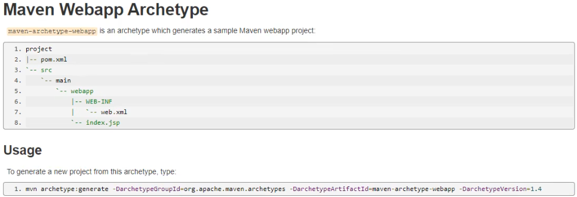

- 执行命令：

```bash
D:\maven-workspace\space-02>mvn archetype:generate -DarchetypeGroupId=org.apache.maven.archetypes -DarchetypeArtifactId=maven-archetype-webapp  -DarchetypeVersion=1.4
[INFO] Scanning for projects...
[INFO]
[INFO] ------------------< org.apache.maven:standalone-pom >-------------------
[INFO] Building Maven Stub Project (No POM) 1
[INFO] --------------------------------[ pom ]---------------------------------
[INFO]
[INFO] >>> maven-archetype-plugin:3.2.1:generate (default-cli) > generate-sources @ standalone-pom >>>
[INFO]
[INFO] <<< maven-archetype-plugin:3.2.1:generate (default-cli) < generate-sources @ standalone-pom <<<
[INFO]
[INFO]
[INFO] --- maven-archetype-plugin:3.2.1:generate (default-cli) @ standalone-pom ---
[INFO] Generating project in Interactive mode
[WARNING] No archetype found in remote catalog. Defaulting to internal catalog
[INFO] Archetype repository not defined. Using the one from [org.apache.maven.archetypes:maven-archetype-webapp:1.0] found in catalog internal
Define value for property 'groupId': pro02-maven-web
Define value for property 'artifactId': com.sin.maven
Define value for property 'version' 1.0-SNAPSHOT: :
Define value for property 'package' pro02-maven-web: :
Confirm properties configuration:
groupId: pro02-maven-web
artifactId: com.sin.maven
version: 1.0-SNAPSHOT
package: pro02-maven-web
 Y: : y
[INFO] ----------------------------------------------------------------------------
[INFO] Using following parameters for creating project from Archetype: maven-archetype-webapp:1.4
[INFO] ----------------------------------------------------------------------------
[INFO] Parameter: groupId, Value: pro02-maven-web
[INFO] Parameter: artifactId, Value: com.sin.maven
[INFO] Parameter: version, Value: 1.0-SNAPSHOT
[INFO] Parameter: package, Value: pro02-maven-web
[INFO] Parameter: packageInPathFormat, Value: pro02-maven-web
[INFO] Parameter: package, Value: pro02-maven-web
[INFO] Parameter: version, Value: 1.0-SNAPSHOT
[INFO] Parameter: groupId, Value: pro02-maven-web
[INFO] Parameter: artifactId, Value: com.sin.maven
[INFO] Project created from Archetype in dir: D:\maven-workspace\space-02\com.sin.maven
[INFO] ------------------------------------------------------------------------
[INFO] BUILD SUCCESS
[INFO] ------------------------------------------------------------------------
[INFO] Total time:  01:27 min
[INFO] Finished at: 2024-10-01T16:54:43+08:00
[INFO] ------------------------------------------------------------------------
                            mvn archetype:generate -DarchetypeGroupId=org.apache.maven.archetypes -DarchetypeArtifactId=maven-archetype-webapp  -DarchetypeVersion=1.4
[INFO] Scanning for projects...
[INFO]
[INFO] ------------------< org.apache.maven:standalone-pom >-------------------
[INFO] Building Maven Stub Project (No POM) 1
[INFO] --------------------------------[ pom ]---------------------------------
[INFO]
[INFO] >>> maven-archetype-plugin:3.2.1:generate (default-cli) > generate-sources @ standalone-pom >>>
[INFO]
[INFO] <<< maven-archetype-plugin:3.2.1:generate (default-cli) < generate-sources @ standalone-pom <<<
[INFO]
[INFO]
[INFO] --- maven-archetype-plugin:3.2.1:generate (default-cli) @ standalone-pom ---
[INFO] Generating project in Interactive mode
[WARNING] No archetype found in remote catalog. Defaulting to internal catalog
[INFO] Archetype repository not defined. Using the one from [org.apache.maven.archetypes:maven-archetype-webapp:1.0] found in catalog internal
Define value for property 'groupId': com.sin.maven
Define value for property 'artifactId': pro02-maven-web
Define value for property 'version' 1.0-SNAPSHOT: :
Define value for property 'package' com.sin.maven: :
Confirm properties configuration:
groupId: com.sin.maven
artifactId: pro02-maven-web
version: 1.0-SNAPSHOT
package: com.sin.maven
 Y: :
[INFO] ----------------------------------------------------------------------------
[INFO] Using following parameters for creating project from Archetype: maven-archetype-webapp:1.4
[INFO] ----------------------------------------------------------------------------
[INFO] Parameter: groupId, Value: com.sin.maven
[INFO] Parameter: artifactId, Value: pro02-maven-web
[INFO] Parameter: version, Value: 1.0-SNAPSHOT
[INFO] Parameter: package, Value: com.sin.maven
[INFO] Parameter: packageInPathFormat, Value: com/sin/maven
[INFO] Parameter: package, Value: com.sin.maven
[INFO] Parameter: version, Value: 1.0-SNAPSHOT
[INFO] Parameter: groupId, Value: com.sin.maven
[INFO] Parameter: artifactId, Value: pro02-maven-web
[INFO] Project created from Archetype in dir: D:\maven-workspace\space-02\pro02-maven-web
[INFO] ------------------------------------------------------------------------
[INFO] BUILD SUCCESS
[INFO] ------------------------------------------------------------------------
[INFO] Total time:  51.398 s
[INFO] Finished at: 2024-10-01T16:57:30+08:00
[INFO] ------------------------------------------------------------------------
```

- 项目结构：执行命令后，项目结构大致如下

```css
project
│
├── pom.xml                      Maven 项目的核心配置文件
├── src
│   ├── main
│   │   ├── java                 Java 源代码目录
│   │   ├── resources            资源文件目录
│   │   └── webapp               Web 资源目录，包含 HTML、JSP 等文件
│   │       ├── WEB-INF
│   │       │   └── web.xml      Web 应用程序的部署描述符
│   │       └── index.jsp
└── ...
```

生成的`pom.xml`文件：

```xml
<?xml version="1.0" encoding="UTF-8"?>

<project xmlns="http://maven.apache.org/POM/4.0.0" xmlns:xsi="http://www.w3.org/2001/XMLSchema-instance"
  xsi:schemaLocation="http://maven.apache.org/POM/4.0.0 http://maven.apache.org/xsd/maven-4.0.0.xsd">
  <modelVersion>4.0.0</modelVersion>

  <groupId>com.sin.maven</groupId>
  <artifactId>pro02-maven-web</artifactId>
  <version>1.0-SNAPSHOT</version>
   <!-- web 工程打包方式是:war-->
  <packaging>war</packaging>

  <name>pro02-maven-web Maven Webapp</name>
  <!-- FIXME change it to the project's website -->
  <url>http://www.example.com</url>

  <properties>
    <project.build.sourceEncoding>UTF-8</project.build.sourceEncoding>
    <maven.compiler.source>1.7</maven.compiler.source>
    <maven.compiler.target>1.7</maven.compiler.target>
  </properties>

  <dependencies>
    <dependency>
      <groupId>junit</groupId>
      <artifactId>junit</artifactId>
      <version>4.11</version>
      <scope>test</scope>
    </dependency>
  </dependencies>

  <build>
    <finalName>pro02-maven-web</finalName>
    <pluginManagement><!-- lock down plugins versions to avoid using Maven defaults (may be moved to parent pom) -->
      <plugins>
        <plugin>
          <artifactId>maven-clean-plugin</artifactId>
          <version>3.1.0</version>
        </plugin>
        <!-- see http://maven.apache.org/ref/current/maven-core/default-bindings.html#Plugin_bindings_for_war_packaging -->
        <plugin>
          <artifactId>maven-resources-plugin</artifactId>
          <version>3.0.2</version>
        </plugin>
        <plugin>
          <artifactId>maven-compiler-plugin</artifactId>
          <version>3.8.0</version>
        </plugin>
        <plugin>
          <artifactId>maven-surefire-plugin</artifactId>
          <version>2.22.1</version>
        </plugin>
        <plugin>
          <artifactId>maven-war-plugin</artifactId>
          <version>3.2.2</version>
        </plugin>
        <plugin>
          <artifactId>maven-install-plugin</artifactId>
          <version>2.5.2</version>
        </plugin>
        <plugin>
          <artifactId>maven-deploy-plugin</artifactId>
          <version>2.8.2</version>
        </plugin>
      </plugins>
    </pluginManagement>
  </build>
</project>
```

在 main 目录下创建java 目录

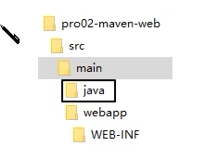

在 java 目录下创建 servlet 类所在的包的目录

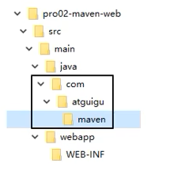

Servlet 依赖：

```xml
<dependency>
  <groupId>javax.servlet</groupId>
  <artifactId>javax.servlet-api</artifactId>
  <version>3.1.0</version> <!-- 你可以根据需要选择版本 -->
  <scope>provided</scope> <!-- 在服务器容器中已经包含该库 -->
</dependency>
```

在包下创建 Servlet 类：

```java
package com.sin.maven;
import javax.servlet.ServletException;
import javax.servlet.http.HttpServlet;
import javax.servlet.http.HttpServletRequest;
import javax.servlet.http.HttpServletResponse;
import java.io.IOException;
public class HelloServlet extends HttpServlet {
    protected void doGet(HttpServletRequest request, HttpServletResponse response)
            throws ServletException, IOException {
        response.getWriter().write("hel1lo maven web");
    }
}
```

在 web.xml 中注册 Servlet：

```xml
<!DOCTYPE web-app PUBLIC
 "-//Sun Microsystems, Inc.//DTD Web Application 2.3//EN"
 "http://java.sun.com/dtd/web-app_2_3.dtd" >

<web-app>
  <display-name>Archetype Created Web Application</display-name>

  <servlet>
    <servlet-name>helloServlet</servlet-name>
    <servlet-class>com.sin.maven.HelloServlet</servlet-class>
  </servlet>
  <servlet-mapping>
    <servlet-name>helloServlet</servlet-name>
    <url-pattern>/helloServlet</url-pattern>
  </servlet-mapping>

</web-app>
```

在 index.jsp 页面编写超链接：JSP全称是Java Server Page，和 Thymeleaf一样，是服务器端页面渲染技术。这里不必关心JSP 语法细节，编写一个超链接标签即可

```jsp
<html>
<body>
<h2>Hello World!</h2>
<a href="helloServlet">Access servlet</a>
</body>
</html>
```

编译：直接执行 mvn compile 命令

将 Web 工程打包为 war 包：运行 mvn package 命令，生成 war 包的位置如下图所示：

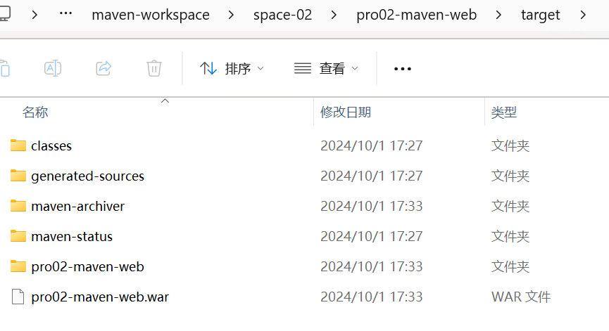

安装tomcat，教程：[Tomcat安装和配置，超详细（附JDK安装及配置环境变量）](https://blog.csdn.net/qq_73185696/article/details/134165947)

将 war 包部署到 Tomcat 上运行：将 war 包（pro02-maven-web.war）或者 解压后的war包（pro02-maven-web）复制到 Tomcat/webapps 目录下

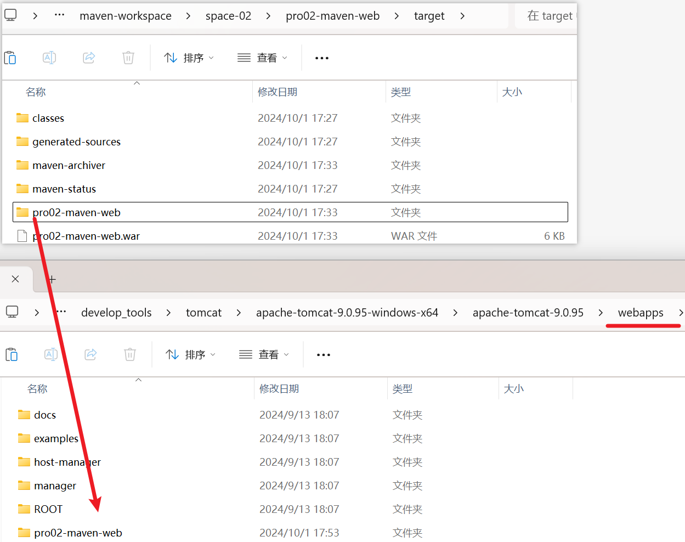

执行命令启动tomcat：

```bash
D:\maven-workspace\space-02>cd D:\develop_tools\tomcat\apache-tomcat-9.0.95-windows-x64\apache-tomcat-9.0.95\bin

D:\develop_tools\tomcat\apache-tomcat-9.0.95-windows-x64\apache-tomcat-9.0.95\bin>startup.bat
```

浏览器访问：`http://localhost:8080/pro02-maven-web/`

到此，项目成功部署到了tomcat上

### 2.5 Web 工程依赖 Java 工程

从来只有 Web 工程依赖Java 工程，没有反过来Java 工程依赖 Web 工程。本质上来说，Web 工程依赖的Java 工程其实就是 Web 工程里导入的 jar包。最终Java 工程会变成 jar 包，放在 Web 工程的 WEB-INF/lib 目录下

在 pro02-maven-web 工程的 pom.xml 中，找到 dependencies 标签，在 dependencies 标签中做如下配置：

```xml
<dependencies>
  <!--配置对Java工程pro01-maven的依赖-->
  <!--具体的配置方式:在dependency标签内使用坐标实现依赖-->
  <dependency>
    <groupId>com.sin.maven</groupId>
    <artifactId>pro01-maven</artifactId>
    <version>1.0-SNAPSHOT</version>
  </dependency>
</dependencies>
```

在 Web 工程中，编写测试代码：

1.补充创建目录：pro02-maven-web\src\test\java\com\sin\maven

2.确认 Web 工程依赖了 junit

```xml
    <dependency>
      <groupId>junit</groupId>
      <artifactId>junit</artifactId>
      <version>4.12</version>
      <scope>test</scope>
    </dependency>
```

3.创建测试类：把 java 工程的 CalculatrTest.java 类复制到 pro02-maven-web\src\test\java\com\sin\maven 目录下

`calculatorTest`：

```java
import org.junit.Test;
// 静态导入的效果是将Assert类中的静态资源导入当前类
// 这样一来，在当前类中就可以直接使用Assert类中的静态资源，不需要写类名
import static org.junit.Assert.*;

public class calculatorTest{

    @Test
    public void testsum(){
        //1.创建calculator对象
        Calculator calculator =new Calculator();
        //2.调用ca1culator对象的方法，获取到程序运行实际的结果
        int actualResult =calculator.sum(5,3);
        //3.声明一个变量，表示程序运行期待的结果
        int expectedResult =8;
        //4.使用断言来判断实际结果和期待结果是否一致
        //如果一致:测试通过，不会抛出异常
        //如果不一致:抛出异常，测试失败
        assertEquals(expectedResult,actualResult);
    }
}
```

测试命令：mvn test

- 测试操作中会提前自动执行编译操作，测试成功就说明编译也是成功的

打包命令：mvn package

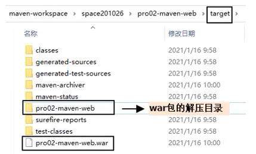

通过查看 war 包内的结构，我们看到被 Web 工程依赖的java 工程确实是会变成 Web 工程的 WEB-INF/lib 目录下的jar 包

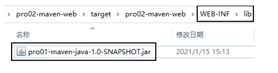

查看当前 Web 工程所依赖的 jar 包的列表：mvn dependency:list

```bash
PS D:\maven-workspace\space-02\pro02-maven-web> mvn dependency:list

[INFO] The following files have been resolved:
[INFO]    com.sin.maven:pro01-maven:jar:1.0-SNAPSHOT:compile
[INFO]    org.hamcrest:hamcrest-core:jar:1.3:test
[INFO]    javax.servlet:javax.servlet-api:jar:3.1.0:provided
[INFO]    junit:junit:jar:4.12:test
```

以树形结构查看当前 Web 工程的依赖信息：mvn dependency:tree

```bash
PS D:\maven-workspace\space-02\pro02-maven-web> mvn dependency:tree
[INFO] Scanning for projects...
[INFO] 
[INFO] -------------------< com.sin.maven:pro02-maven-web >--------------------
[INFO] Building pro02-maven-web Maven Webapp 1.0-SNAPSHOT
[INFO]   from pom.xml
[INFO] --------------------------------[ war ]---------------------------------
[INFO] 
[INFO] --- maven-dependency-plugin:2.8:tree (default-cli) @ pro02-maven-web ---
[INFO] com.sin.maven:pro02-maven-web:war:1.0-SNAPSHOT
[INFO] +- junit:junit:jar:4.12:test
[INFO] |  \- org.hamcrest:hamcrest-core:jar:1.3:test
[INFO] +- javax.servlet:javax.servlet-api:jar:3.1.0:provided
[INFO] \- com.sin.maven:pro01-maven:jar:1.0-SNAPSHOT:compile
[INFO] ------------------------------------------------------------------------
[INFO] BUILD SUCCESS
[INFO] ------------------------------------------------------------------------
```

### 2.6 依赖范围

依赖范围：

- 标签的位置：dependencies -> dependency -> scope
- 标签的可选值：compile、test、provided、system、runtime、import

测试方法：

- 通过 import 语句将要测试的类引入当前类，引入后
  - 编译通过：可以使用，这个范围的依赖对当前类有效
  - 编译失败：不能使用，这个范围的依赖对当前类无效

compile 和 test 对比：

| .       | main目录(空间) | test目录(空间) | 开发过程(时间) | 部署到服务器(时间) |
| ------- | -------------- | -------------- | -------------- | ------------------ |
| compile | 有效           | 有效           | 有效           | 有效               |
| test    | 无效           | 有效           | 有效           | 无效               |

compile 和 provided 对比：

| .        | main目录(空间) | test目录(空间) | 开发过程(时间) | 部署到服务器(时间) |
| -------- | -------------- | -------------- | -------------- | ------------------ |
| compile  | 有效           | 有效           | 有效           | 有效               |
| provided | 有效           | 有效           | 有效           | 无效               |

compile：通常使用的第三方框架的 jar 包这样在项目实际运行时真正要用到的 jar 包都是以 compile 范围进行依赖的。比如 SSM 框架所需jar包

test：测试过程中使用的 jar 包，以 test 范围依赖进来。比如 junit

provided：在开发过程中需要用到的“服务器上的 jar 包”，通常以 provided 范围依赖进来。比如 servlet-api、jsp-api。而这个范围的 jar 包之所以不参与部署、不放进 war 包，就是避免和服务器上已有的同类 jar 包产生冲突，同时减轻服务器的负担。说白了就是：服务器上已经有了，你就别带啦！

### 2.7 依赖的传递性

A 依赖 B，B 依赖 C，那么在A没有配置对C的依赖的情况下，A 里面能不能直接使用 C ？

传递的原则：

- 在 A依赖 B，B 依赖C的前提下，C是否能够传递到 A，取决于 B 依赖 C时使用的依赖范围
- B 依赖C时使用 compie 范围：可以传递
- B 依赖C时使用 test 或 provided 范围：不能传递，所以需要这样的 jar 包时，就必须在需要的地方明确配置依赖才可以

使用 compile 范围依赖 spring-core：

- 测试方式：让 pro01-maven 工程依赖 spring-core
- 具体操作：编辑 pro01-maven 工程根目录下 pom.xml

```xml
<!-- https://mvnrepository.com/artifact/org.springframework/spring-core -->
<!--以 compile 范围导入 spring-core 依赖，测试依赖的传递性-->
<dependency>
    <groupId>org.springframework</groupId>
    <artifactId>spring-core</artifactId>
    <version>4.0.0.RELEASE</version>
</dependency>
```

在pro01-maven 工程中使用 mvn dependency:tree 命令查看效果：

```sh
PS D:\maven-workspace\space-01\pro01-maven> mvn dependency:tree
[INFO] Scanning for projects...
[INFO] 
[INFO] ---------------------< com.sin.maven:pro01-maven >----------------------
[INFO] Building pro01-maven 1.0-SNAPSHOT
[INFO]   from pom.xml
[INFO] --------------------------------[ jar ]---------------------------------
[INFO]
[INFO] --- maven-dependency-plugin:2.8:tree (default-cli) @ pro01-maven ---
[INFO] com.sin.maven:pro01-maven:jar:1.0-SNAPSHOT
[INFO] +- junit:junit:jar:3.8.1:test
[INFO] \- org.springframework:spring-core:jar:4.0.0.RELEASE:compile
[INFO]    \- commons-logging:commons-logging:jar:1.1.1:compile
[INFO] ------------------------------------------------------------------------
[INFO] BUILD SUCCESS
[INFO] ------------------------------------------------------------------------
[INFO] Total time:  0.756 s
[INFO] Finished at: 2024-10-01T21:44:27+08:00
[INFO] ------------------------------------------------------------------------
```

在pro02-maven-web工程中使用 mvn dependency:tree 命令查看效果：

```sh
PS D:\maven-workspace\space-02\pro02-maven-web> mvn dependency:tree
[INFO] Scanning for projects...
[INFO] 
[INFO] -------------------< com.sin.maven:pro02-maven-web >--------------------
[INFO] Building pro02-maven-web Maven Webapp 1.0-SNAPSHOT
[INFO]   from pom.xml
[INFO] --------------------------------[ war ]---------------------------------
[INFO] 
[INFO] --- maven-dependency-plugin:2.8:tree (default-cli) @ pro02-maven-web ---
[INFO] com.sin.maven:pro02-maven-web:war:1.0-SNAPSHOT
[INFO] +- junit:junit:jar:4.12:test
[INFO] |  \- org.hamcrest:hamcrest-core:jar:1.3:test
[INFO] +- javax.servlet:javax.servlet-api:jar:3.1.0:provided
[INFO] \- com.sin.maven:pro01-maven:jar:1.0-SNAPSHOT:compile
[INFO]    \- org.springframework:spring-core:jar:4.0.0.RELEASE:compile
[INFO]       \- commons-logging:commons-logging:jar:1.1.1:compile
[INFO] ------------------------------------------------------------------------
[INFO] BUILD SUCCESS
[INFO] ------------------------------------------------------------------------
[INFO] Total time:  0.463 s
[INFO] Finished at: 2024-10-01T21:50:23+08:00
[INFO] ------------------------------------------------------------------------
```

### 2.8 依赖的排除

当 A依赖 B，B 依赖C而且C可以传递到A的时候，A不想要C，需要在A里面把C排除掉

依赖的排除往往是为了避免 jar 包之间的冲突。依赖的排除其实就是阻止某些jar 包的传递。因为这样的 jar 包传递过来会和其他 jar 包冲突


```xml
    <dependency>
      <groupId>com.sin.maven</groupId>
      <artifactId>pro01-maven</artifactId>
      <version>1.0-SNAPSHOT</version>
      <scope>compile</scope>
      <!-- 使用exc1udes标签配置依赖的排除-->
      <exclusions>
        <exclusion>
        <!-- 指定要排除的依赖的坐标(不需要写version) -->
        <!-- 配置具体排除信息，让 commons-logging 不要传递到当前工程(pro02-maven-web)-->
          <!--这里指定坐标时不需要指定 version-->
        <groupId>commons-logging</groupId>
        <artifactId>commons-logging</artifactId>
        </exclusion>
      </exclusions>
    </dependency>
```

### 2.9 继承

Maven工程之间，A 工程继承 B工程

- B 工程：父工程
- A工程：子工程
- 本质上是 A 工程的 pom.xm 中的配置继承了 B 工程中 pom.xml 的配置

作用：

- 在父工程中统一管理项目中的依赖信息，具体来说是管理依赖信息的版本
- 背景：
  - 对一个比较大型的项目进行模块拆分
  - 一个 project 下面，创建了很多个 module
  - 每一个 module 都需要配置自己的依赖信息
- 统一管理依赖：
  - 在每一个 module 中各自维护各自的依赖信息很容易发生出入，不易统一管理
  - 使用同一个框架内的不同 jar 包，它们应该是同一个版本，所以整个项目中使用的框架版本需要统一
  - 使用框架时所需要的jar 包组合(或者说依赖信息组合)需要经过长期摸索和反复调试，最终确定一个可用组合。这个耗费很大精力总结出来的方案不应该在新的项目中重新摸索
  - 通过在父工程中为整个项目维护依赖信息的组合既保证了整个项目使用规范、准确的jar 包。又能够将以往的经验沉淀下来，节约时间和精力

举例：

- 在一个工程中依赖多个 Spring的jar 包
- 使用 Spring 时要求所有 Spring 自己的 jar 包版本必须一致。为了能够对这些 jar 包的版本进行统一管理，我们使用继承这个机制，将所有版本信息统一在父工程中进行管理


创建父工程：

- 创建的过程和前面创建 pro01-maven-java 一样
- 工程名称：pro03-maven-parent
- 工程创建好之后，要修改它的打包方式：

```xml
<groupId>com.sin.maven</groupId>
<artifactId>pro03-maven-parent</artifactId>
<version>1.0-SNAPSHOT</version>
<!--当前工程作为父工程，它要去管理子工程，所以打包方式必须是pom-->
<packaging>pom</packaging>
```

- 只有打包方式为 pom 的 Maven 工程能够管理其他, Maven 工程。打包方式为 pom 的 Maven 工程中不写业务代码，它是专门管理其他 Maven 工程的工程


```sh
D:\maven-workspace\space-03>mvn archetype:generate
[INFO] Scanning for projects...
[INFO]
[INFO] ------------------< org.apache.maven:standalone-pom >-------------------
[INFO] Building Maven Stub Project (No POM) 1
[INFO] --------------------------------[ pom ]---------------------------------
[INFO]
[INFO] >>> maven-archetype-plugin:3.2.1:generate (default-cli) > generate-sources @ standalone-pom >>>
[INFO]
[INFO] <<< maven-archetype-plugin:3.2.1:generate (default-cli) < generate-sources @ standalone-pom <<<
[INFO]
[INFO]
[INFO] --- maven-archetype-plugin:3.2.1:generate (default-cli) @ standalone-pom ---
[INFO] Generating project in Interactive mode
[WARNING] No archetype found in remote catalog. Defaulting to internal catalog
[INFO] No archetype defined. Using maven-archetype-quickstart (org.apache.maven.archetypes:maven-archetype-quickstart:1.0)
Choose archetype:
1: internal -> org.apache.maven.archetypes:maven-archetype-archetype (An archetype which contains a sample archetype.)
2: internal -> org.apache.maven.archetypes:maven-archetype-j2ee-simple (An archetype which contains a simplifed sample J2EE application.)
3: internal -> org.apache.maven.archetypes:maven-archetype-plugin (An archetype which contains a sample Maven plugin.)
4: internal -> org.apache.maven.archetypes:maven-archetype-plugin-site (An archetype which contains a sample Maven plugin site.
      This archetype can be layered upon an existing Maven plugin project.)
5: internal -> org.apache.maven.archetypes:maven-archetype-portlet (An archetype which contains a sample JSR-268 Portlet.)
6: internal -> org.apache.maven.archetypes:maven-archetype-profiles ()
7: internal -> org.apache.maven.archetypes:maven-archetype-quickstart (An archetype which contains a sample Maven project.)
8: internal -> org.apache.maven.archetypes:maven-archetype-site (An archetype which contains a sample Maven site which demonstrates
      some of the supported document types like APT, XDoc, and FML and demonstrates how
      to i18n your site. This archetype can be layered upon an existing Maven project.)
9: internal -> org.apache.maven.archetypes:maven-archetype-site-simple (An archetype which contains a sample Maven site.)
10: internal -> org.apache.maven.archetypes:maven-archetype-webapp (An archetype which contains a sample Maven Webapp project.)
Choose a number or apply filter (format: [groupId:]artifactId, case sensitive contains): 7: 7
Define value for property 'groupId': com.sin.maven
Define value for property 'artifactId': pro03-maven-parenet
Define value for property 'version' 1.0-SNAPSHOT: : 1.0-SNAPSHOT
Define value for property 'package' com.sin.maven: :
Confirm properties configuration:
groupId: com.sin.maven
artifactId: pro03-maven-parenet
version: 1.0-SNAPSHOT
package: com.sin.maven
 Y: : y
[INFO] ----------------------------------------------------------------------------
[INFO] Using following parameters for creating project from Old (1.x) Archetype: maven-archetype-quickstart:1.1
[INFO] ----------------------------------------------------------------------------
[INFO] Parameter: basedir, Value: D:\maven-workspace\space-03
[INFO] Parameter: package, Value: com.sin.maven
[INFO] Parameter: groupId, Value: com.sin.maven
[INFO] Parameter: artifactId, Value: pro03-maven-parenet
[INFO] Parameter: packageName, Value: com.sin.maven
[INFO] Parameter: version, Value: 1.0-SNAPSHOT
[INFO] project created from Old (1.x) Archetype in dir: D:\maven-workspace\space-03\pro03-maven-parenet
[INFO] ------------------------------------------------------------------------
[INFO] BUILD SUCCESS
[INFO] ------------------------------------------------------------------------
[INFO] Total time:  01:11 min
[INFO] Finished at: 2024-10-01T23:06:39+08:00
[INFO] ------------------------------------------------------------------------
```


创建模块工程：

- 模块工程类似于 IDEA 中的 module，所以需要进入 pro03-maven-parent 工程的根目录，然后运行 mvn archetype:generate 命令来创建模块工程
- 假设创建三个模块工程：

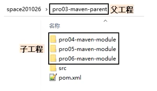

```sh
D:\maven-workspace\space-03>cd pro03-maven-parenet

D:\maven-workspace\space-03\pro03-maven-parenet>mvn archetype:generate
[INFO] Scanning for projects...
[INFO]
[INFO] -----------------< com.sin.maven:pro03-maven-parenet >------------------
[INFO] Building pro03-maven-parenet 1.0-SNAPSHOT
[INFO]   from pom.xml
[INFO] --------------------------------[ pom ]---------------------------------
[INFO]
[INFO] >>> maven-archetype-plugin:3.2.1:generate (default-cli) > generate-sources @ pro03-maven-parenet >>>
[INFO]
[INFO] <<< maven-archetype-plugin:3.2.1:generate (default-cli) < generate-sources @ pro03-maven-parenet <<<
[INFO]
[INFO]
[INFO] --- maven-archetype-plugin:3.2.1:generate (default-cli) @ pro03-maven-parenet ---
[INFO] Generating project in Interactive mode
[WARNING] No archetype found in remote catalog. Defaulting to internal catalog
[INFO] No archetype defined. Using maven-archetype-quickstart (org.apache.maven.archetypes:maven-archetype-quickstart:1.0)
Choose archetype:
1: internal -> org.apache.maven.archetypes:maven-archetype-archetype (An archetype which contains a sample archetype.)
2: internal -> org.apache.maven.archetypes:maven-archetype-j2ee-simple (An archetype which contains a simplifed sample J2EE application.)
3: internal -> org.apache.maven.archetypes:maven-archetype-plugin (An archetype which contains a sample Maven plugin.)
4: internal -> org.apache.maven.archetypes:maven-archetype-plugin-site (An archetype which contains a sample Maven plugin site.
      This archetype can be layered upon an existing Maven plugin project.)
5: internal -> org.apache.maven.archetypes:maven-archetype-portlet (An archetype which contains a sample JSR-268 Portlet.)
6: internal -> org.apache.maven.archetypes:maven-archetype-profiles ()
7: internal -> org.apache.maven.archetypes:maven-archetype-quickstart (An archetype which contains a sample Maven project.)
8: internal -> org.apache.maven.archetypes:maven-archetype-site (An archetype which contains a sample Maven site which demonstrates
      some of the supported document types like APT, XDoc, and FML and demonstrates how
      to i18n your site. This archetype can be layered upon an existing Maven project.)
9: internal -> org.apache.maven.archetypes:maven-archetype-site-simple (An archetype which contains a sample Maven site.)
10: internal -> org.apache.maven.archetypes:maven-archetype-webapp (An archetype which contains a sample Maven Webapp project.)
Choose a number or apply filter (format: [groupId:]artifactId, case sensitive contains): 7: 7
Define value for property 'groupId': com.sin.maven
Define value for property 'artifactId': pro04-maven-module
Define value for property 'version' 1.0-SNAPSHOT: : 1.0-SNAPSHOT
Define value for property 'package' com.sin.maven: :
Confirm properties configuration:
groupId: com.sin.maven
artifactId: pro04-maven-module
version: 1.0-SNAPSHOT
package: com.sin.maven
 Y: : y
[INFO] ----------------------------------------------------------------------------
[INFO] Using following parameters for creating project from Old (1.x) Archetype: maven-archetype-quickstart:1.1
[INFO] ----------------------------------------------------------------------------
[INFO] Parameter: basedir, Value: D:\maven-workspace\space-03\pro03-maven-parenet
[INFO] Parameter: package, Value: com.sin.maven
[INFO] Parameter: groupId, Value: com.sin.maven
[INFO] Parameter: artifactId, Value: pro04-maven-module
[INFO] Parameter: packageName, Value: com.sin.maven
[INFO] Parameter: version, Value: 1.0-SNAPSHOT
[INFO] project created from Old (1.x) Archetype in dir: D:\maven-workspace\space-03\pro03-maven-parenet\pro04-maven-module
[INFO] ------------------------------------------------------------------------
[INFO] BUILD SUCCESS
[INFO] ------------------------------------------------------------------------
[INFO] Total time:  44.257 s
[INFO] Finished at: 2024-10-01T23:09:43+08:00
[INFO] ------------------------------------------------------------------------
```

父工程的pom.xml：

```xml
<?xml version="1.0" encoding="UTF-8" standalone="no"?>
<project xmlns="http://maven.apache.org/POM/4.0.0" xmlns:xsi="http://www.w3.org/2001/XMLSchema-instance" xsi:schemaLocation="http://maven.apache.org/POM/4.0.0 http://maven.apache.org/xsd/maven-4.0.0.xsd">
  <modelVersion>4.0.0</modelVersion>

  <groupId>com.sin.maven</groupId>
  <artifactId>pro03-maven-parenet</artifactId>
  <version>1.0-SNAPSHOT</version>
  <!--当前工程作为父工程，它要去管理子工程，所以打包方式必须是pom-->
  <packaging>pom</packaging>
  
  <name>pro03-maven-parenet</name>
  <url>http://maven.apache.org</url>

  <properties>
    <!--创建我们自定义的属性标签-->
    <!--标签名: 属性名-->
    <!--标签值: 属性值-->
    <!--引用方式：${sin.spring.version}-->
    <sin.spring.version>4.0.0.RELEASE</sin.spring.version>
    <project.build.sourceEncoding>UTF-8</project.build.sourceEncoding>
  </properties>


  <!--聚合的配置-->
    <modules>
        <module>pro04-maven-module</module>
        <module>pro05-maven-module</module>
        <module>pro06-maven-module</module>
    </modules>

   <!--在父工程中统一管理依赖信息-->
   <!--注意:即使在父工程配置了对依赖的管理，子工程需要使用具体哪一个依赖还是要明确配置。-->
    <!-- 父工程统一管理依赖信息 -->
    <!-- 使用dependencyManagement标签配置对依赖的管理 -->
    <!-- 被管理的依赖并没有真正被引入到每个子工程 -->
    <!-- 在子工程中还要指定依赖 -->
    <dependencyManagement>
        <dependencies>
            <dependency>
                <groupId>org.springframework</groupId>
                <artifactId>spring-core</artifactId>
                <!-- 自定义标签引用方式：${sin.spring.version}-->
                <!--通过引用属性表达式设定版本号，这样版本号就成了一个动态值 -->
                <!--通过属性名解析后才知道具体是什么值-->
                <version>${sin.spring.version}</version>
            </dependency>
            <dependency>
                <groupId>org.springframework</groupId>
                <artifactId>spring-beans</artifactId>
                <version>5.2.5.RELEASE</version>
            </dependency>
            <dependency>
                <groupId>org.springframework</groupId>
                <artifactId>spring-context</artifactId>
                <version>5.2.5.RELEASE</version>
            </dependency>
            <dependency>
                <groupId>org.springframework</groupId>
                <artifactId>spring-expression</artifactId>
                <version>5.2.5.RELEASE</version>
            </dependency>
            <dependency>
                <groupId>org.springframework</groupId>
                <artifactId>spring-aop</artifactId>
                <version>5.2.5.RELEASE</version>
            </dependency>
        </dependencies>
    </dependencyManagement>

</project>
```

子工程的pom.xml：

```xml
<?xml version="1.0"?>
<project xsi:schemaLocation="http://maven.apache.org/POM/4.0.0 https://maven.apache.org/xsd/maven-4.0.0.xsd" xmlns="http://maven.apache.org/POM/4.0.0"
    xmlns:xsi="http://www.w3.org/2001/XMLSchema-instance">
  <modelVersion>4.0.0</modelVersion>


 <!-- parent 标签给当前工程配置父工程-->
  <parent>
    <!--通过指定父工程的坐标找到父工程-->
    <groupId>com.sin.maven</groupId>
    <artifactId>pro03-maven-parenet</artifactId>
    <version>1.0-SNAPSHOT</version>
  </parent>


  <!-- 子工程的 groupid 如果和父工程一样，则可以省略 -->
  <groupId>com.sin.maven</groupId>
  <!-- 省略 groupId 和 version 后，子工程自己的坐标可以只保留 artifactId -->
  <artifactId>pro04-maven-module</artifactId>
  <!--子工程的 version 如果和父工程一样，则可以省略 -->
  <version>1.0-SNAPSHOT</version>
  <name>pro04-maven-module</name>
  <url>http://maven.apache.org</url>
  <properties>
    <project.build.sourceEncoding>UTF-8</project.build.sourceEncoding>
  </properties>
  <dependencies>
    <dependency>
      <groupId>junit</groupId>
      <artifactId>junit</artifactId>
      <version>3.8.1</version>
      <scope>test</scope>
    </dependency>

    <!--注意:即使在父工程配置了对依赖的管理，子工程需要使用具体哪一个依赖还是要明确配置。-->
    <dependency>
      <groupId>org.springframework</groupId>
      <artifactId>spring-core</artifactId>
      <!-- 对于已经在父工程进行了管理的依赖，子工程中引用时可以不写 version -->
      <!--情况1： 确实省略了，子工程采纳的就是父工程管理的版本-->
<!--      情况2： 没有省略 version 标签:
              A:这里配置了 version 和父工程管理的版本一致。最终还是采纳这个版本，
              B:这里配置了version。 但是和父工程管理的版本不一致，那么这里子工程配置的版本会覆盖父工程管理的版本并最终采纳。-->
            <version>4.0.0.RELEASE</version>
          </dependency>
        </dependencies>
      </project>
```

继承的实际意义：

- 编写一套符合要求、开发各种功能都能正常工作的依赖组合并不容易。如果公司里已经有人总结了成熟的组合方案，那么再开发新项目时，如果不使用原有的积累，而是重新摸索，会浪费大量的时间。为了提高效率，我们可以使用工程继承的机制，让成熟的依赖组合方案能够保留下来
- 如图所示，公司级的父工程中管理的就是成熟的依赖组合方案，各个新项目、子系统各取所需即可


### 2.10 聚合

聚合本身的含义：

- 部分组成整体
- 动画片《战神金刚》中的经典台词：“我来组成头部!我来组成手臂!"就是聚合关系最生动的体现

Maven 中的聚合：

- 使用一个“总工程”将各个“模块工程”汇集起来，作为一个整体对应完整的项目

  - 项目：整体
  - 模块：部分

- 概念的对应关系：

  - 从继承关系角度来看：	

    - 父工程
    - 子工程

  - 从聚合关系角度来看：

    - 总工程

    - 模块工程


聚合的好处：

- 一键执行 Maven 命令：很多构建命令都可以在“总工程”中一键执行
- 以 mvn install 命令为例：Maven 要求有父工程时先安装父工程。有依赖的工程时，先安装被依赖的工程。我们自己考虑这些规则会很麻烦。但是工程聚合之后，在总工程执行 mvn install 可以一键完成安装，而且会自动按照正确的顺序执行
- 配置聚合之后，各个模块工程会在总工程中展示一个列表，让项目中的各个模块一目了然


聚合的配置：

- 在总工程中配置 modules 即可

```xml
<!--聚合的配置-->
  <modules>
      <module>pro04-maven-module</module>
      <module>pro05-maven-module</module>
      <module>pro06-maven-module</module>
  </modules>
```


聚合工程中使用mvn install ：

- pro04-maven-module 依赖 pro05-maven-module

```xml
      <!-- 测试聚合之后可以一键安装:让 pro04 依赖 pro05 -->
        <dependency>
          <groupId>com.sin.maven</groupId>
          <artifactId>pro05-maven-module</artifactId>
          <version>1.0-SNAPSHOT</version>
        </dependency>
```

- pro05-maven-module 依赖 pro06-maven-module

```xml
<!-- 测试聚合之后可以一键安装:让 pro05 依赖 pro06 -->
<dependency>
  <groupId>com.sin.maven</groupId>
  <artifactId>pro06-maven-module</artifactId>
  <version>1.0-SNAPSHOT</version>
</dependency>
```

- 聚合工程中使用mvn install ：

```sh
PS D:\maven-workspace\space-03\pro03-maven-parenet> mvn clean install  
[INFO] Scanning for projects...
[INFO] ------------------------------------------------------------------------
[INFO] Reactor Build Order:
[INFO]
[INFO] pro03-maven-parenet                                                [pom]
[INFO] pro06-maven-module                                                 [jar]
[INFO] pro05-maven-module                                                 [jar]
[INFO] pro04-maven-module                                                 [jar]
[INFO]
[INFO] -----------------< com.sin.maven:pro03-maven-parenet >------------------
[INFO] Building pro03-maven-parenet 1.0-SNAPSHOT                          [1/4]
[INFO]   from pom.xml
[INFO] --------------------------------[ pom ]---------------------------------
[INFO] 
[INFO] --- maven-clean-plugin:2.5:clean (default-clean) @ pro03-maven-parenet ---
[INFO] 
[INFO] --- maven-install-plugin:2.4:install (default-install) @ pro03-maven-parenet ---
[INFO] Installing D:\maven-workspace\space-03\pro03-maven-parenet\pom.xml to D:\develop_tools\ma
ven\apache-maven-3.8.8-bin\maven_respository\com\sin\maven\pro03-maven-parenet\1.0-SNAPSHOT\pro03-maven-parenet-1.0-SNAPSHOT.pom
[INFO]
[INFO] ------------------< com.sin.maven:pro06-maven-module >------------------
[INFO] Building pro06-maven-module 1.0-SNAPSHOT                           [2/4]
[INFO]   from pro06-maven-module\pom.xml
[INFO] --------------------------------[ jar ]---------------------------------
[INFO] 
[INFO] --- maven-clean-plugin:2.5:clean (default-clean) @ pro06-maven-module ---
[INFO]
[INFO] --- maven-resources-plugin:2.6:resources (default-resources) @ pro06-maven-module ---    
[INFO] Using 'UTF-8' encoding to copy filtered resources.
[INFO] skip non existing resourceDirectory D:\maven-workspace\space-03\pro03-maven-parenet\pro06-maven-module\src\main\resources
[INFO]
[INFO] --- maven-compiler-plugin:3.1:compile (default-compile) @ pro06-maven-module ---
[INFO] Changes detected - recompiling the module!
[INFO] Compiling 1 source file to D:\maven-workspace\space-03\pro03-maven-parenet\pro06-maven-module\target\classes
[INFO] 
[INFO] --- maven-resources-plugin:2.6:testResources (default-testResources) @ pro06-maven-module ---
[INFO] Using 'UTF-8' encoding to copy filtered resources.
[INFO] skip non existing resourceDirectory D:\maven-workspace\space-03\pro03-maven-parenet\pro06-maven-module\src\test\resources
[INFO]
[INFO] --- maven-compiler-plugin:3.1:testCompile (default-testCompile) @ pro06-maven-module --- 
[INFO] Changes detected - recompiling the module!
[INFO] Compiling 1 source file to D:\maven-workspace\space-03\pro03-maven-parenet\pro06-maven-module\target\test-classes
[INFO] 
[INFO] --- maven-surefire-plugin:2.12.4:test (default-test) @ pro06-maven-module ---
[INFO] Surefire report directory: D:\maven-workspace\space-03\pro03-maven-parenet\pro06-maven-module\target\surefire-reports

-------------------------------------------------------
 T E S T S
-------------------------------------------------------
Running com.sin.maven.AppTest
Tests run: 1, Failures: 0, Errors: 0, Skipped: 0, Time elapsed: 0.004 sec

Results :

Tests run: 1, Failures: 0, Errors: 0, Skipped: 0

[INFO] 
[INFO] --- maven-jar-plugin:2.4:jar (default-jar) @ pro06-maven-module ---
[INFO] Building jar: D:\maven-workspace\space-03\pro03-maven-parenet\pro06-maven-module\target\pro06-maven-module-1.0-SNAPSHOT.jar
[INFO] 
[INFO] --- maven-install-plugin:2.4:install (default-install) @ pro06-maven-module ---
[INFO] Installing D:\maven-workspace\space-03\pro03-maven-parenet\pro06-maven-module\target\pro0
6-maven-module-1.0-SNAPSHOT.jar to D:\develop_tools\maven\apache-maven-3.8.8-bin\maven_respository\com\sin\maven\pro06-maven-module\1.0-SNAPSHOT\pro06-maven-module-1.0-SNAPSHOT.jar
[INFO] Installing D:\maven-workspace\space-03\pro03-maven-parenet\pro06-maven-module\pom.xml to 
D:\develop_tools\maven\apache-maven-3.8.8-bin\maven_respository\com\sin\maven\pro06-maven-module\1.0-SNAPSHOT\pro06-maven-module-1.0-SNAPSHOT.pom
[INFO]
[INFO] ------------------< com.sin.maven:pro05-maven-module >------------------
[INFO] Building pro05-maven-module 1.0-SNAPSHOT                           [3/4]
[INFO]   from pro05-maven-module\pom.xml
[INFO] --------------------------------[ jar ]---------------------------------
[INFO]
[INFO] --- maven-clean-plugin:2.5:clean (default-clean) @ pro05-maven-module ---
[INFO]
[INFO] --- maven-resources-plugin:2.6:resources (default-resources) @ pro05-maven-module ---    
[INFO] Using 'UTF-8' encoding to copy filtered resources.
[INFO] skip non existing resourceDirectory D:\maven-workspace\space-03\pro03-maven-parenet\pro05-maven-module\src\main\resources
[INFO]
[INFO] --- maven-compiler-plugin:3.1:compile (default-compile) @ pro05-maven-module ---
[INFO] Changes detected - recompiling the module!
[INFO] Compiling 1 source file to D:\maven-workspace\space-03\pro03-maven-parenet\pro05-maven-module\target\classes
[INFO] 
[INFO] --- maven-resources-plugin:2.6:testResources (default-testResources) @ pro05-maven-module ---
[INFO] Using 'UTF-8' encoding to copy filtered resources.
[INFO] skip non existing resourceDirectory D:\maven-workspace\space-03\pro03-maven-parenet\pro05-maven-module\src\test\resources
[INFO]
[INFO] --- maven-compiler-plugin:3.1:testCompile (default-testCompile) @ pro05-maven-module --- 
[INFO] Changes detected - recompiling the module!
[INFO] Compiling 1 source file to D:\maven-workspace\space-03\pro03-maven-parenet\pro05-maven-module\target\test-classes
[INFO] 
[INFO] --- maven-surefire-plugin:2.12.4:test (default-test) @ pro05-maven-module ---
[INFO] Surefire report directory: D:\maven-workspace\space-03\pro03-maven-parenet\pro05-maven-module\target\surefire-reports

-------------------------------------------------------
 T E S T S
-------------------------------------------------------
Running com.sin.maven.AppTest
Tests run: 1, Failures: 0, Errors: 0, Skipped: 0, Time elapsed: 0.004 sec

Results :

Tests run: 1, Failures: 0, Errors: 0, Skipped: 0

[INFO]
[INFO] --- maven-jar-plugin:2.4:jar (default-jar) @ pro05-maven-module ---
[INFO] Building jar: D:\maven-workspace\space-03\pro03-maven-parenet\pro05-maven-module\target\pro05-maven-module-1.0-SNAPSHOT.jar
[INFO] 
[INFO] --- maven-install-plugin:2.4:install (default-install) @ pro05-maven-module ---
[INFO] Installing D:\maven-workspace\space-03\pro03-maven-parenet\pro05-maven-module\target\pro0
5-maven-module-1.0-SNAPSHOT.jar to D:\develop_tools\maven\apache-maven-3.8.8-bin\maven_respository\com\sin\maven\pro05-maven-module\1.0-SNAPSHOT\pro05-maven-module-1.0-SNAPSHOT.jar
[INFO] Installing D:\maven-workspace\space-03\pro03-maven-parenet\pro05-maven-module\pom.xml to 
D:\develop_tools\maven\apache-maven-3.8.8-bin\maven_respository\com\sin\maven\pro05-maven-module\1.0-SNAPSHOT\pro05-maven-module-1.0-SNAPSHOT.pom
[INFO]
[INFO] ------------------< com.sin.maven:pro04-maven-module >------------------
[INFO] Building pro04-maven-module 1.0-SNAPSHOT                           [4/4]
[INFO]   from pro04-maven-module\pom.xml
[INFO] --------------------------------[ jar ]---------------------------------
[INFO]
[INFO] --- maven-clean-plugin:2.5:clean (default-clean) @ pro04-maven-module ---
[INFO]
[INFO] --- maven-resources-plugin:2.6:resources (default-resources) @ pro04-maven-module ---
[INFO] Using 'UTF-8' encoding to copy filtered resources.
[INFO] skip non existing resourceDirectory D:\maven-workspace\space-03\pro03-maven-parenet\pro04-maven-module\src\main\resources
[INFO]
[INFO] --- maven-compiler-plugin:3.1:compile (default-compile) @ pro04-maven-module ---
[INFO] Changes detected - recompiling the module!
[INFO] Compiling 1 source file to D:\maven-workspace\space-03\pro03-maven-parenet\pro04-maven-module\target\classes
[INFO] 
[INFO] --- maven-resources-plugin:2.6:testResources (default-testResources) @ pro04-maven-module ---
[INFO] Using 'UTF-8' encoding to copy filtered resources.
[INFO] skip non existing resourceDirectory D:\maven-workspace\space-03\pro03-maven-parenet\pro04-maven-module\src\test\resources
[INFO]
[INFO] --- maven-compiler-plugin:3.1:testCompile (default-testCompile) @ pro04-maven-module --- 
[INFO] Changes detected - recompiling the module!
[INFO] Compiling 1 source file to D:\maven-workspace\space-03\pro03-maven-parenet\pro04-maven-module\target\test-classes
[INFO] 
[INFO] --- maven-surefire-plugin:2.12.4:test (default-test) @ pro04-maven-module ---
[INFO] Surefire report directory: D:\maven-workspace\space-03\pro03-maven-parenet\pro04-maven-module\target\surefire-reports

-------------------------------------------------------
 T E S T S
-------------------------------------------------------
Running com.sin.maven.AppTest
Tests run: 1, Failures: 0, Errors: 0, Skipped: 0, Time elapsed: 0.005 sec

Results :

Tests run: 1, Failures: 0, Errors: 0, Skipped: 0

[INFO]
[INFO] --- maven-jar-plugin:2.4:jar (default-jar) @ pro04-maven-module ---
[INFO] Building jar: D:\maven-workspace\space-03\pro03-maven-parenet\pro04-maven-module\target\pro04-maven-module-1.0-SNAPSHOT.jar
[INFO] 
[INFO] --- maven-install-plugin:2.4:install (default-install) @ pro04-maven-module ---
[INFO] Installing D:\maven-workspace\space-03\pro03-maven-parenet\pro04-maven-module\target\pro0
4-maven-module-1.0-SNAPSHOT.jar to D:\develop_tools\maven\apache-maven-3.8.8-bin\maven_respository\com\sin\maven\pro04-maven-module\1.0-SNAPSHOT\pro04-maven-module-1.0-SNAPSHOT.jar
[INFO] Installing D:\maven-workspace\space-03\pro03-maven-parenet\pro04-maven-module\pom.xml to 
D:\develop_tools\maven\apache-maven-3.8.8-bin\maven_respository\com\sin\maven\pro04-maven-module\1.0-SNAPSHOT\pro04-maven-module-1.0-SNAPSHOT.pom
[INFO] ------------------------------------------------------------------------
[INFO] Reactor Summary for pro03-maven-parenet 1.0-SNAPSHOT:
[INFO]
[INFO] pro03-maven-parenet ................................ SUCCESS [  0.131 s]
[INFO] pro06-maven-module ................................. SUCCESS [  0.845 s]
[INFO] pro05-maven-module ................................. SUCCESS [  0.231 s]
[INFO] pro04-maven-module ................................. SUCCESS [  0.228 s]
[INFO] ------------------------------------------------------------------------
[INFO] BUILD SUCCESS
[INFO] ------------------------------------------------------------------------
[INFO] Total time:  1.484 s
[INFO] Finished at: 2024-10-02T01:08:19+08:00
[INFO] ------------------------------------------------------------------------
```

依赖循环问题：

- 如果A工程依赖 B工程，B 工程依赖C工程，C工程又反过来依赖A工程，那么在执行构建操作时会报下面的错误： danger [ERROR] [ERROR] The projects in the reactor contain a cyclic reference。这个错误的含义是：循环引用

## 3.其他核心概念

### 3.1 生命周期

生命周期作用：

- 为了让构建过程自动化完成，Maven 设定了三个生命周期，生命周期中的每一个环节对应构建过程中的一个操作
- Maven 之所以这么设计其实就是为了提高构建过程的自动化程度。让使用者只关心最终要干的即可，过程中的各个环节是自动执行的

三个生命周期：

| 生命周期名称 | 作用         | 各个环节                                                     |
| ------------ | ------------ | ------------------------------------------------------------ |
| Clean        | 清理操作相关 | pre-clean、clean、post-clean                                 |
| Site         | 生成站点相关 | pre-site、site、post-site、deploy-site                       |
| Default      | 主要构建过程 | validate<br/><br/>generate-sources<br/><br/>process-sources<br/><br/>generate-resources<br/><br/>process-resources 复制并处理资源文件，至目标目录，准备打包<br/><br/>compile 编译项目的源代码<br/><br/>process-classes<br/><br/>generate-test-sources<br/><br/>process-test-sources<br/><br/>generate-test-resources<br/>process-test-sources<br/><br/>generate-test-resources<br/><br/>process-test-resources 复制并处理资源文件，至目标测试目录<br/><br/>test-compile 编译测试源代码。<br/><br/>process-test-classes<br/><br/>test 使用合适的单元测试框架运行测试。这些测试代码不会被打包,或部署<br/><br/>prepare-package<br/><br/>package 接受编译好的代码，打包成可发布的格式，如JAR。<br/><br/>pre-integration-test<br/><br/>integration-test<br/><br/>post-integration-test<br/>verify<br/>install 将包安装至本地仓库，以让其它项目依赖。<br/>deploy将最终的包复制到远程的仓库，以让其它开发人员共享;<br/>或者部署到服务器上运行(需借助插件，例如:cargo) |

### 3.2 插件和目标

插件：

- Maven 的核心程序仅仅负责宏观调度，不做具体工作。具体工作都是由 Maven 插件完成的。例如：编译就是由maven-compiler-plugin-3.1.jar插件来执行的

目标：

- 一个插件可以对应多个目标，而每一个目标都和生命周期中的某一个环节对应
- Defaut 生命周期中有 compile 和 test-compile 两个和编译相关的环节，这两个环节对应 compile 和 test-compile 两个目标，而这两个目标都是由 maven-compiler-plugin-3.1.jar 插件来执行的

### 3.3 仓库

本地仓库：在当前电脑上，为电脑上所有 Maven 工程服务

远程仓库：需要联网

- 局域网：自己搭建的 Maven 私服，例如使用Nexus 技术

- Internet：

  - 中央仓库

  - 镜像仓库：内容和中央仓库保持一致，但是能够分担中央仓库的负载，同时让用户能够就近访问提高下载速度，例如：Nexus aliyun

- 建议：不要中央仓库和阿里云镜像混用，否则jar 包来源不纯，彼此冲突
- 专门搜索 Maven 依赖信息的网站：https://mvnrepository.com/


## 4.POM 深入与强化

### 4.1 重新认识Maven

Maven 的完整功能：

- 在入门的时候我们介绍说 Maven 是一款『构建管理』和「依赖管理」的工具。但事实上这只是 Maven 的一部分功能。Maven 本身的产品定位是一款「项目管理工具」

项目管理功能的具体体现：

- 下面是 spring-boot-starter 的 POM 文件，可以看到：除了我们熟悉的坐标标签、dependencies 标签，还有description、url、organization、licenses、developers、scm、issueManagement等这些描述项目信息的标签

```xml
<?xml version="1.0" encoding="UTF-8"?>
<project xsi:schemaLocation="http://maven.apache.org/POM/4.0.0 http://maven.apache.org/xsd/maven-4.0.0.xsd" xmlns="http://maven.apache.org/POM/4.0.0"
    xmlns:xsi="http://www.w3.org/2001/XMLSchema-instance">
  <!-- This module was also published with a richer model, Gradle metadata,  -->
  <!-- which should be used instead. Do not delete the following line which  -->
  <!-- is to indicate to Gradle or any Gradle module metadata file consumer  -->
  <!-- that they should prefer consuming it instead. -->
  <!-- do_not_remove: published-with-gradle-metadata -->
  <modelVersion>4.0.0</modelVersion>
  <groupId>org.springframework.boot</groupId>
  <artifactId>spring-boot-starter</artifactId>
  <version>2.5.6</version>
  <name>spring-boot-starter</name>
  <description>Core starter, including auto-configuration support, logging and YAML</description>
  <url>https://spring.io/projects/spring-boot</url>
  <organization>
    <name>Pivotal Software, Inc.</name>
    <url>https://spring.io</url>
  </organization>
  <licenses>
    <license>
      <name>Apache License, Version 2.0</name>
      <url>https://www.apache.org/licenses/LICENSE-2.0</url>
    </license>
  </licenses>
  <developers>
    <developer>
      <name>Pivotal</name>
      <email>info@pivotal.io</email>
      <organization>Pivotal Software, Inc.</organization>
      <organizationUrl>https://www.spring.io</organizationUrl>
    </developer>
  </developers>
  <scm>
    <connection>scm:git:git://github.com/spring-projects/spring-boot.git</connection>
    <developerConnection>scm:git:ssh://git@github.com/spring-projects/spring-boot.git</developerConnection>
    <url>https://github.com/spring-projects/spring-boot</url>
  </scm>
  <issueManagement>
    <system>GitHub</system>
    <url>https://github.com/spring-projects/spring-boot/issues</url>
  </issueManagement>

  <dependencies>
    <dependency>
      ……
    </dependency>
  </dependencies>
</project>
```

所以从『项目管理』的角度来看，Maven 提供了如下这些功能：

- 项目对象模型（POM）：将整个项目本身抽象、封装为应用程序中的一个对象，以便于管理和操作。
- 全局性构建逻辑重用：Maven 对整个构建过程进行封装之后，程序员只需要指定配置信息即可完成构建。让构建过程从 Ant 的『编程式』升级到了 Maven 的『声明式』。
- 构件的标准集合：在 Maven 提供的标准框架体系内，所有的构件都可以按照统一的规范生成和使用。
- 构件关系定义：Maven 定义了构件之间的三种基本关系，让大型应用系统可以使用 Maven 来进行管理
  - 继承关系：通过从上到下的继承关系，将各个子构件中的重复信息提取到父构件中统一管理
  - 聚合关系：将多个构件聚合为一个整体，便于统一操作
  - 依赖关系：Maven 定义了依赖的范围、依赖的传递、依赖的排除、版本仲裁机制等一系列规范和标准，让大型项目可以有序容纳数百甚至更多依赖
  - 插件目标系统：Maven 核心程序定义抽象的生命周期，然后将插件的目标绑定到生命周期中的特定阶段，实现了标准和具体实现解耦合，让 Maven 程序极具扩展性
- 项目描述信息的维护：我们不仅可以在 POM 中声明项目描述信息，更可以将整个项目相关信息收集起来生成 HTML 页面组成的一个可以直接访问的站点。这些项目描述信息包括：
  - 公司或组织信息
  - 项目许可证
  - 开发成员信息
  - issue 管理信息
  - SCM 信息

### 4.2 POM的四个层次

##### 4.2.1 超级 POM

经过前面的学习，我们看到 **Maven** 在构建过程中有很多默认的设定。例如：源文件存放的目录、测试源文件存放的目录、构建输出的目录……等等。但是其实这些要素也都是被 **Maven** 定义过的。定义的位置就是：**超级 POM**

关于超级 **POM**，**Maven** 官网是这样介绍的：

> The Super POM is Maven’s default POM. All POMs extend the Super POM unless explicitly set, meaning the configuration specified in the Super POM is inherited by the POMs you created for your projects.
>

> 译文：Super POM 是 Maven 的默认 POM。除非明确设置，否则所有 POM 都扩展 Super POM，这意味着 Super POM 中指定的配置由您为项目创建的 POM 继承。

所以我们自己的 **POM** 即使没有明确指定一个父工程（父 **POM**），其实也默认继承了超级 **POM**。就好比一个 **Java** 类默认继承了 **Object** 类。

那么超级 **POM** 中定义了哪些东西呢？如下

```xml
<project>
  <modelVersion>4.0.0</modelVersion>
 
  <repositories>
    <repository>
      <id>central</id>
      <name>Central Repository</name>
      <url>https://repo.maven.apache.org/maven2</url>
      <layout>default</layout>
      <snapshots>
        <enabled>false</enabled>
      </snapshots>
    </repository>
  </repositories>
 
  <pluginRepositories>
    <pluginRepository>
      <id>central</id>
      <name>Central Repository</name>
      <url>https://repo.maven.apache.org/maven2</url>
      <layout>default</layout>
      <snapshots>
        <enabled>false</enabled>
      </snapshots>
      <releases>
        <updatePolicy>never</updatePolicy>
      </releases>
    </pluginRepository>
  </pluginRepositories>
 
  <build>
    <directory>${project.basedir}/target</directory>
    <outputDirectory>${project.build.directory}/classes</outputDirectory>
    <finalName>${project.artifactId}-${project.version}</finalName>
    <testOutputDirectory>${project.build.directory}/test-classes</testOutputDirectory>
    <sourceDirectory>${project.basedir}/src/main/java</sourceDirectory>
    <scriptSourceDirectory>${project.basedir}/src/main/scripts</scriptSourceDirectory>
    <testSourceDirectory>${project.basedir}/src/test/java</testSourceDirectory>
    <resources>
      <resource>
        <directory>${project.basedir}/src/main/resources</directory>
      </resource>
    </resources>
    <testResources>
      <testResource>
        <directory>${project.basedir}/src/test/resources</directory>
      </testResource>
    </testResources>
    <pluginManagement>
      <!-- NOTE: These plugins will be removed from future versions of the super POM -->
      <!-- They are kept for the moment as they are very unlikely to conflict with lifecycle mappings (MNG-4453) -->
      <plugins>
        <plugin>
          <artifactId>maven-antrun-plugin</artifactId>
          <version>1.3</version>
        </plugin>
        <plugin>
          <artifactId>maven-assembly-plugin</artifactId>
          <version>2.2-beta-5</version>
        </plugin>
        <plugin>
          <artifactId>maven-dependency-plugin</artifactId>
          <version>2.8</version>
        </plugin>
        <plugin>
          <artifactId>maven-release-plugin</artifactId>
          <version>2.5.3</version>
        </plugin>
      </plugins>
    </pluginManagement>
  </build>
 
  <reporting>
    <outputDirectory>${project.build.directory}/site</outputDirectory>
  </reporting>
 
  <profiles>
    <!-- NOTE: The release profile will be removed from future versions of the super POM -->
    <profile>
      <id>release-profile</id>
 
      <activation>
        <property>
          <name>performRelease</name>
          <value>true</value>
        </property>
      </activation>
 
      <build>
        <plugins>
          <plugin>
            <inherited>true</inherited>
            <artifactId>maven-source-plugin</artifactId>
            <executions>
              <execution>
                <id>attach-sources</id>
                <goals>
                  <goal>jar-no-fork</goal>
                </goals>
              </execution>
            </executions>
          </plugin>
          <plugin>
            <inherited>true</inherited>
            <artifactId>maven-javadoc-plugin</artifactId>
            <executions>
              <execution>
                <id>attach-javadocs</id>
                <goals>
                  <goal>jar</goal>
                </goals>
              </execution>
            </executions>
          </plugin>
          <plugin>
            <inherited>true</inherited>
            <artifactId>maven-deploy-plugin</artifactId>
            <configuration>
              <updateReleaseInfo>true</updateReleaseInfo>
            </configuration>
          </plugin>
        </plugins>
      </build>
    </profile>
  </profiles>
</project>
```

##### 4.2.2 父 POM

和 **Java** 类一样，**POM** 之间其实也是**单继承**的。如果我们给一个 **POM** 指定了父 **POM**，那么继承关系如下图所示：

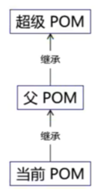

##### 4.2.3 有效 POM

①概念

- 有效 POM 英文翻译为 effective POM，它的概念是这样的——在 POM 的继承关系中，子 POM 可以覆盖父 POM 中的配置；如果子 POM 没有覆盖，那么父 POM 中的配置将会被继承。按照这个规则，继承关系中的所有 POM 叠加到一起，就得到了一个最终生效的 POM。显然 Maven 实际运行过程中，执行构建操作就是按照这个最终生效的 POM 来运行的。这个最终生效的 POM 就是有效 POM，英文叫effective POM

②查看有效 POM

```
mvn help:effective-pom
```

##### 4.2.4 小结

综上所述，平时我们使用和配置的 POM 其实大致是由四个层次组成的：

超级 POM：所有 POM 默认继承，只是有直接和间接之分

父 POM：这一层可能没有，可能有一层，也可能有很多层

当前 pom.xml 配置的 POM：我们最多关注和最多使用的一层

有效 POM：隐含的一层，但是实际上真正生效的一层

### 4.3 属性的声明与引用

#### 4.3.1 help 插件的各个目标

官网说明地址：https://maven.apache.org/plugins/maven-help-plugin

| 目标                    | 说明                                              |
| ----------------------- | ------------------------------------------------- |
| help:active-profiles    | 列出当前已激活的 profile                          |
| help:all-profiles       | 列出当前工程所有可用 profile                      |
| help:describe           | 描述一个插件和/或 Mojo 的属性                     |
| help:effective-pom      | 以 XML 格式展示有效 POM                           |
| help:effective-settings | 为当前工程以 XML 格式展示计算得到的 settings 配置 |
| help:evaluate           | 计算用户在交互模式下给出的 Maven 表达式           |
| help:system             | 显示平台详细信息列表，如系统属性和环境变量        |

#### 4.3.2 使用 help:evaluate 查看属性值

①定义属性

```xml
<properties>
    <com.atguigu.hello>good morning maven</com.atguigu.hello>
</properties>
```

②运行命令

> mvn help:evaluate

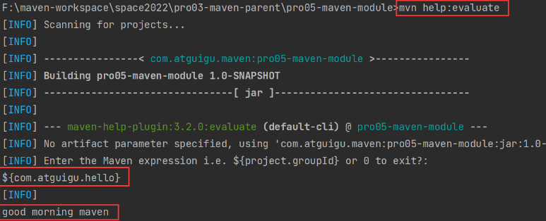

③运行结果

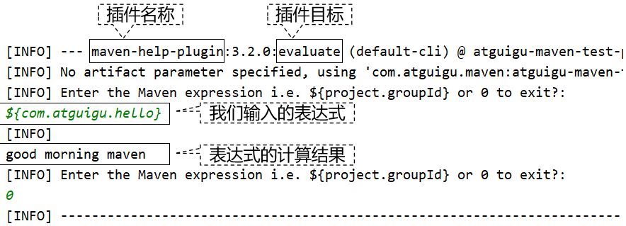


#### 4.3.3 通过 Maven 访问系统属性

###### ① Java 系统属性一览

[1] Java 代码

```java
Properties properties = System.getProperties();
Set<Object> propNameSet = properties.keySet();
for (Object propName : propNameSet) {
    String propValue = properties.getProperty((String) propName);
    System.out.println(propName + " = " + propValue);
}
```

[2]运行结果

```
java.runtime.name = Java™ SE Runtime Environment
sun.boot.library.path = D:\software\Java\jre\bin
java.vm.version = 25.141-b15
java.vm.vendor = Oracle Corporation
java.vendor.url = http://java.oracle.com/
path.separator = ;
java.vm.name = Java HotSpot™ 64-Bit Server VM
file.encoding.pkg = sun.io
user.country = CN
user.script =
sun.java.launcher = SUN_STANDARD
sun.os.patch.level =
java.vm.specification.name = Java Virtual Machine Specification
user.dir = D:\idea2019workspace\atguigu-maven-test-prepare
java.runtime.version = 1.8.0_141-b15
java.awt.graphicsenv = sun.awt.Win32GraphicsEnvironment
java.endorsed.dirs = D:\software\Java\jre\lib\endorsed
os.arch = amd64
java.io.tmpdir = C:\Users\ADMINI~1\AppData\Local\Temp\
line.separator =
java.vm.specification.vendor = Oracle Corporation
user.variant =
os.name = Windows 10
sun.jnu.encoding = GBK
java.library.path = D:\software\Java\bin;C:\WINDOWS\Sun\Java\bin;C:\WIN……
java.specification.name = Java Platform API Specification
java.class.version = 52.0
sun.management.compiler = HotSpot 64-Bit Tiered Compilers
os.version = 10.0
user.home = C:\Users\Administrator
user.timezone =
java.awt.printerjob = sun.awt.windows.WPrinterJob
file.encoding = UTF-8
java.specification.version = 1.8
java.class.path = D:\software\Java\jre\lib\charsets.jar;D:\softw……
user.name = Administrator
java.vm.specification.version = 1.8
sun.java.command = com.atguigu.maven.MyTest
java.home = D:\software\Java\jre
sun.arch.data.model = 64
user.language = zh
java.specification.vendor = Oracle Corporation
awt.toolkit = sun.awt.windows.WToolkit
java.vm.info = mixed mode
java.version = 1.8.0_141
java.ext.dirs = D:\software\Java\jre\lib\ext;C:\WINDOWS\Sun\Java\lib\ext
sun.boot.class.path = D:\software\Java\jre\lib\resources.jar;D:\sof……
java.vendor = Oracle Corporation
file.separator = \
java.vendor.url.bug = http://bugreport.sun.com/bugreport/
sun.io.unicode.encoding = UnicodeLittle
sun.cpu.endian = little
sun.desktop = windows
sun.cpu.isalist = amd64
```

###### ②使用 Maven 访问系统属性

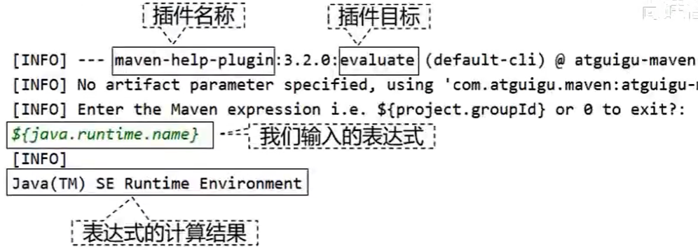

#### 4.3.4 访问系统环境变量

> ${env.系统环境变量名}

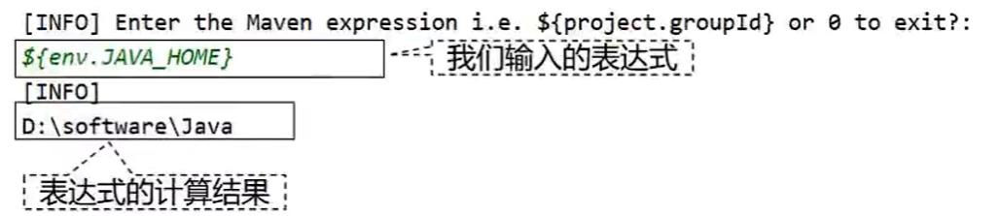

#### 4.3.5 访问 project 属性

###### ①含义


使用表达式 ${project.xxx} 可以访问当前 POM 中的元素值

###### ②访问一级标签

```
${project.标签名}
```

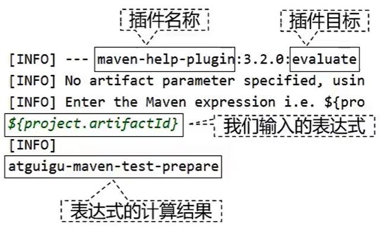

###### ③访问子标签

```
${project.标签名.子标签名}
```

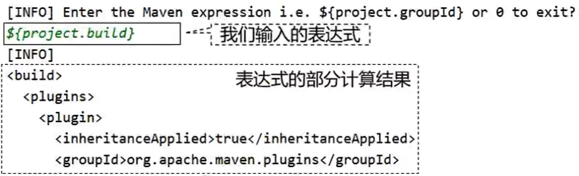

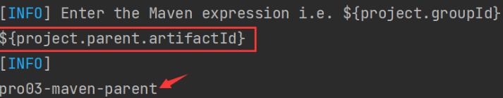


###### ④访问列表标签

```
${project.标签名[下标]}
```

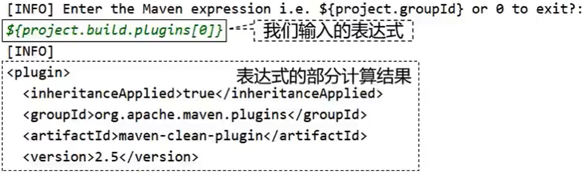

#### 4.3.6 访问 settings 全局配置

${settings.标签名} 可以访问 settings.xm| 中配置的元素值。

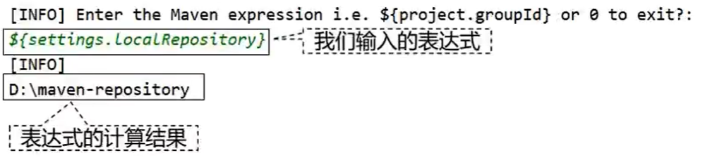

#### 4.3.7 用途

在当前 pom.xml 文件中引用属性

资源过滤功能：在非 Maven 配置文件中引用属性，由 Maven 在处理资源时将引用属性的表达式替换为属性值


### 4.4 build 标签详解

#### 4.4.1 简介

在实际使用 Maven 的过程中，我们会发现 build 标签有时候有，有时候没，这是怎么回事呢?其实通过有效POM 我们能够看到，build 标签的相关配置其实一直都在，只是在我们需要定制构建过程的时候才会通过配置build 标签覆盖默认值或补充配置。这一点我们可以通过打印有效 POM 来看到

所以本质上来说：我们配置的 build 标签都是对超级 POM 配置的叠加。那我们又为什么要在默认配置的基础上叠加呢？很简单，在默认配置无法满足需求的时候定制构建过程

build 标签的完整示例：

```xml
<build>
    <sourceDirectory>D:\idea2019workspace\atguigu-maven-test-prepare\src\main\java</sourceDirectory>
    <scriptSourceDirectory>D:\idea2019workspace\atguigu-maven-test-prepare\src\main\scripts</scriptSourceDirectory>
    <testSourceDirectory>D:\idea2019workspace\atguigu-maven-test-prepare\src\test\java</testSourceDirectory>
    <outputDirectory>D:\idea2019workspace\atguigu-maven-test-prepare\target\classes</outputDirectory>
    <testOutputDirectory>D:\idea2019workspace\atguigu-maven-test-prepare\target\test-classes</testOutputDirectory>
    <resources>
        <resource>
            <directory>D:\idea2019workspace\atguigu-maven-test-prepare\src\main\resources</directory>
        </resource>
    </resources>
    <testResources>
        <testResource>
            <directory>D:\idea2019workspace\atguigu-maven-test-prepare\src\test\resources</directory>
        </testResource>
    </testResources>
    <directory>D:\idea2019workspace\atguigu-maven-test-prepare\target</directory>
    <finalName>atguigu-maven-test-prepare-1.0-SNAPSHOT</finalName>
    <pluginManagement>
        <plugins>
            <plugin>
                <artifactId>maven-antrun-plugin</artifactId>
                <version>1.3</version>
            </plugin>
            <plugin>
                <artifactId>maven-assembly-plugin</artifactId>
                <version>2.2-beta-5</version>
            </plugin>
            <plugin>
                <artifactId>maven-dependency-plugin</artifactId>
                <version>2.8</version>
            </plugin>
            <plugin>
                <artifactId>maven-release-plugin</artifactId>
                <version>2.5.3</version>
            </plugin>
        </plugins>
    </pluginManagement>
    <plugins>
        <plugin>
            <artifactId>maven-clean-plugin</artifactId>
            <version>2.5</version>
            <executions>
                <execution>
                    <id>default-clean</id>
                    <phase>clean</phase>
                    <goals>
                        <goal>clean</goal>
                    </goals>
                </execution>
            </executions>
        </plugin>
        <plugin>
            <artifactId>maven-resources-plugin</artifactId>
            <version>2.6</version>
            <executions>
                <execution>
                    <id>default-testResources</id>
                    <phase>process-test-resources</phase>
                    <goals>
                        <goal>testResources</goal>
                    </goals>
                </execution>
                <execution>
                    <id>default-resources</id>
                    <phase>process-resources</phase>
                    <goals>
                        <goal>resources</goal>
                    </goals>
                </execution>
            </executions>
        </plugin>
        <plugin>
            <artifactId>maven-jar-plugin</artifactId>
            <version>2.4</version>
            <executions>
                <execution>
                    <id>default-jar</id>
                    <phase>package</phase>
                    <goals>
                        <goal>jar</goal>
                    </goals>
                </execution>
            </executions>
        </plugin>
        <plugin>
            <artifactId>maven-compiler-plugin</artifactId>
            <version>3.1</version>
            <executions>
                <execution>
                    <id>default-compile</id>
                    <phase>compile</phase>
                    <goals>
                        <goal>compile</goal>
                    </goals>
                </execution>
                <execution>
                    <id>default-testCompile</id>
                    <phase>test-compile</phase>
                    <goals>
                        <goal>testCompile</goal>
                    </goals>
                </execution>
            </executions>
        </plugin>
        <plugin>
            <artifactId>maven-surefire-plugin</artifactId>
            <version>2.12.4</version>
            <executions>
                <execution>
                    <id>default-test</id>
                    <phase>test</phase>
                    <goals>
                        <goal>test</goal>
                    </goals>
                </execution>
            </executions>
        </plugin>
        <plugin>
            <artifactId>maven-install-plugin</artifactId>
            <version>2.4</version>
            <executions>
                <execution>
                    <id>default-install</id>
                    <phase>install</phase>
                    <goals>
                        <goal>install</goal>
                    </goals>
                </execution>
            </executions>
        </plugin>
        <plugin>
            <artifactId>maven-deploy-plugin</artifactId>
            <version>2.7</version>
            <executions>
                <execution>
                    <id>default-deploy</id>
                    <phase>deploy</phase>
                    <goals>
                        <goal>deploy</goal>
                    </goals>
                </execution>
            </executions>
        </plugin>
        <plugin>
            <artifactId>maven-site-plugin</artifactId>
            <version>3.3</version>
            <executions>
                <execution>
                    <id>default-site</id>
                    <phase>site</phase>
                    <goals>
                        <goal>site</goal>
                    </goals>
                    <configuration>
                        <outputDirectory>D:\idea2019workspace\atguigu-maven-test-prepare\target\site</outputDirectory>
                        <reportPlugins>
                            <reportPlugin>
                                <groupId>org.apache.maven.plugins</groupId>
                                <artifactId>maven-project-info-reports-plugin</artifactId>
                            </reportPlugin>
                        </reportPlugins>
                    </configuration>
                </execution>
                <execution>
                    <id>default-deploy</id>
                    <phase>site-deploy</phase>
                    <goals>
                        <goal>deploy</goal>
                    </goals>
                    <configuration>
                        <outputDirectory>D:\idea2019workspace\atguigu-maven-test-prepare\target\site</outputDirectory>
                        <reportPlugins>
                            <reportPlugin>
                                <groupId>org.apache.maven.plugins</groupId>
                                <artifactId>maven-project-info-reports-plugin</artifactId>
                            </reportPlugin>
                        </reportPlugins>
                    </configuration>
                </execution>
            </executions>
            <configuration>
                <outputDirectory>D:\idea2019workspace\atguigu-maven-test-prepare\target\site</outputDirectory>
                <reportPlugins>
                    <reportPlugin>
                        <groupId>org.apache.maven.plugins</groupId>
                        <artifactId>maven-project-info-reports-plugin</artifactId>
                    </reportPlugin>
                </reportPlugins>
            </configuration>
        </plugin>
    </plugins>
</build>
```

#### 4.4.2 build 标签组成

从完整示例中我们能够看到，build 标签的子标签大致包含三个主体部分

##### ①定义约定的目录结构

参考示例中的如下部分

```xml
<sourceDirectory>D:\idea2019workspace\atguigu-maven-test-prepare\src\main\java</sourceDirectory>
<scriptSourceDirectory>D:\idea2019workspace\atguigu-maven-test-prepare\src\main\scripts</scriptSourceDirectory>
<testSourceDirectory>D:\idea2019workspace\atguigu-maven-test-prepare\src\test\java</testSourceDirectory>
<outputDirectory>D:\idea2019workspace\atguigu-maven-test-prepare\target\classes</outputDirectory>
<testOutputDirectory>D:\idea2019workspace\atguigu-maven-test-prepare\target\test-classes</testOutputDirectory>
<resources>
    <resource>
        <directory>D:\idea2019workspace\atguigu-maven-test-prepare\src\main\resources</directory>
    </resource>
</resources>
<testResources>
    <testResource>
        <directory>D:\idea2019workspace\atguigu-maven-test-prepare\src\test\resources</directory>
    </testResource>
</testResources>
<directory>D:\idea2019workspace\atguigu-maven-test-prepare\target</directory>
```

我们能看到各个目录的作用如下：

| 目录名                | 作用                       |
| --------------------- | -------------------------- |
| sourceDirectory       | 主体源程序存放目录         |
| scriptSourceDirectory | 脚本源程序存放目录         |
| testSourceDirectony   | 测试源程序存放目录         |
| outputDirectory       | 主体源程序编译结果输出目录 |
| testOutputDirectory   | 测试源程序编译结果输出目录 |
| resources             | 主体资源文件存放目录       |
| testResources         | 测试资源文件存放目录       |
| directory             | 构建结果输出目录           |

##### ②备用插件管理

pluginManagement 标签存放着几个极少用到的插件：

- maven-antrun-plugin
- maven-assembly-plugin
- maven-dependency-plugin
- maven-release-plugin

通过 pluginManagement 标签管理起来的插件就像 dependencyManagement 一样，子工程使用时可以省略版本号，起到在父工程中统一管理版本的效果。请看下面例子：

- 被 spring-boot-dependencies 管理的插件信息：

```xml
<plugin>
	<groupId>org.springframework.boot</groupId>
	<artifactId>spring-boot-maven-plugin</artifactId>
	<version>2.6.2</version>
</plugin>
```

- 子工程使用的插件信息：

```xml
<build>
    <plugins>
        <plugin>
            <groupId>org.springframework.boot</groupId>
            <artifactId>spring-boot-maven-plugin</artifactId>
        </plugin>
    </plugins>
</build>
```

##### ③生命周期插件

`plugins` 标签存放的是默认生命周期中实际会用到的插件，这些插件想必大家都不陌生，所以抛开插件本身不谈，我们来看看` plugin` 标签的结构：

```xml
<plugin>
    <artifactId>maven-compiler-plugin</artifactId>
    <version>3.1</version>
    <executions>
        <execution>
            <id>default-compile</id>
            <phase>compile</phase>
            <goals>
                <goal>compile</goal>
            </goals>
        </execution>
        <execution>
            <id>default-testCompile</id>
            <phase>test-compile</phase>
            <goals>
                <goal>testCompile</goal>
            </goals>
        </execution>
    </executions>
</plugin>
```

[1]坐标部分

> artifactld 和 version 标签定义了插件的坐标，作为 Maven 的自带插件这里省略了 groupld。


[2]执行部分

> executions 标签内可以配置多个 execution 标签，executions 标签内：
>
> - id：指定唯一标识
> - phase：关联的生命周期阶段
> - goals/goal：关联指定生命周期的目标
>   - goals 标签中可以配置多个goal标签，表示一个生命周期环节可以对应当前插件的多个目标
>
> 从语义上来说，goals 中当然可以包含多个 goal。但是从功能上来说，一个插件在生命周期的一个阶段中关联多个
> 目标该如何理解?
>
> - 按照逻辑推理应该是：当 Maven 通过生命周期阶段来使用插件功能时，生命周期的这个阶段对应这个插件的多个目标
>
> 可是这么多目标又该执行哪一个?
>
> - 所以从逻辑和实际功能运行情况的角度来说也应该是生命周期的一个环节对应插件的一个目标，目前也没有看到goals 标签中包含多个 goal 标签

另外，插件目标的执行过程可以进行配置，例如maven-site-plugin 插件的 site 目标：

```xml
<execution>
    <id>default-site</id>
    <phase>site</phase>
    <goals>
        <goal>site</goal>
    </goals>
    <configuration>
        <outputDirectory>D:\idea2019workspace\atguigu-maven-test-prepare\target\site</outputDirectory>
        <reportPlugins>
            <reportPlugin>
                <groupId>org.apache.maven.plugins</groupId>
                <artifactId>maven-project-info-reports-plugin</artifactId>
            </reportPlugin>
        </reportPlugins>
    </configuration>
</execution>
```

configuration 标签内进行配置时使用的标签是插件本身定义的。就以 maven-site-plugin 插件为例，它的核心类是 org.apache.maven.plugins.site.render.SiteMojo，在这个类中我们看到了 outputDirectory 属性：

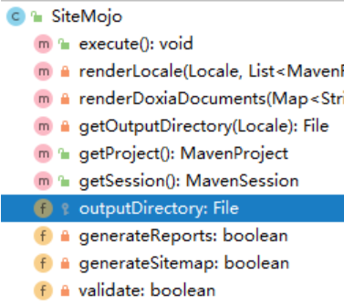


`SiteMojo` 的父类是：`AbstractSiteRenderingMojo`，在父类中我们看到 `reportPlugins `属性：

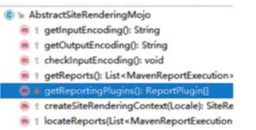

**结论**：每个插件能够做哪些设置都是各个插件自己规定的，无法一概而论

#### 4.4.3 典型应用：指定 JDK 版本

##### ①提出问题

前面我们在 settings.xml 中配置了JDK版本，那么将来把 Maven 工程部署都服务器上，脱离了 settings.xml 配置，如何保证程序正常运行呢？

思路就是我们直接把JDK版本信息告诉负责编译操作的 maven-compiler-plugin插件，让它在构建过程中，按照我们指定的信息工作

##### ②暂时取消 settings.xml 配置

为了测试对 maven-compiler-plugin 插件进行配置的效果，我们暂时取消 settings.xml 中的 profile 配置

```xml
<!-- 配置Maven工程的默认JDK版本 -->
<!-- <profile>
  <id>jdk-1.8</id>
  <activation>
	<activeByDefault>true</activeByDefault>
	<jdk>1.8</jdk>
  </activation>
  <properties>
	<maven.compiler.source>1.8</maven.compiler.source>
	<maven.compiler.target>1.8</maven.compiler.target>
	<maven.compiler.compilerVersion>1.8</maven.compiler.compilerVersion>
  </properties>
</profile> -->
```

##### ③编写源文件代码

很明显这里用到了 Lambda 表达式，这是 JDK 1.8 才支持的语法

```java
package com.sin.maven;

public class Hello {

    public void hello() {
        new Thread(()->{
            System.out.println("thread ...");
        }).start();
    }
}
```

此时我们执行编译命令：

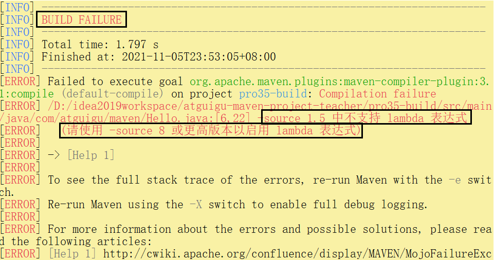

##### ④配置构建过程

```xml
<!-- build 标签：意思是告诉 Maven，你的构建行为，我要开始定制了！ -->
<build>
    <!-- plugins 标签：Maven 你给我听好了，你给我构建的时候要用到这些插件！ -->
    <plugins>
        <!-- plugin 标签：这是我要指定的一个具体的插件 -->
        <plugin>
            <!-- 插件的坐标。此处引用的 maven-compiler-plugin 插件不是第三方的，是一个 Maven 自带的插件。 -->
            <groupId>org.apache.maven.plugins</groupId>
            <artifactId>maven-compiler-plugin</artifactId>
            <version>3.1</version>
            
            <!-- configuration 标签：配置 maven-compiler-plugin 插件 -->
            <configuration>
                <!-- 具体配置信息会因为插件不同、需求不同而有所差异 -->
                <source>1.8</source>
                <target>1.8</target>
                <encoding>UTF-8</encoding>
            </configuration>
        </plugin>
    </plugins>
</build>
```

##### ⑤再次执行编译命令

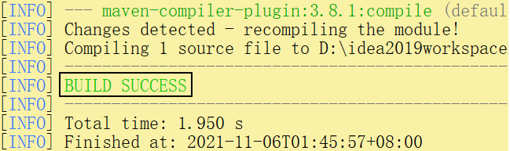

##### ⑥两种配置方式比较

settings.xml 中配置：仅在本地生效，如果脱离当前 settings.xml 能够覆盖的范围，则无法生效。

在当前 Maven 工程 pom.xm 中配置：无论在哪个环境执行编译等构建操作都有效。


##### ⑦补充说明

**[1]source 标签含义**：查看 Maven 官网页面，我们找到 source 标签的介绍


翻译过来就是：调用Java 编译器命令时传入的 -source 参数。那对编译器来说，-source 参数是啥意思呢?

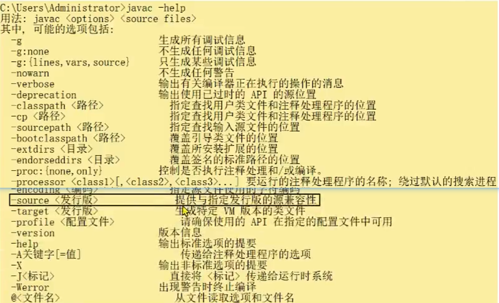

「提供与指定发行版的源兼容性] 。这句话我的理解是：

- 我们写代码是按JDK1.8写的--这就是「源兼容性」里的「源』
- 指定发行版就是我们指定的 JDK1.8
- 『兼容性』是谁和谁兼容呢？现在源代码是既定的，所以就是要求编译器使用指定的JDK 版本来兼容我们的源代码

另外我们还看到：


这个功能还可以通过在 properties 标签中配置 maven.compiler.source 属性来实现。所以我们也经常会看到类似这样的配置：

```xml
<properties>
    <maven.compiler.source>1.8</maven.compiler.source>
    <maven.compiler.target>1.8</maven.compiler.target>
    <project.build.sourceEncoding>UTF-8</project.build.sourceEncoding>
</properties>
```

**[2]target 标签含义**


翻译过来就是：调用Java 编译器命令时传入的 -target 参数。那对编译器来说，-target 参数是啥意思呢?

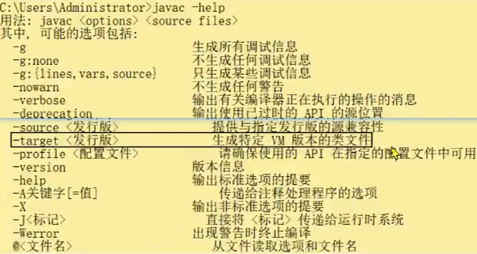

「生成特定 VM 版本的类文件」这句话我的理解是：

- VM 指 JVM
- 类文件指 `*.class` 字节码文件
- 整体意思就是源文件编译后，生成的`*.class` 字节码文件要符合指定的 JVM 版本

#### 4.4.4 典型应用：SpringBoot定制化打包

##### ①需求

很显然 spring-boot-maven-plugin 并不是 Maven 自带的插件，而是 SpringBoot 提供的，用来改变 Maven 默认的构建行为。具体来说是改变打包的行为。默认情况下 Maven 调用 maven-jar-plugin 插件的jar 目标，生成普通的 jar 包

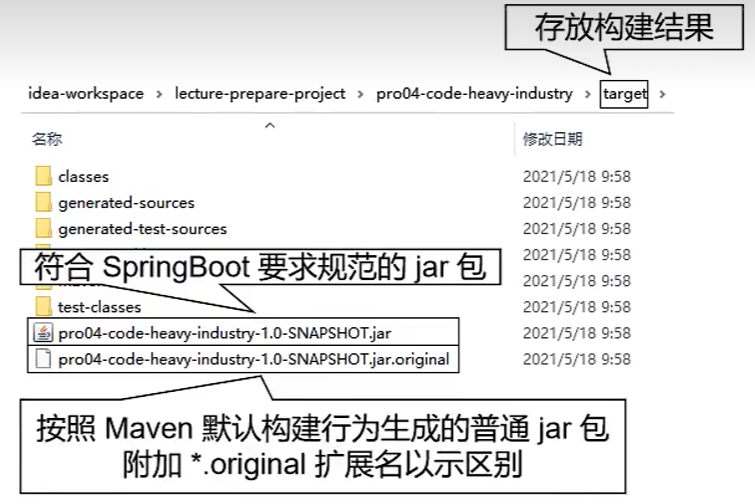

##### ②示例代码

所有的一切已经都被 SpringBoot 封装好了，所以配置非常简单，提供插件坐标即可

```xml
<build>
	<plugins>
		<plugin>
			<groupId>org.springframework.boot</groupId>
			<artifactId>spring-boot-maven-plugin</artifactId>
			<version>2.5.5</version>
		</plugin>
	</plugins>
</build>
```

##### ③插件的七个目标

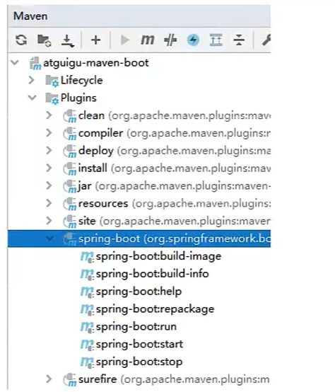

| **目标名称**            | **作用**                                                     |
| ----------------------- | ------------------------------------------------------------ |
| sourceDirectory         | 主体源程序存放目录                                           |
| spring-boot:build-image | Package an application into a OCI image using a buildpack.   |
| spring-boot:build-info  | Generate a build-info.properties file based on the content of the current MavenProject. |
| spring-boot:help        | Display help information on spring-boot-maven-plugin.Call mvn spring-boot:help -Ddetail=true -Dgoal= to display parameter details. |
| spring-boot:repackage   | Repackage existing JAR and WAR archives so that they can be executed from the command line using java -jar. With layout=NONE can also be used simply to package a JAR with nested dependencies (and no main class, so not executable). |
| spring-boot:run         | Run an application in place.                                 |
| spring-boot:start       | Start a spring application. Contrary to the run goal, this does not block and allows other goals to operate on the application. This goal is typically used in integration test scenario where the application is started before a test suite and stopped after |
| spring-boot:stop        | Stop an application that has been started by the ‘start’ goal. Typically invoked once a test suite has completed. |

#### 4.4.5 典型应用：Mybatis 逆向工程
使用 Mybatis 的逆向工程需要使用如下配置，MBG 插件的特点是需要提供插件所需的依赖：

```xml
<!-- 控制 Maven 在构建过程中相关配置 -->
<build>
		
	<!-- 构建过程中用到的插件 -->
	<plugins>
		
		<!-- 具体插件，逆向工程的操作是以构建过程中插件形式出现的 -->
		<plugin>
			<groupId>org.mybatis.generator</groupId>
			<artifactId>mybatis-generator-maven-plugin</artifactId>
			<version>1.3.0</version>
	
			<!-- 插件的依赖 -->
			<dependencies>
				
				<!-- 逆向工程的核心依赖 -->
				<dependency>
					<groupId>org.mybatis.generator</groupId>
					<artifactId>mybatis-generator-core</artifactId>
					<version>1.3.2</version>
				</dependency>
					
				<!-- 数据库连接池 -->
				<dependency>
					<groupId>com.mchange</groupId>
					<artifactId>c3p0</artifactId>
					<version>0.9.2</version>
				</dependency>
					
				<!-- MySQL驱动 -->
				<dependency>
					<groupId>mysql</groupId>
					<artifactId>mysql-connector-java</artifactId>
					<version>5.1.8</version>
				</dependency>
			</dependencies>
		</plugin>
	</plugins>
</build>
```

#### 4.4.6 小结

不知大家有没有发现，通常需要用到 `build `标签的时候底层都会帮我们封装好，需要我们配置的地方不多。即使有些地方需要我们配置，也不会真的我们自己去写，把现成的案例复制过来就行。

所以对 `build` 标签来说，我们的掌握要求就是：**能大致看懂就行**。

### 4.5 依赖配置补充

#### 4.5.1 依赖范围`<scope>`

###### ①import

管理依赖最基本的办法是继承父工程，但是和 Java 类一样，Maven 也是单继承的。如果不同体系的依赖信息封装在不同 POM 中了，没办法继承多个父工程怎么办？这时就可以使用 import 依赖范围。典型案例当然是在项目中引入 SpringBoot、SpringCloud 依赖：

```xml
<dependencyManagement>
    <dependencies>

        <!-- SpringCloud 依赖导入 -->
        <dependency>
            <groupId>org.springframework.cloud</groupId>
            <artifactId>spring-cloud-dependencies</artifactId>
            <version>Hoxton.SR9</version>
            <type>pom</type>
            <scope>import</scope>
        </dependency>

        <!-- SpringCloud Alibaba 依赖导入 -->
        <dependency>
            <groupId>com.alibaba.cloud</groupId>
            <artifactId>spring-cloud-alibaba-dependencies</artifactId>
            <version>2.2.6.RELEASE</version>
            <type>pom</type>
            <scope>import</scope>
        </dependency>

        <!-- SpringBoot 依赖导入 -->
        <dependency>
            <groupId>org.springframework.boot</groupId>
            <artifactId>spring-boot-dependencies</artifactId>
            <version>2.3.6.RELEASE</version>
            <type>pom</type>
            <scope>import</scope>
        </dependency>
    </dependencies>
</dependencyManagement>
```

import依赖范围使用要求：

- 打包类型必须是 pom
- 必须放在 dependencyManagement中

> 官网说明如下：
>
> This scope is only supported on a dependency of type pom in the section. It indicates the dependency is to be replaced with the effective list of dependencies in the specified POM’s section. Since they are replaced, dependencies with a scope of import do not actually participate in limiting the transitivity of a dependency.
>

###### ②system

以 Windows 系统环境下开发为例，假设现在 `D:\tempare\atguigu-maven-test-aaa-1.0-SNAPSHOT.jar` 想要引入到我们的项目中，此时我们就可以将依赖配置为 system 范围：

```xml
<dependency>
    <groupId>com.atguigu.maven</groupId>
    <artifactId>atguigu-maven-test-aaa</artifactId>
    <version>1.0-SNAPSHOT</version>
    <systemPath>D:\tempare\atguigu-maven-test-aaa-1.0-SNAPSHOT.jar</systemPath>
    <scope>system</scope>
</dependency>
```

###### ③runtime

专门用于编译时不需要，但是运行时需要的jar包。比如：编译时我们根据接口调用方法，但是实际运行时需要的是接口的实现类。典型案例是：

```xml
<!--热部署 -->
<dependency>
    <groupId>org.springframework.boot</groupId>
    <artifactId>spring-boot-devtools</artifactId>
    <scope>runtime</scope>
    <optional>true</optional>
</dependency>
```

#### 4.5.2 可选依赖

①配置举例

```xml
<!--热部署 -->
<dependency>
    <groupId>org.springframework.boot</groupId>
    <artifactId>spring-boot-devtools</artifactId>
    <scope>runtime</scope>
    <optional>true</optional>
</dependency>
```

②本质含义：可选其实就是「可有可无』。官网的解释是：

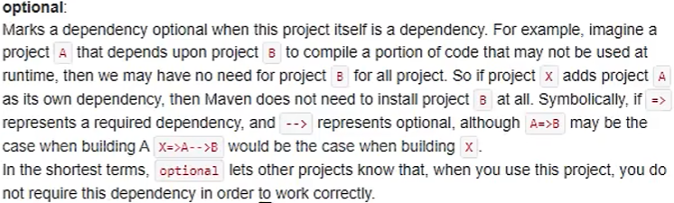

其核心含义是：ProjectX依赖 Project A，A中一部分X用不到的代码依赖了 B，那么对X来说 B 就是『可有可无』的

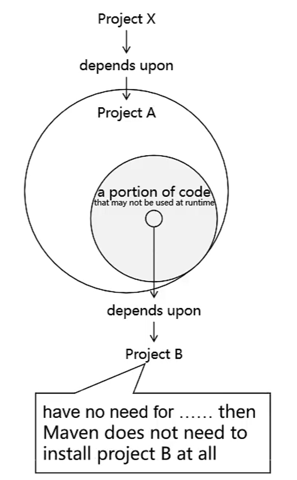

#### 4.5.3 版本仲裁

###### ①最短路径优先

在下图的例子中，对模块 pro25-module-a来说，Maven 会采纳 1.2.12 版本


###### ②路径相同时先声明者优先

此时 Maven 采纳哪个版本，取决于在 pro29-module-x中，对 pro30-module-y和 pro31-module-z 两个模块的依赖哪一个先声明

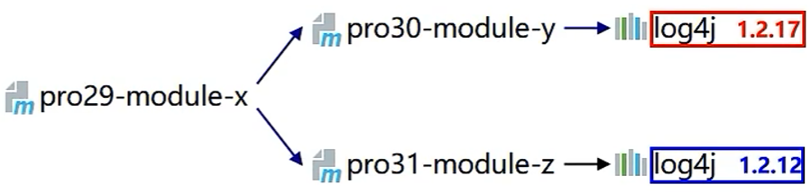


###### ③小结

其实 Maven 的版本仲裁机制只是在没有人为干预的情况下，自主决定jar 包版本的一个办法。而实际上我们要使用具体的哪一个版本，还要取决于项目中的实际情况。所以在项目正常运行的情况下，jar包版本可以由 Maven 仲裁，不必我们操心。而发生冲突时Maven 仲裁决定的版本无法满足要求，此时就应该由程序员明确指定 jar 包版本

### 4.6 Maven 自定义插件
#### 4.6.1 本节定位

其实实际开发中几平没有什么场景需要我们开发自定义 Maven 插件，所以本节只是通过这个角度帮助我们更好的理解插件的目标和生命周期阶段之间的关系

#### 4.6.2 插件开发

###### ①创建工程

略

###### ②设定打包方式

```xml
<packaging>maven-plugin</packaging>
```

当使用 `<packaging>maven-plugin</packaging>` 时，表示该项目是一个 Maven 插件。即，这个项目的输出将是一个可用于其他 Maven 项目的插件，而不是常规的可执行程序或库文件（如 JAR 或 WAR）

###### ③引入依赖

下面两种方式二选一：

[1]将来在文档注释中使用注解

```xml
<dependency>
    <groupId>org.apache.maven</groupId>
    <artifactId>maven-plugin-api</artifactId>
    <version>3.5.2</version>
</dependency>
```

[2]将来直接使用注解

```xml
<dependency>
    <groupId>org.apache.maven.plugin-tools</groupId>
    <artifactId>maven-plugin-annotations</artifactId>
    <version>3.5.2</version>
</dependency>
```

###### ④创建 Mojo 类

`Mojo` 类是一个 Maven 插件的核心类。`Mojo` 这个单词的意思是：Maven Old Java Object，其实 `mojo` 这个单词本身包含魔力;符咒(袋);护身符;(人的)魅力的含义，Maven 用 `Mojo` 是因为它是对 POJO 开的一个小玩笑

[1] Mojo 接口

- 每一个 `Mojo` 都需要实现 `org.apache.maven.plugin.Mojo` 接口。

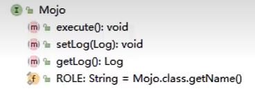

[2]AbstractMojo 抽象类

- 我们实现 Mojo 接口比较困难，幸好可以继承 AbstractMojo，此时我们只要实现 execute() 这一个方法即可

```java
import org.apache.maven.plugin.AbstractMojo;
import org.apache.maven.plugin.MojoExecutionException;
import org.apache.maven.plugin.MojoFailureException;
public class MyHelloPlugin extends AbstractMojo {
    @Override
    public void execute() throws MojoExecutionException, MojoFailureException {
        getLog().info("---> This is my first maven plugin. <---");
    }
}
```

#### 4.6.3 插件配置
###### ①Mojo 类中的配置

[1]文档注释中用注解：对应的 pom.xml 中的依赖：maven-plugin-api

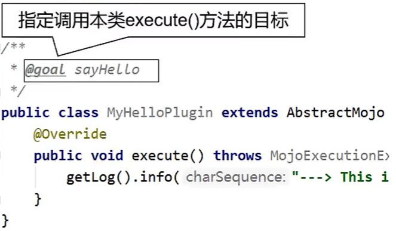

```java
/**
 * @goal sayHello
 */
public class MyHelloPlugin extends AbstractMojo {
    @Override
    public void execute() throws MojoExecutionException, MojoFailureException {
        getLog().info("---> This is my first maven plugin. <---");
    }
}
```

[2]直接在类上标记注解：对应 pom.xml 中的依赖 maven-plugin-annotations

```java
// name 属性：指定目标名称
@Mojo(name = "firstBlood")
public class MyPluginOfFistBlood extends AbstractMojo {
    @Override
    public void execute() throws MojoExecutionException, MojoFailureException {
        getLog().info("---> first blood <---");
    }
}
```

###### ②安装插件

要在后续使用插件，就必须至少将插件安装到本地仓库

```
# 安装
mvn install
```

###### ③注册插件

需要将插件坐标中的 groupId 部分注册到 settings.xml 中

```xml
<pluginGroups>
	<!-- pluginGroup
	 | Specifies a further group identifier to use for plugin lookup.
	<pluginGroup>com.your.plugins</pluginGroup>
	-->
	<pluginGroup>com.atguigu.maven</pluginGroup>
</pluginGroups>
```

#### 4.6.4 使用插件

###### ①识别插件前缀：

Maven 根据插件的 artifactid 来识别插件前缀。例如下面两种情况:

[1]前置匹配

- 匹配规则：${prefix}-maven-plugin
- artifactId：hello-maven-plugin
- 前缀：hello

[2]中间匹配

- 匹配规则：maven-${prefix}-plugin
- artifactId：maven-good-plugin
- 前缀：good

###### ②在命令行直接用

- 命令：

```
mvn hello:sayHello
```

- 效果：

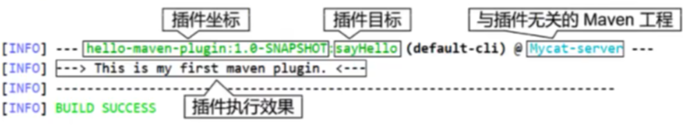

###### ③配置到 build 标签里

这里找一个和插件无关的 Maven 工程配置才有说服力

- [1]配置

```xml
<build>
	<plugins>
		<plugin>
			<groupId>com.atguigu.maven</groupId>
			<artifactId>hello-maven-plugin</artifactId>
			<version>1.0-SNAPSHOT</version>
			<executions>
				<execution>
                    <id>hello</id>
                    <!-- 指定和目标关联的生命周期阶段 -->
					<phase>clean</phase>
					<goals>
						<goal>sayHello</goal>
					</goals>
				</execution>
                <execution>
                    <id>blood</id>
                    <phase>validate</phase>
                    <goals>
                        <goal>firstBlood</goal>
                    </goals>
                </execution>
			</executions>
		</plugin>
	</plugins>
</build>
```

- [2]效果

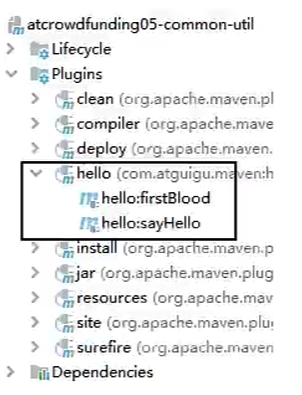

- [3]图形化界面使用

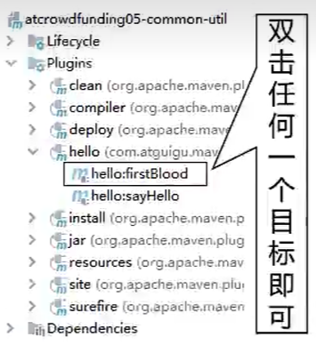

- [4]命令行使用：执行已和插件目标绑定的生命周期:

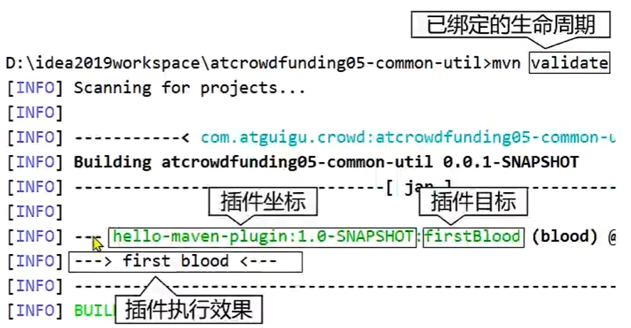

### 4.7 profile 详解
#### 4.7.1 profile 概述

###### ①单词释义

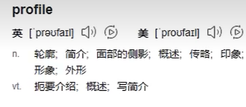

这里我们可以对接 profile 这个单词中「侧面』这个含义：项目的每一个运行环境，相当于是项目整体的一个侧面


###### ②项目的不同运行环境

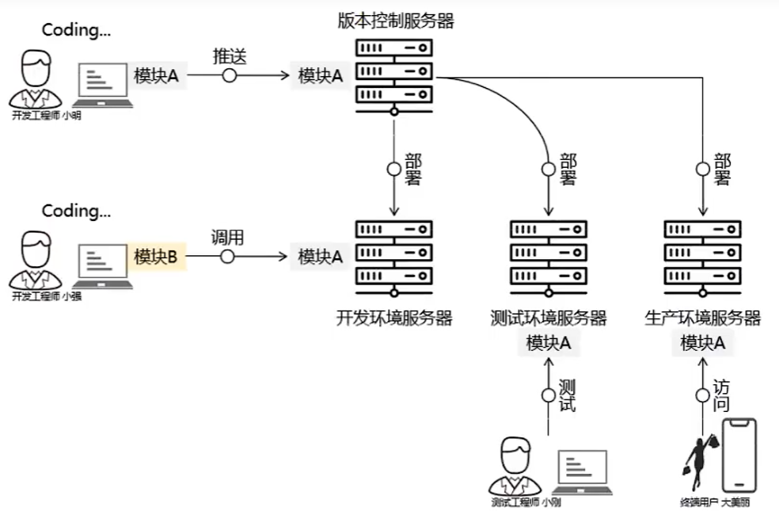

通常情况下，我们至少有三种运行环境：

- 开发环境：供不同开发工程师开发的各个模块之间互相调用、访问; 内部使用
- 测试环境：供测试工程师对项目的各个模块进行功能测试;内部使用
- 生产环境：供最终用户访问--所以这是正式的运行环境，对外提供服务

而我们这里的『环境」仍然只是一个笼统的说法，实际工作中一整套运行环境会包含很多种不同服务器：

- MySQL
- Redis
- ElasticSearch
- RabbitMQ
- FastDFS
- Nginx
- Tomcat

就拿其中的 MySQL来说，不同环境下的访问参数肯定完全不同：

| **开发环境**                                                 | 测试环境                                                     | **生产环境**                                                 |
| ------------------------------------------------------------ | ------------------------------------------------------------ | ------------------------------------------------------------ |
| dev.driver=com.mysql.jdbc.Driver<br/>dev.url=jdbc:mysql://127.0.0.1:3306/db-sys<br/>dev.username=root<br/>dev.password=123456 | test.driver=com.mysql.jdbc.Driver<br/>test.url=jdbc:mysql://127.0.0.1:3306/test-sys<br/>test.username=dev-team<br/>test.password=123456 | product.driver=com.mysql.jdbc.Driver<br/>product.url=jdbc:mysql://192.168.37.132:3306/prod-db-sys<br/>product.username=root<br/>product.password=123456 |

可是代码只有一套。如果在 jdbc.properties 里面来回改，那就太麻烦了，而且很容易遗漏或写错，增加调试的难度和工作量。所以最好的办法就是把适用于各种不同环境的配置信息分别准备好，部署哪个环境就激活哪个配置。

在 Maven 中，使用 profile 机制来管理不同环境下的配置信息。但是解决同类问题的类似机制在其他框架中也有，而且从模块划分的角度来说，持久化层的信息放在构建工具中配置也违反了『高内聚，低耦合』的原则。

所以 Maven 的 profile 我们了解一下即可，不必深究。

###### ③profile 声明和使用的基本逻辑

首先为每一个环境声明一个profile

- 环境 A：profile A
- 环境 B：profile B
- 环境 C：profle C

然后激活某一个profile

###### ④默认 profile

其实即使我们在 pom.xml 中不配置 profile 标签，也已经用到 profile了。为什么呢？因为根标签 project 下所有标签相当于都是在设定默认的 profile。这样一来我们也就很容易理解下面这句话：project 标签下除了 modelVersion 和坐标标签之外，其它标签都可以配置到 profile 中

#### 4.7.2 profile 配置

###### ①外部视角：配置文件

从外部视角来看，profile 可以在下面两种配置文件中配置

- settings.xml ：全局生效。其中我们最熟悉的就是配置 JDK 1.8
- pom.xml：当前 POM 生效

本地 settings.xml 文件：

```xml
<profile>
  <!-- id 标签：唯一标识 -->
  <id>jdk-1.8</id>
  <!-- activation 标签：激活方式 -->
  <activation>
  	<!-- activeByDefault 标签：是否默认激活 -->
	<activeByDefault>true</activeByDefault>
	<!-- jdk 标签：标识当前 profile 可以根据 JDK 版本来激活 -->
	<jdk>1.8</jdk>
  </activation>
  <!-- 其它标签：当前 profile 被激活后要采纳的配置。 -->
  <properties>
	<maven.compiler.source>1.8</maven.compiler.source>
	<maven.compiler.target>1.8</maven.compiler.target>
	<maven.compiler.compilerVersion>1.8</maven.compiler.compilerVersion>
  </properties>
</profile>
```

###### ②内部实现：具体标签

从内部视角来看，配置 profile 有如下语法要求：

[1]profiles/profile 标签：

- 由于 profile 天然代表众多可选配置中的一个所以由复数形式的 profiles 标签统一管理
- 由于profile 标签覆盖了 pom.xml 中的默认配置，所以 profiles 标签通常是 pom.xml 中的最后一个标签

[2]id 标签：

- 每个 `profile` 都必须有一个 `id` 标签，指定该 `profile` 的唯一标识。这个 `id` 标签的值会在命令行调用 `profile` 时被用到。这个命令格式是：`-D<profile id>`

[3]其它允许出现的标签：

- 一个 `profile` 可以覆盖项目的最终名称、项目依赖、插件配置等各个方面以影响构建行为
- build
  - defaultGoal
  - finalName
  - resources
  - testResources
  - plugins

- reporting
- modules
- dependencies
- dependencyManagement
- repositories
- pluginRepositories
- properties


#### 4.7.3 激活 profile

##### ①默认配置默认被激活

前面提到了，POM 中没有在 profile 标签里的就是默认的 profile，当然默认被激活

##### ②基于环境信息激活

环境信息包含：**JDK** 版本、操作系统参数、文件、属性等各个方面。一个 `profile` 一旦被激活，那么它定义的所有配置都会覆盖原来 **POM** 中对应层次的元素。大家可以参考下面的标签结构：

```xml
<profile>
	<id>dev</id>
    <activation>
        <!-- 配置是否默认激活 -->
    	<activeByDefault>false</activeByDefault>
        <jdk>1.5</jdk>
        <os>
        	<name>Windows XP</name>
            <family>Windows</family>
            <arch>x86</arch>
            <version>5.1.2600</version>
        </os>
        <property>
        	<name>mavenVersion</name>
            <value>2.0.5</value>
        </property>
        <file>
        	<exists>file2.properties</exists>
            <missing>file1.properties</missing>
        </file>
    </activation>
</profile>
```

这里有个问题是：多个激活条件之间是什么关系呢？

- Maven 3.2.2 之前：遇到第一个满足的条件即可激活——**或**的关系

- Maven 3.2.2 开始：各条件均需满足一一**且**的关系

下面我们来看一个具体例子。假设有如下 profile 配置，在 JDK 版本为 1.6 时被激活：

```xml
<profiles>
	<profile>
    	<id>JDK1.6</id>
        <activation>
            <!-- 指定激活条件为：JDK 1.6 -->
        	<jdk>1.6</jdk>
        </activation>
        ……
    </profile>
</profiles>
```

这里需要指出的是：**Maven** 会自动检测当前环境安装的 **JDK** 版本，只要 **JDK** 版本是以 `1.6` 开头都算符合条件。下面几个例子都符合：

- 1.6.0_03
- 1.6.0_02

##### ③命令行激活

###### [1]列出活动的 profile

```sh
# 列出所有激活的 profile，以及它们在哪里定义
mvn help:active-profiles
```

###### [2]指定某个具体 profile

```sh
mvn compile -P<profile id>
```


#### 4.7.4 操作举例

##### ①编写 Lambda 表达式代码

Lambda 表达式代码要求 JDK 版本必须是 `1.8`，我们可以以此来判断某个指定更低 JDK 版本的 `profile` 是否被激活生效

```java
@Test
public void test() {
    new Thread(()->{
        System.out.println(Thread.currentThread().getName() + " is working");
    }).start();
}
```

以目前配置运行这个测试方法：

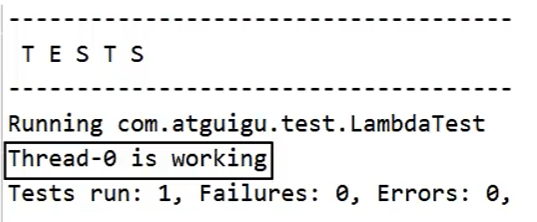

##### ②配置 profile

```xml
<profiles>
    <profile>
        <id>myJDKProfile</id>
        <!-- build 标签：意思是告诉 Maven，你的构建行为，我要开始定制了！ -->
        <build>
            <!-- plugins 标签：Maven 你给我听好了，你给我构建的时候要用到这些插件！ -->
            <plugins>
                <!-- plugin 标签：这是我要指定的一个具体的插件 -->
                <plugin>
                    <!-- 插件的坐标。此处引用的 maven-compiler-plugin 插件不是第三方的，是一个 Maven 自带的插件。 -->
                    <groupId>org.apache.maven.plugins</groupId>
                    <artifactId>maven-compiler-plugin</artifactId>
                    <version>3.1</version>

                    <!-- configuration 标签：配置 maven-compiler-plugin 插件 -->
                    <configuration>
                        <!-- 具体配置信息会因为插件不同、需求不同而有所差异 -->
                        <source>1.6</source>
                        <target>1.6</target>
                        <encoding>UTF-8</encoding>
                    </configuration>
                </plugin>
            </plugins>
        </build>
    </profile>
</profiles>
```

##### ③执行构建命令

```sh
mvn clean test -PmyJDKProfile
```

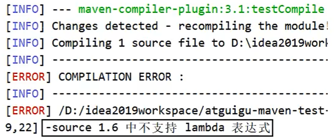

#### 4.7.5 资源属性过滤

##### ①简介

Maven 为了能够通过 profile 实现各不同运行环境切换，提供了一种「资源属性过滤』的机制。通过属性替换实现不同环境使用不同的参数

##### ②操作演示

###### [1]配置 profile

```xml
<profiles>
    <profile>
        <id>devJDBCProfile</id>
        <properties>
            <dev.jdbc.user>root</dev.jdbc.user>
            <dev.jdbc.password>atguigu</dev.jdbc.password>
            <dev.jdbc.url>http://localhost:3306/db_good</dev.jdbc.url>
            <dev.jdbc.driver>com.mysql.jdbc.Driver</dev.jdbc.driver>
        </properties>
        <build>
            <resources>
                <resource>
                    <!-- 表示为这里指定的目录开启资源过滤功能 -->
                    <directory>src/main/resources</directory>

                    <!-- 将资源过滤功能打开 -->
                    <filtering>true</filtering>
                </resource>
            </resources>
        </build>
    </profile>
</profiles>
```

###### [2]创建待处理的资源文件

```properties
dev.user=${dev.jdbc.user}
dev.password=${dev.jdbc.password}
dev.url=${dev.jdbc.url}
dev.driver=${dev.jdbc.driver}
```

###### [3]执行处理资源命令

```sh
mvn clean resources:resources -PdevJDBCProfile
```

###### [4]找到处理得到的资源文件

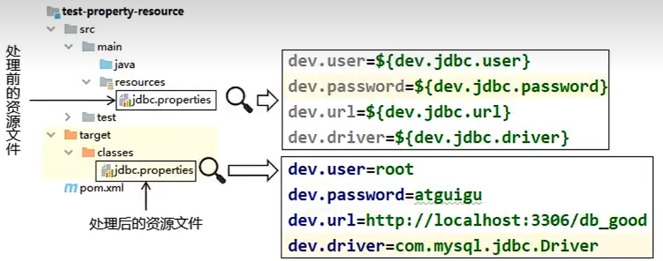

###### [5]延伸

我们时不时会在 `resource` 标签下看到 `includes` 和 `excludes` 标签。它们的作用是：

- `includes`：指定执行 `resource` 阶段时要**包含**到目标位置的资源
- `excludes`：指定执行 `resource` 阶段时要**排除**的资源

请看下面的例子：

```xml
<build>
    <resources>
        <resource>
            <!-- 表示为这里指定的目录开启资源过滤功能 -->
            <directory>src/main/resources</directory>

            <!-- 将资源过滤功能打开 -->
            <filtering>true</filtering>

            <includes>
                <include>*.properties</include>
            </includes>

            <excludes>
                <exclude>happy.properties</exclude>
            </excludes>
        </resource>
    </resources>
</build>
```

执行处理资源命令：

```sh
mvn clean resources:resources -PdevJDBCProfile
```

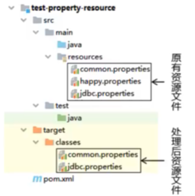


当然我们这里只是以 `properties` 文件为例，并不是只能处理 `properties` 文件


## 5.生产实践

### 5.1 搭建 Maven 私服：Nexus

#### 5.1.1 Nexus 安装

##### ①下载地址

Nexus下载地址：https://download.sonatype.com/nexus/3/latest-unix.tar.gz

小诀窍：使用迅雷下载比直接用浏览器下载快很多

##### ②上传、解压
在/opt/nexus目录下

解压：tar -zxvf nexus-3.31.1-01-unix.tar.gz

上传到 Linux 系统，解压后即可使用，不需要安装。但是需要注意：必须提前安装 JDK

##### ③启动 Nexus

进入bin目录下

```sh
# 启动 Nexus
./nexus start

# 查看状态
./nexus status
```


##### ④查看端口占用情况

```sh
netstat -anp | grep java
```

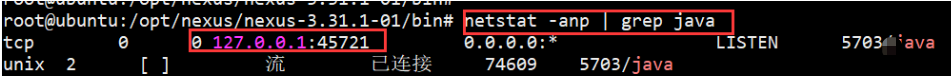

上面 `45721` 这个每次都不一样，不用管它。我们要访问的是 `8081` 这个端口。但是需要注意：`8081` 端口的这个进程要在启动 `/opt/nexus-3.31.1-01/bin/nexus` 这个主体程序一、两分钟后才会启动，请耐心等待

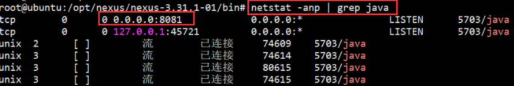

注意：需要关闭防火墙

##### ⑤访问 Nexus 首页

首页地址：`http://192.168.37.128:8081/`

### 5.2 初始设置

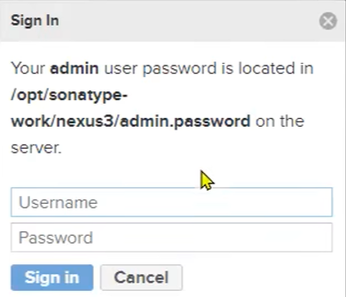


参考提示在服务器的指定目录下找到初始密码：

- 用户名：admin
- 密码：查看 `/opt/sonatype-work/nexus3/admin.password` 文件

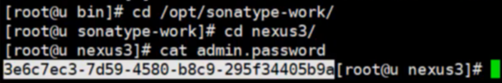

所以登录信息输入如下：

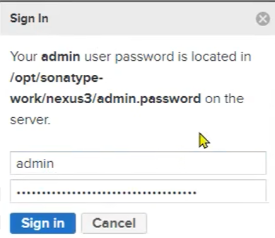

继续执行初始化：


给 `admin` 用户指定新密码：

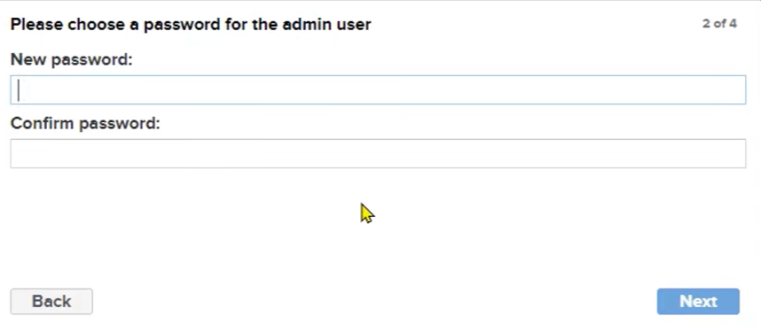


匿名登录，启用还是禁用？由于启用匿名登录后，后续操作比较简单，这里演示禁用匿名登录的操作方式：

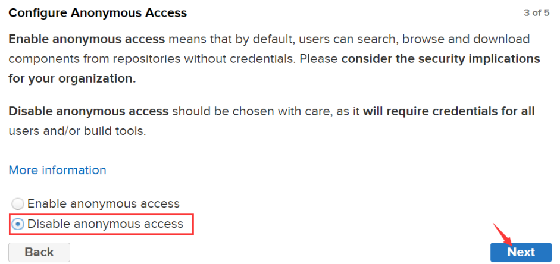


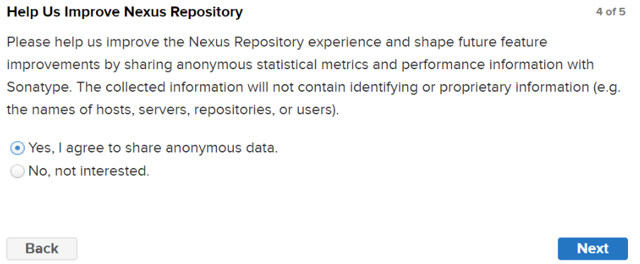


完成：

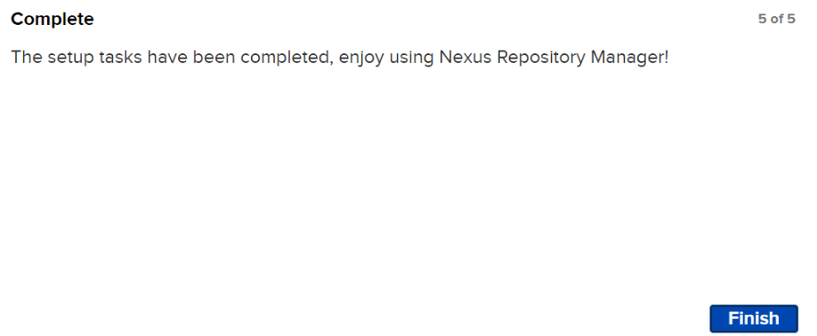

### 5.3 对接 Nexus

#### ①通过 Nexus 下载 jar 包

##### [1]了解 Nexus 上的各种仓库

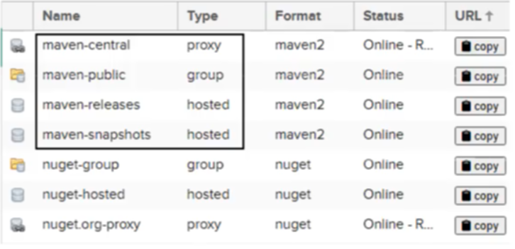

| **仓库类型** | **说明**                                       |
| ------------ | ---------------------------------------------- |
| proxy        | 某个远程仓库的代理                             |
| group        | 存放：通过 Nexus 获取的第三方 jar 包           |
| hosted       | 存放：本团队其他开发人员部署到 Nexus 的 jar 包 |


| **仓库名称**    | 说明                                                         |
| --------------- | ------------------------------------------------------------ |
| maven-central   | Nexus 对 Maven 中央仓库的代理                                |
| maven-public    | Nexus 默认创建，供开发人员下载使用的组仓库                   |
| maven-releasse  | Nexus 默认创建，供开发人员部署自己 jar 包的宿主仓库要求 releasse 版本 |
| maven-snapshots | Nexus 默认创建，供开发人员部署自己 jar 包的宿主仓库要求 snapshots 版本(快照) |

初始状态下，这几个仓库都没有内容：

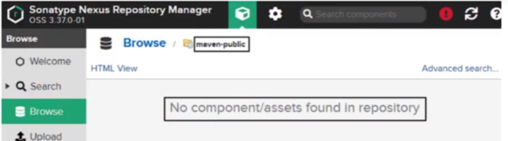

##### [2]使用空的本地仓库

```xml
  <!-- 配置一个新的 Maven 本地仓库 -->
  <localRepository>E:/maven/repo-new</localRepository>
```

##### [3]指定 Nexus 服务器地址

把我们原来配置阿里云仓库地址的 `mirror` 标签改成下面这样：

```xml
<mirror>
	<id>nexus-mine</id>
	<mirrorOf>central</mirrorOf>
	<name>Nexus mine</name>
	<url>http://192.168.37.128:8081/repository/maven-public/</url>
</mirror>
```

这里的 url 标签是这么来的：

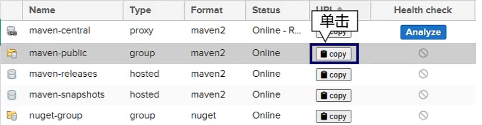

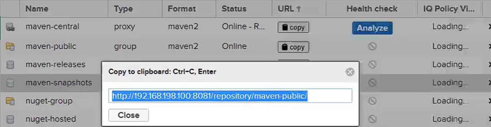

把上图中看到的地址复制出来即可。如果我们在前面允许了匿名访问，到这里就够了。但如果我们禁用了匿名访问，那么接下来我们还要继续配置 `settings.xml`：

```xml
<server>
  <id>nexus-mine</id>
  <username>admin</username>
  <password>admin</password>
</server>
```

这里需要格外注意：`server` 标签内的 `id` 标签值必须和 `mirror` 标签中的 `id` 值一样

##### [4]效果

找一个用到框架的 Maven 工程，执行命令：

```sh
mvn clean compile
```

> Downloading from nexus-mine: http://192.168.37.128:8081/repository/maven-public/org/springframework/cloud/spring-cloud-dependencies/Hox
> ton.SR9/spring-cloud-dependencies-Hoxton.SR9.pom
> Downloaded from nexus-mine: http://192.168.37.128:8081/repository/maven-public/org/springframework/cloud/spring-cloud-dependencies/Hoxt
> on.SR9/spring-cloud-dependencies-Hoxton.SR9.pom (12 kB at 4.3 kB/s)
> Downloading from nexus-mine: http://192.168.37.128:8081/repository/maven-public/org/springframework/cloud/spring-cloud-dependencies-par
> ent/2.3.1.RELEASE/spring-cloud-dependencies-parent-2.3.1.RELEASE.pom
> Downloaded from nexus-mine: http://192.168.37.128:8081/repository/maven-public/org/springframework/cloud/spring-cloud-dependencies-pare
> nt/2.3.1.RELEASE/spring-cloud-dependencies-parent-2.3.1.RELEASE.pom (8.3 kB at 8.3 kB/s)
> Downloading from nexus-mine: http://192.168.37.128:8081/repository/maven-public/org/springframework/cloud/spring-cloud-commons-dependen
> cies/2.2.6.RELEASE/spring-cloud-commons-dependencies-2.2.6.RELEASE.pom
> Downloaded from nexus-mine: http://192.168.37.128:8081/repository/maven-public/org/springframework/cloud/spring-cloud-commons-dependenc
> ies/2.2.6.RELEASE/spring-cloud-commons-dependencies-2.2.6.RELEASE.pom (7.0 kB at 10 kB/s)
> Downloading from nexus-mine: http://192.168.37.128:8081/repository/maven-public/org/springframework/cloud/spring-cloud-netflix-dependen
> cies/2.2.6.RELEASE/spring-cloud-netflix-dependencies-2.2.6.RELEASE.pom
> Downloaded from nexus-mine: http://192.168.37.128:8081/repository/maven-public/org/springframework/cloud/spring-cloud-netflix-dependenc
> ies/2.2.6.RELEASE/spring-cloud-netflix-dependencies-2.2.6.RELEASE.pom (18 kB at 30 kB/s)
> Downloading from nexus-mine: http://192.168.37.128:8081/repository/maven-public/org/springframework/cloud/spring-cloud-stream-dependenc
> ies/Horsham.SR9/spring-cloud-stream-dependencies-Horsham.SR9.pom


下载后，Nexus 服务器上就有了 `jar` 包：


#### ②将 jar 包部署到 Nexus

##### [1]配置 Maven 工程

父POM工程下，添加：

```xml
<distributionManagement>
    <snapshotRepository>
        <id>nexus-mine</id>
        <name>Nexus Snapshot</name>
        <url>http://192.168.37.128:8081/repository/maven-snapshots/</url>
    </snapshotRepository>
</distributionManagement>
```

这里 `snapshotRepository` 的 `id` 标签也必须和` settings.xml` 中指定的` mirror` 标签的`id`属性一致

##### [2]执行部署命令

```sh
mvn clean deploy
```

> Uploaded to nexus-mine: http://192.168.37.128:8081/repository/maven-snapshots/com/atguigu/maven/demo07-redis-data-provider/1.0-SNAPSHOT
> /maven-metadata.xml (787 B at 6.4 kB/s)
> Uploading to nexus-mine: http://192.168.37.128:8081/repository/maven-snapshots/com/atguigu/maven/demo07-redis-data-provider/maven-metad
> ata.xml
> Uploaded to nexus-mine: http://192.168.37.128:8081/repository/maven-snapshots/com/atguigu/maven/demo07-redis-data-provider/maven-metada
> ta.xml (301 B at 3.7 kB/s)
> [INFO] ------------------------------------------------------------------------
> [INFO] Reactor Summary for pro07-demo-imperial-court-micro-service 1.0-SNAPSHOT:
> [INFO]
> [INFO] pro07-demo-imperial-court-micro-service … SUCCESS [ 14.410 s]
> [INFO] demo01-imperial-court-gateway … SUCCESS [ 4.143 s]
> [INFO] demo09-base-entity … SUCCESS [ 2.201 s]
> [INFO] demo10-base-util … SUCCESS [ 2.014 s]
> [INFO] demo08-base-api … SUCCESS [ 4.055 s]
> [INFO] demo02-user-auth-center … SUCCESS [ 3.456 s]
> [INFO] demo03-emp-manager-center … SUCCESS [ 0.801 s]
> [INFO] demo04-memorials-manager-center … SUCCESS [ 0.831 s]
> [INFO] demo05-working-manager-center … SUCCESS [ 0.617 s]
> [INFO] demo06-mysql-data-provider … SUCCESS [ 3.510 s]
> [INFO] demo07-redis-data-provider … SUCCESS [ 0.767 s]
> [INFO] ------------------------------------------------------------------------
> [INFO] BUILD SUCCESS
> [INFO] ------------------------------------------------------------------------

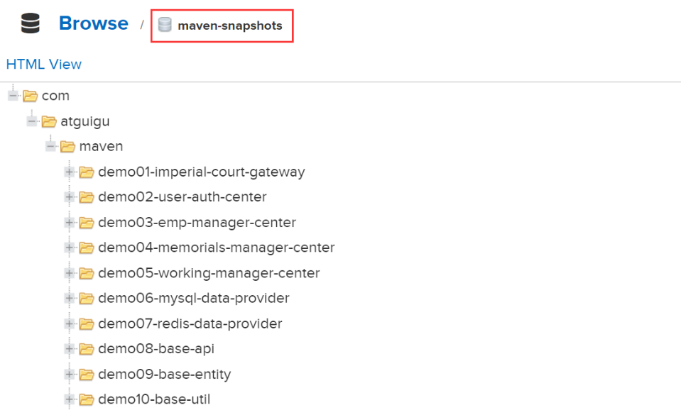

#### ③引用别人部署的 jar 包

##### [1]提出问题

- 默认访问的 **Nexus** 仓库：`maven-public`
- 存放别人部署`jar` 包的仓库：`maven-snapshots`

##### [2]配置 Maven 工程

```xml
<dependencies>
        <dependency>
            <groupId>com.atguigu.maven</groupId>
            <artifactId>demo10-base-util</artifactId>
            <version>1.0-SNAPSHOT</version>
        </dependency>
</dependencies>

<repositories>
    <repository>
        <id>nexus-mine</id>
        <name>nexus-mine</name>
        <url>http://192.168.37.128:8081/repository/maven-snapshots/</url>
        <snapshots>
            <enabled>true</enabled>
        </snapshots>
        <releases>
            <enabled>true</enabled>
        </releases>
    </repository>
</repositories>
```

### 5.4 修改仓库配置

举例：修改 `maven-central` 仓库代理的远程库地址

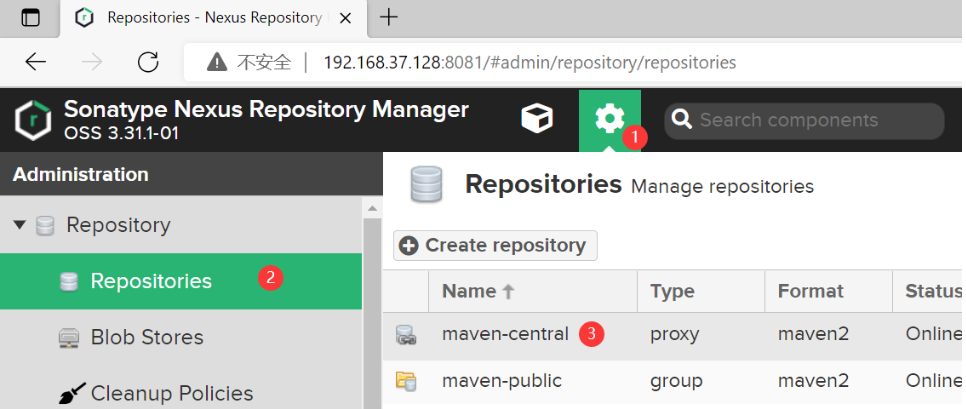

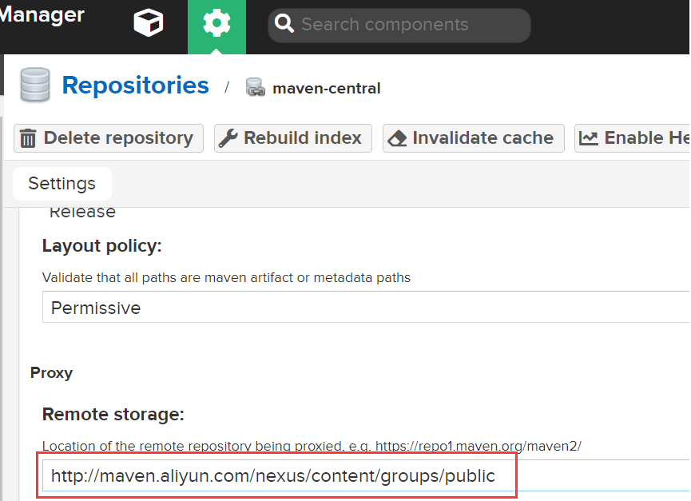


## 6.jar 包冲突问题

### 6.1 谁需要面对 jar 包冲突？

先给结论：编订依赖列表的程序员。初次设定一组依赖，因为尚未经过验证，所以确实有可能存在各种问题，需要做有针对性的调整。那么谁来做这件事呢？我们最不希望看到的就是：团队中每个程序员都需要自己去找依赖，即使是做同一个项目，每个模块也各加各的依赖，没有统一管理。那前人踩过的坑，后人还要再踩一遍。而且大家用的依赖有很多细节都不一样，版本更是五花八门，这就让事情变得更加复杂。

所以虽然初期需要根据项目开发和实际运行情况对依赖配置不断调整，最终确定一个各方面都 OK 的版本。但是一旦确定下来，放在父工程中做依赖管理，各个子模块各取所需，这样基本上就能很好的避免问题的扩散。

即使开发中遇到了新问题，也可以回到源头检查、调整 dependencyManagement 配置的列表——而不是每个模块都要改。所以学完这一节你应该就会对前面讲过的『继承』有了更深的理解

### 6.2 表现形式


由于实际开发时我们往往都会整合使用很多大型框架，所以一个项目中哪怕只是一个模块也会涉及到大量 jar 包。数以百计的 jar 包要彼此协调、精密配合才能保证程序正常运行。而规模如此庞大的 jar 包组合在一起难免会有磕磕碰碰。最关键的是由于 jar 包冲突所导致的问题非常诡异，这里我们只能罗列较为典型的问题，而没法保证穷举

但是我们仍然能够指出一点：一般来说，由于我们自己编写代码、配置文件写错所导致的问题通常能够在异常信息中看到我们自己类的全类名或配置文件的所在路径。如果整个错误信息中完全没有我们负责的部分，全部是框架、第三方工具包里面的类报错，这往往就是 jar 包的问题所引起的

而具体的表现形式中，主要体现为找不到类或找不到方法

##### ①抛异常：找不到类

此时抛出的常见的异常类型：

- java.lang.ClassNotFoundException：编译过程中找不到类
- java.lang.NoClassDefFoundError：运行过程中找不到类
- java.lang.LinkageError：不同类加载器分别加载的多个类有相同的全限定名

举个例子：

```xml
<dependency>
    <groupId>org.apache.httpcomponents</groupId>
    <artifactId>httpclient</artifactId>
    <version>4.x.x</version>
</dependency>
```

`httpclient` 这个 `jar` 包中有一个类：`org.apache.http.conn.ssl.NoopHostnameVerifier`。这个类在较低版本中没有，但在较高版本存在。比如：

| **jar 包版本** | 是否存在 |
| -------------- | -------- |
| 4.3.6          | 否       |
| 4.4            | 是       |

那当确实需要用到 NoopHostnameVerifier 这个类，我们看到 Maven 通过依赖传递机制引入了这个 jar 包，所以没有明确地显式声明对这个 jar 包的依赖。可是 Maven 传递过来的 jar 包是 4.3.6 版本，里面没有包含我们需要的类，就会抛出异常。

而『冲突』体现在：4.3.6 和 4.4 这两个版本的 jar 包都被框架所依赖的 jar 包给传递进来了，但是假设 Maven 根据『版本仲裁』规则实际采纳的是 4.3.6。


##### ②抛异常：找不到方法

程序找不到符合预期的方法。这种情况多见于通过反射调用方法，所以经常会导致：`java.lang.NoSuchMethodError`。比如 `antlr:antlr:x.x.x` 这个包中有一个接口：`antlr.collections.AST`

| **版本** | getLine()方法 |
| -------- | ------------- |
| 2.7.2    | 无            |
| 2.7.6    | 有            |

##### ③没报错但结果不对

发生这种情况比较典型的原因是：两个 `jar` 包中的类分别实现了同一个接口，这本来是很正常的。但是问题在于：由于没有注意命名规范，两个不同实现类恰巧是同一个名字

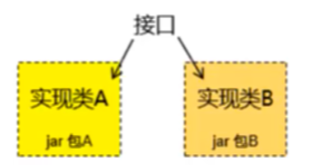


具体例子是有的同学在实际工作中遇到过：项目中部分模块使用 `log4j `打印日志；其它模块使用 `logback`，编译运行都不会冲突，但是会引起日志服务降级，让你的 `log` 配置文件失效。比如：你指定了 `error` 级别输出，但是冲突就会导致 `info`、`debug` 都在输出

### 6.3 本质

以上表现形式归根到底是两种基本情况导致的

##### ①同一jar包的不同版本

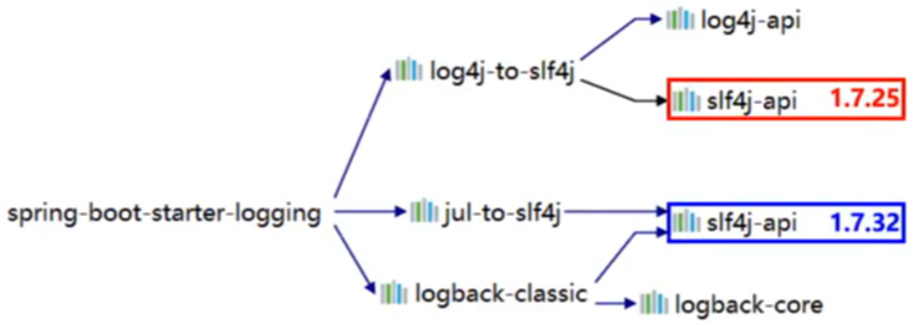


##### ②不同jar包中包含同名类

这里我们拿 netty 来举个例子，netty 是一个类似 Tomcat 的 Servlet 容器。通常我们不会直接依赖它，所以基本上都是框架传递进来的。那么当我们用到的框架很多时，就会有不同的框架用不同的坐标导入 netty。大家可以参照下表对比一下两组坐标：

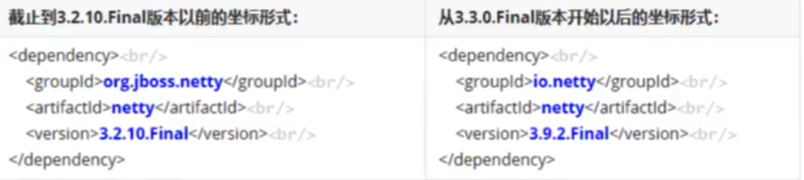

但是偏偏这两个【不同的包】里面又有很多【全限定名相同】的类。例如：

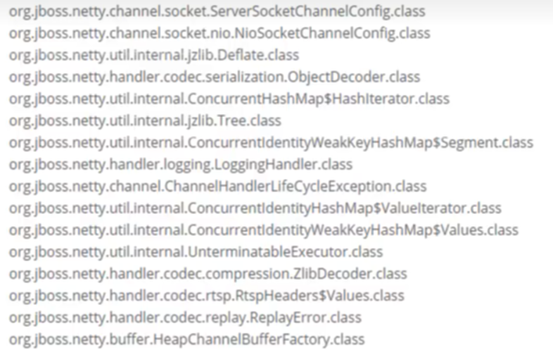

当然，如果全限定名相同，类中的代码也完全相同，那么用着也行。问题是如果『**全限定名相同**』，但是『**代码不同**』，那可太坑了。我们随便找一个来看看：

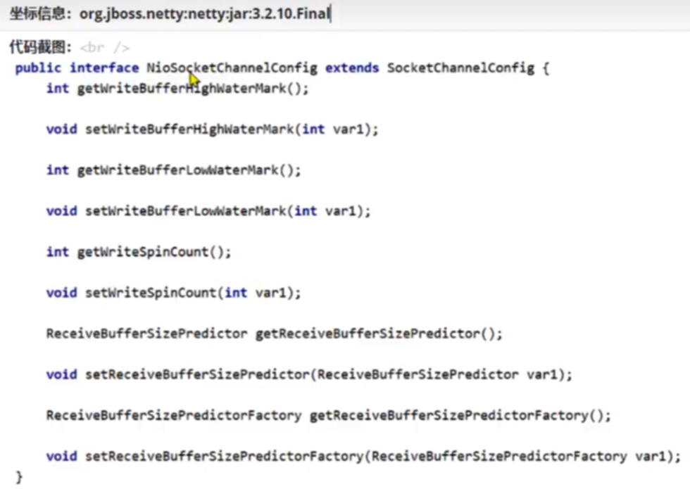

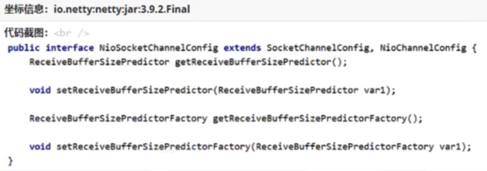

### 6.4 解决办法

####  ①概述

很多情况下常用框架之间的整合容易出现的冲突问题都有人总结过了，拿抛出的异常搜索一下基本上就可以直接找到对应的 jar 包。我们接下来要说的是通用方法。

不管具体使用的是什么工具，基本思路无非是这么两步：

- 第一步：把彼此冲突的 jar 包找到
- 第二步：在冲突的 jar 包中选定一个。具体做法无非是通过 exclusions 排除依赖，或是明确声明依赖

#### ②IDEA 的 Maven Helper 插件

这个插件是 IDEA 中安装的插件，不是 Maven 插件。它能够给我们罗列出来同一个jar包的不同版本，以及它们的来源。但是对不同 jar 包中同名的类没有办法。

- 在 IDEA 中安装 Maven helper 插件。

- 基于 pom.xml 的依赖冲突分析。

#### ③Maven 的 enforcer 插件

使用 Maven 的 enforcer 插件既可以检测同一个jar包的不同版本，又可以检测不同 jar 包中同名的类

##### [1]引入 netty 依赖

这里我们引入两个对 netty 的依赖，展示不同 jar 包中有同名类的情况

```xml
<dependencies>
    <dependency>
        <groupId>org.jboss.netty</groupId>
        <artifactId>netty</artifactId>
        <version>3.2.10.Final</version>
    </dependency>

    <dependency>
        <groupId>io.netty</groupId>
        <artifactId>netty</artifactId>
        <version>3.9.2.Final</version>
    </dependency>
</dependencies>
```

##### [2]配置 enforcer 插件

```xml
<build>
    <pluginManagement>
        <plugins>
            <plugin>
                <groupId>org.apache.maven.plugins</groupId>
                <artifactId>maven-enforcer-plugin</artifactId>
                <version>1.4.1</version>
                <executions>
                    <execution>
                        <id>enforce-dependencies</id>
                        <phase>validate</phase>
                        <goals>
                            <goal>display-info</goal>
                            <goal>enforce</goal>
                        </goals>
                    </execution>
                </executions>
                <dependencies>
                    <dependency>
                        <groupId>org.codehaus.mojo</groupId>
                        <artifactId>extra-enforcer-rules</artifactId>
                        <version>1.0-beta-4</version>
                    </dependency>
                </dependencies>
                <configuration>
                    <rules>
                        <banDuplicateClasses>
                            <findAllDuplicates>true</findAllDuplicates>
                        </banDuplicateClasses>
                    </rules>
                </configuration>
            </plugin>
        </plugins>
    </pluginManagement>
</build>
```

##### [3]测试

执行如下 **Maven** 命令：

```sh
mvn clean package enforcer:enforce
```

部分运行结果：

```
[INFO] — maven-enforcer-plugin:1.4.1:enforce (default-cli) @ pro32-duplicate-class —
[WARNING] Rule 0: org.apache.maven.plugins.enforcer.BanDuplicateClasses failed with message:
Duplicate classes found:

Found in:
io.netty:netty:jar:3.9.2.Final:compile
org.jboss.netty:netty:jar:3.2.10.Final:compile
Duplicate classes:
org/jboss/netty/channel/socket/ServerSocketChannelConfig.class
org/jboss/netty/channel/socket/nio/NioSocketChannelConfig.class
org/jboss/netty/util/internal/jzlib/Deflate.class
org/jboss/netty/handler/codec/serialization/ObjectDecoder.class
org/jboss/netty/util/internal/ConcurrentHashMap$HashIterator.class
```

最后，问你一个问题：解决 jar 包冲突问题这么麻烦，是不是不该用 Maven？

### 6.5 体系外 jar 包引入

#### ① 提出问题

『体系外 jar 包』这个名字是我起的，来源是这样——目前来说我们在 Maven 工程中用到的 jar 包都是通过 Maven 本身的机制导入进来的

而实际开发中确实有可能用到一些jar包并非是用 Maven 的方式发布，那自然也没法通过 Maven 导入

此时如果我们能够拿到该 jar 包的源码那还可以自己建一个 Maven 工程，自己打包。可是如果连源码都没有呢？

这方面的例子包括一些人脸识别用的 jar 包、海康视频监控 jar 包等等

#### ② 解决办法

##### [1] 准备一个体系外 jar 包

通过学 Maven 以前的方式创建一个 Java 工程，然后导出`jar`包即可用来测试

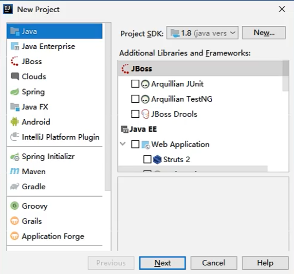


