<!-- START doctoc generated TOC please keep comment here to allow auto update -->
<!-- DON'T EDIT THIS SECTION, INSTEAD RE-RUN doctoc TO UPDATE -->
**Table of Contents**  *generated with [DocToc](https://github.com/thlorenz/doctoc)*

- [单体架构案例](#%E5%8D%95%E4%BD%93%E6%9E%B6%E6%9E%84%E6%A1%88%E4%BE%8B)
  - [1. 创建工程：引入依赖](#1-%E5%88%9B%E5%BB%BA%E5%B7%A5%E7%A8%8B%E5%BC%95%E5%85%A5%E4%BE%9D%E8%B5%96)
  - [2. 搭建环境：持久化层](#2-%E6%90%AD%E5%BB%BA%E7%8E%AF%E5%A2%83%E6%8C%81%E4%B9%85%E5%8C%96%E5%B1%82)
      - [2.1 数据建模](#21-%E6%95%B0%E6%8D%AE%E5%BB%BA%E6%A8%A1)
      - [2.2 获取数据库连接](#22-%E8%8E%B7%E5%8F%96%E6%95%B0%E6%8D%AE%E5%BA%93%E8%BF%9E%E6%8E%A5)
      - [2.3 封装通用BaseDao](#23-%E5%B0%81%E8%A3%85%E9%80%9A%E7%94%A8basedao)
      - [2.4 子类 Dao](#24-%E5%AD%90%E7%B1%BB-dao)
  - [3. 搭建环境：事务控制](#3-%E6%90%AD%E5%BB%BA%E7%8E%AF%E5%A2%83%E4%BA%8B%E5%8A%A1%E6%8E%A7%E5%88%B6)
  - [4. 搭建环境：表述层](#4-%E6%90%AD%E5%BB%BA%E7%8E%AF%E5%A2%83%E8%A1%A8%E8%BF%B0%E5%B1%82)
      - [4.1 前后端交互](#41-%E5%89%8D%E5%90%8E%E7%AB%AF%E4%BA%A4%E4%BA%92)
      - [4.2 Thymeleaf 简要工作机制](#42-thymeleaf-%E7%AE%80%E8%A6%81%E5%B7%A5%E4%BD%9C%E6%9C%BA%E5%88%B6)
      - [4.3 基类封装 ViewBaseservlet](#43-%E5%9F%BA%E7%B1%BB%E5%B0%81%E8%A3%85-viewbaseservlet)
      - [4.4 web.xml补充说明](#44-webxml%E8%A1%A5%E5%85%85%E8%AF%B4%E6%98%8E)
  - [5. 搭建环境：辅助功能](#5-%E6%90%AD%E5%BB%BA%E7%8E%AF%E5%A2%83%E8%BE%85%E5%8A%A9%E5%8A%9F%E8%83%BD)
  - [6. 业务功能：登录](#6-%E4%B8%9A%E5%8A%A1%E5%8A%9F%E8%83%BD%E7%99%BB%E5%BD%95)
    - [6.1 显示首页](#61-%E6%98%BE%E7%A4%BA%E9%A6%96%E9%A1%B5)
        - [6.1.1 流程图](#611-%E6%B5%81%E7%A8%8B%E5%9B%BE)
        - [6.1.2 创建并注册 PortalServlet](#612-%E5%88%9B%E5%BB%BA%E5%B9%B6%E6%B3%A8%E5%86%8C-portalservlet)
        - [6.1.3 编写登录表单](#613-%E7%BC%96%E5%86%99%E7%99%BB%E5%BD%95%E8%A1%A8%E5%8D%95)
    - [6.2 登录操作](#62-%E7%99%BB%E5%BD%95%E6%93%8D%E4%BD%9C)
        - [6.2.1流程图](#621%E6%B5%81%E7%A8%8B%E5%9B%BE)
        - [6.2.2创建  EmpDao 和 Empservice](#622%E5%88%9B%E5%BB%BA--empdao-%E5%92%8C-empservice)
        - [6.2.3创建登录失败异常](#623%E5%88%9B%E5%BB%BA%E7%99%BB%E5%BD%95%E5%A4%B1%E8%B4%A5%E5%BC%82%E5%B8%B8)
        - [6.2.4创建并注册 AuthServlet](#624%E5%88%9B%E5%BB%BA%E5%B9%B6%E6%B3%A8%E5%86%8C-authservlet)
    - [6.3 退出登录](#63-%E9%80%80%E5%87%BA%E7%99%BB%E5%BD%95)
  - [7 业务功能：显示奏折列表](#7-%E4%B8%9A%E5%8A%A1%E5%8A%9F%E8%83%BD%E6%98%BE%E7%A4%BA%E5%A5%8F%E6%8A%98%E5%88%97%E8%A1%A8)
      - [7.1 流程图](#71-%E6%B5%81%E7%A8%8B%E5%9B%BE)
      - [7.2 创建并注册 WorkServlet组件](#72-%E5%88%9B%E5%BB%BA%E5%B9%B6%E6%B3%A8%E5%86%8C-workservlet%E7%BB%84%E4%BB%B6)
      - [7.3 创建 MemorialsDao 和 MemorialsService](#73-%E5%88%9B%E5%BB%BA-memorialsdao-%E5%92%8C-memorialsservice)
      - [7.4 WorkServlet 方法实现](#74-workservlet-%E6%96%B9%E6%B3%95%E5%AE%9E%E7%8E%B0)
      - [7.5 页面显示](#75-%E9%A1%B5%E9%9D%A2%E6%98%BE%E7%A4%BA)
      - [7.6 登录跳转](#76-%E7%99%BB%E5%BD%95%E8%B7%B3%E8%BD%AC)
      - [7.7 测试](#77-%E6%B5%8B%E8%AF%95)
  - [8. 业务功能：显示奏折详情](#8-%E4%B8%9A%E5%8A%A1%E5%8A%9F%E8%83%BD%E6%98%BE%E7%A4%BA%E5%A5%8F%E6%8A%98%E8%AF%A6%E6%83%85)
      - [8.1 流程图](#81-%E6%B5%81%E7%A8%8B%E5%9B%BE)
      - [8.2 调整奏折列表页面的超链接](#82-%E8%B0%83%E6%95%B4%E5%A5%8F%E6%8A%98%E5%88%97%E8%A1%A8%E9%A1%B5%E9%9D%A2%E7%9A%84%E8%B6%85%E9%93%BE%E6%8E%A5)
      - [8.3 创建 MemorialsDao 和 MemorialsService](#83-%E5%88%9B%E5%BB%BA-memorialsdao-%E5%92%8C-memorialsservice)
      - [8.4 创建WorkServlet 方法](#84-%E5%88%9B%E5%BB%BAworkservlet-%E6%96%B9%E6%B3%95)
      - [8.5 详情页](#85-%E8%AF%A6%E6%83%85%E9%A1%B5)
  - [9 业务功能：批复奏折](#9-%E4%B8%9A%E5%8A%A1%E5%8A%9F%E8%83%BD%E6%89%B9%E5%A4%8D%E5%A5%8F%E6%8A%98)
      - [9.1 实现 MemorialsDao 和 MemorialsService](#91-%E5%AE%9E%E7%8E%B0-memorialsdao-%E5%92%8C-memorialsservice)
      - [9.2 WorkServlet 方法](#92-workservlet-%E6%96%B9%E6%B3%95)
  - [10. 业务功能：登录检查](#10-%E4%B8%9A%E5%8A%A1%E5%8A%9F%E8%83%BD%E7%99%BB%E5%BD%95%E6%A3%80%E6%9F%A5)
  - [11. 打包部署](#11-%E6%89%93%E5%8C%85%E9%83%A8%E7%BD%B2)

<!-- END doctoc generated TOC please keep comment here to allow auto update -->


## 单体架构案例

### 1. 创建工程：引入依赖

架构：架构其实就是项目的结构。架构是一个更大的词，通常用来形容比较大规模事物的结构

单体架构：

- 单体架构也叫all-in-one结构，就是所有代码、配置文件、各种资源都在同一个工程
- 一个项目包含一个工程
- 导出一个war 包
- 放在一个Tomcat 上运行

确定技术选型：确定我们项目中要使用哪些技术。确定技术选型、组建依赖列表、项目划分模等等这些操作其实都属于架构设计的范畴

- 项目本身所属行业的基本特点
- 项目具体的功能需求
- 项目预计访问压力程度
- 项目预计将来需要扩展的功能
- 设计项目总体的体系结构

创建工程：

- 创建工程 pro05-demo-all-in-one

持久化层所需依赖：

```xml
 <dependency>
   <groupId>mysql</groupId>
   <artifactId>mysql-connector-java</artifactId>
   <version>5.1.37</version>
 </dependency>

 <dependency>
   <groupId>com.alibaba</groupId>
   <artifactId>druid</artifactId>
   <version>1.2.8</version>
 </dependency>

<dependency>
   <groupId>commons-dbutils</groupId>
   <artifactId>commons-dbutils</artifactId>
   <version>1.6</version>
 </dependency>
```

表述层所需依赖：

```xml
    <dependency>
      <groupId>javax.servlet</groupId>
      <artifactId>javax.servlet-api</artifactId>
      <version>3.1.0</version>
      <scope>provided</scope>
    </dependency>
    <dependency>
      <groupId>org.thymeleaf</groupId>
      <artifactId>thymeleaf</artifactId>
      <version>3.0.11.RELEASE</version>
    </dependency>
```

辅助功能所需依赖：

```xml
<dependency>
    <groupId>junit</groupId>
    <artifactId>junit</artifactId>
    <version>4.12</version>
    <scope>test</scope>
</dependency>
<dependency>
    <groupId>ch.qos.logback</groupId>
    <artifactId>logback-classic</artifactId>
    <version>1.2.3</version>
    <scope>test</scope>
</dependency>
```

建包：

| package 功能          | package 名称                          |
| --------------------- | ------------------------------------- |
| 主包                  | com.sin.imperial.court                |
| 子包[实体类]          | com.sin.imperial.court.entity         |
| 子包[Servlet基类包]   | com.sin.imperial.court.servlet.base   |
| 子包[Servlet模块包]   | com.sin.imperial.court.servlet.module |
| 子包[Service接口包]   | com.sin.imperial.court.service.api    |
| 子包[Service实现类包] | com.sin.imperial.court.service.impl   |
| 子包[Dao接口包]       | com.sin.imperial.court.dao.api        |
| 子包[Dao实现类包]     | com.sin.imperial.court.dao.impl       |
| 子包[Filter]          | com.sin.imperial.court.filter         |
| 子包[异常类包]        | com.sin.imperial.court.exception      |
| 子包[工具类]          | com.sin.imperial.court.util           |
| 子包[测试类]          | com.sin.imperial.court.test           |

### 2. 搭建环境：持久化层

##### 2.1 数据建模

- 物理建模：

```sql
create database db_imperial_court;

use db_imperial_court;

create table t_emp
(
    emp_id         int primary key auto_increment,
    emp_name       char(100) not null,
    emp_position   char(100) not null,
    login_account  char(100) not null unique,
    login_password char(100) not null
);

insert into t_emp(emp_name, emp_position, login_account, login_password)
values ('爱新觉罗·玄烨', 'emperor', 'xiaoxuanzi1654', '25325C896624D444B2E241807DCAC98B'), # 16540504
       ('纳兰明珠', 'minister', 'brightball1635', 'A580D0EF93C22036C859E194C14CB777'),   # 16351119
       ('赫舍里·索额图', 'minister', 'tutu1636', 'E40FD7D49B8B7EF46F47407D583C3538'); # 17030921

create table t_memorials
(
    memorials_id          int primary key auto_increment,
    memorials_title       char(100)     not null,
    memorials_content     varchar(5000) not null,
    memorials_emp         int           not null,
    memorials_create_time char(100),
    feedback_time       char(100),
    feedback_content    varchar(1000),
    memorials_status      int           not null
);

insert into t_memorials(memorials_title,
                      memorials_content,
                      memorials_emp,
                      memorials_create_time,
                      feedback_time,
                      feedback_content,
                      memorials_status)
values ('浙江巡抚奏钱塘堤决口疏', '皇上啊，不好啦！钱塘江发大水啦！堤坝冲毁啦！您看这咋弄啊！', 2, '1690-05-07', null, null, 0),
       ('左都御史参鳌拜圈地疏', '皇上啊，鳌拜这厮不是东西呀！占老百姓的地哇！还打人呀！您看咋弄啊！', 3, '1690-04-14', null, null, 0),
       ('都察院劾吴三桂不臣疏', '皇上啊，不得了啦！吴三桂那孙子想造反呀！', 2, '1693-11-18', null, null, 0),
       ('兵部奏准噶尔犯境疏', '皇上啊，不得了啦！葛尔丹要打过来了呀！', 3, '1693-11-18', null, null, 0),
       ('朝鲜使臣朝拜事宜呈皇上御览', '皇上啊！朝鲜国的人要来啦！咱们请他们吃猪肉炖粉条子吧！', 2, '1680-06-11', null, null, 0),
       ('英吉利炮舰购买事宜疏', '皇上啊！英国的小船船咱们买多少啊？', 3, '1680-06-12', null, null, 0),
       ('劾杭州织造贪墨疏', '皇上啊！杭州织造有问题啊！', 2, '1680-06-13', null, null, 0),
       ('禀畅春园落成疏', '皇上啊！畅春园修好了哇！您啥时候过来看看呀！', 3, '1680-06-14', null, null, 0),
       ('请旨木兰秋狝疏', '皇上啊！秋天到啦，又该打猎啦！', 2, '1680-06-15', null, null, 0),
       ('核准西北军饷银两疏', '皇上啊！您看看这钱数算的对不对呀！', 3, '1680-06-16', null, null, 0),
       ('请旨裁撤三藩疏', '皇上啊！咱们不裁撤三藩就芭比Q了哇！', 2, '1680-06-17', null, null, 0),
       ('蒙古王公进京朝拜疏', '皇上啊！蒙古王公要来啦！咱们请他们吃猪肉炖粉条子吧！', 3, '1680-06-18', null, null, 0),
       ('礼部请旨九阿哥赐名疏', '皇上啊！您看九阿哥该叫什么名字呀？', 2, '1680-06-19', null, null, 0),
       ('户部尚书请旨告老还乡疏', '皇上啊！臣想回家养老啦！您看看啥时候给臣把俸禄结一下啊！', 3, '1680-06-20', null, null, 0),
       ('查江宁织造贪墨疏', '皇上啊！江宁织造有问题啊！', 2, '1680-06-21', null, null, 0)
       ;

```

`Emp`：`Emp`实体类（自行补充set\get\toString）

```java
package com.sin.imperial.court.entity;
public class Emp {

        private Integer empId;
        
        private String empName;
        
        private String empPosition;
        
        private String loginAccount;
        
        private String loginPassword;
}
```

`Memorials`：`Memorials`实体类（自行补充set\get\toString）

```java
package com.sin.imperial.court.entity;

public class Memorials {
    
    private Integer memorialsId;

    private String memorialsTitle;

    private String memorialsContent;

    // 奏折摘要数据库没有，这里是为了配置页面显示
    private String memorialsContentDigest;

    private Integer memorialsEmp;

    // 员工姓名数据库没有，这里是为了配合页面显示
    private String memorialsEmpName;

    private String memorialsCreateTime;

    private String feedbackTime;

    private String feedbackContent;

    private Integer memorialsStatus;

}
```

##### 2.2 获取数据库连接

数据库连接信息配置：`src/main/resources/jdbc.properties`：

```properties
driverClassName=com.mysql.cj.jdbc.Driver
url=jdbc:mysql://127.0.0.1:3306/db_imperial_court?useUnicode=true&characterEncoding=utf8
username=root
password=123456
initialSize=10
maxActive=20
maxWait=10000
```

获取数据库连接：创建JDBCUtils 工具类

JDBC工具类对事务的保证：

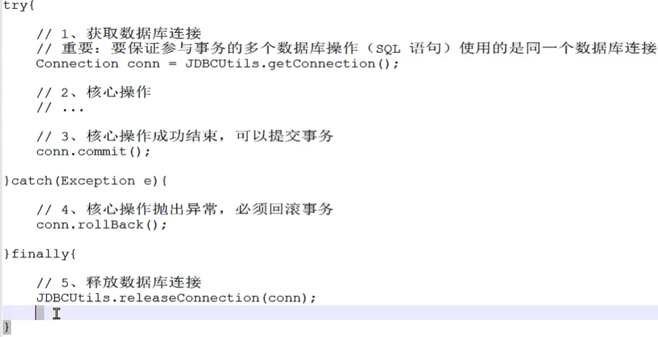

(1)在一个方法内控制事务：如果在每一个 Service 方法中都写下面代码，那么代码重复性就太高了

```java
try {
    //1、获取数据库连接
    //重要:要保证参与事务的多个数据库操作(SQL语句)使用的是同一个数据库连接
    Connection conn = JDBCUtils.getConnection();
    // 2.核心操作
    //3、核心操作成功结束，可以提交事务
    conn.commit();
} catch (Exception e) {
    //4、核心操作抛出异常，必须回滚事务
    conn.rollBack();
} finally {
    //5、释放数据库连接
    JDBCUtils.releaseConnection(conn);
}
```

(2)将重复代码抽取到 Filter

```java
public void doFilter(ServletRequest request, ServletResponse response, FilterChain chain) {
    try {
        //1、获取数据库连接
        //重要:要保证参与事务的多个数据库操作(SQL语句)使用的是同一个数据库连接
        Connection conn = JDBCUtils.getConnection();
        //2、核心操作:通过 chain 对象放行当前请求
        // 这样就可以保证当前请求覆盖的 Servlet 方法、Service 方法、Dao 方法都在同一个事务中
        //同时各个请求都经过这个 Fi1ter，所以当前事务控制的代码在这里只写一遍就行了避免了代码的几余。
        chain.doFilter(request,response);
        //3、核心操作成功结束，可以提交事务
        conn.commit();
    } catch (Exception e) {
        //4、核心操作抛出异常，必须回滚事务
        conn.rollBack();
    } finally {
        //5、释放数据库连接
        JDBCUtils.releaseConnection(conn);
    }
}
```

(3)数据的跨方法传递：

- 通过 JDBCUtils 工具类获取到的 Connection 对象需要传递给 Dao 方法，让事务涉及到的所有 Dao 方法用的都是同一个 Connection 对象
- 但是 Connection 对象无法通过 chain.doFilter()方法以参数的形式传递过去
- 所以从获取到 Connection 对象到使用 Connection 对象中间隔着很多不是我们自己声明的方法——无法决定它们的参数
- 使用ThreadLocal 实现Connection 对象变量的跨方法传递


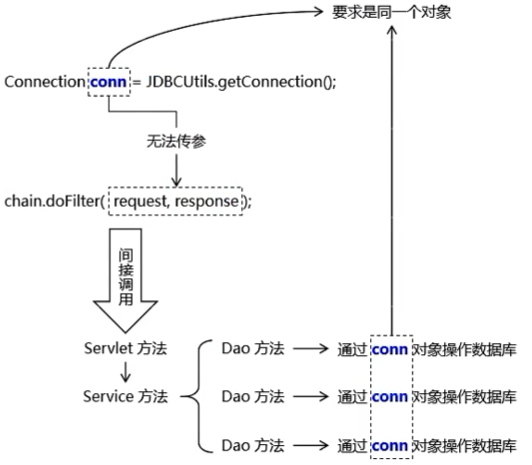

(4)ThreadLocal 对象的功能：

- ThreadLocal全类名： `java.lang.ThreadLocal<T>`
- 泛型T：要绑定到当前线程的数据的类型
- 具体三个主要的方法：

| 方法名       | 功能                       |
| ------------ | -------------------------- |
| set(T value) | 将数据绑定到当前线程       |
| get()        | 从当前线程获取已绑定的数据 |
| remove()     | 将数据从当前线程移除       |

- java代码：

```java
// 由于 ThreadLocal 对象需要作为绑定数据时 k-v 对中的 key，所以要保证唯一性
// 加 static 声明为静态资源即可保证唯一性
private static ThreadLocal<Connection> threadLocal = new ThreadLocal<>();
```


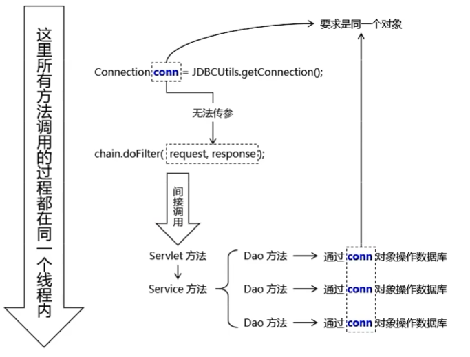

(5)`JDBCUtils`完整代码：

```java
package com.sin.imperial.court.util;

import com.alibaba.druid.pool.DruidDataSourceFactory;

import javax.sql.DataSource;
import java.io.InputStream;
import java.sql.Connection;
import java.sql.SQLException;
import java.util.Properties;

/**
 * 功能1：从数据源获取数据库连接
 * 功能2：从数据库获取到数据库连接后，绑定到本地线程（借助 ThreadLocal）
 * 功能3：释放线程时和本地线程解除绑定
 */
public class JDBCUtils {

    // 数据源成员变量设置成静态资源，保证对象的单例性；同时保证静态方法中可以访问
    private static DataSource dataSource;

    // 由于 ThreadLocal 对象需要作为绑定数据时 k-v 对中的 key，所以要保证唯一性
    // 加 static 声明为静态资源即可保证唯一性
    private static ThreadLocal<Connection> threadLocal = new ThreadLocal<Connection>();

    // 在静态代码块中初始化数据源
    static {
        //操作思路分析：
        // 从 jdbc.properties 文件中读取连接数据库的信息
        // 为了保证程序代码的可移植性，需要基于一个确定的基准来读取这个文件
        // 确定的基准: 类路径的根目录。resources 目录下的内容经过构建操作中打包操作后确定放在
        //  WEB-INFO/classes 目录下。 WEB-INFO/classes : 目录存放编译好的 *.class 字节码文件，
        //  所以这个目录我们就称之为类路径。
        // 类路径无论在本地运行还是在服务器端运行都是一个确定的基准。
        //操作具体实现：
        try {
            //1、获取当前类的类加载器
            ClassLoader classLoader = JDBCUtils.class.getClassLoader();

            //2、通过类加载器对象从类路径根目录下读取文件
            InputStream stream = classLoader.getResourceAsStream("jdbc.properties");

            //3、使用 Properties 类封装属性文件中的数据
            Properties properties = new Properties();
            properties.load(stream);

            //4、根据 Properties 对象（已经封装了数据库连接信息）来创建数据源对象
            dataSource = DruidDataSourceFactory.createDataSource(properties);
        } catch (Exception e) {
            e.printStackTrace();
            //为了避免在真正抛出异常后， catch 块捕获到异常从而掩盖问题，
            //这里将所捕获到的异常封装为运行异常继续抛出
            throw new RuntimeException(e);
        }
    }

    /**
     * 工具方法：获取数据库连接并返回
     * @return
     */
    public static Connection getConnection(){
        Connection connection = null;
        try {
            // 1、尝试从当前线程检查是否存在已经绑定的 Connection 对象
            connection = threadLocal.get();
            // 2、检查 Connection 对象是否为 null
            if (connection == null) {
                // 3、如果为 null，则从数据源获取数据库连接
                connection = dataSource.getConnection();
                // 4、获取到数据库连接后绑定到当前线程
                threadLocal.set(connection);
            }
        } catch (SQLException e) {
            e.printStackTrace();
            // 为了调用工具方法方便，编译时异常不往外抛
            // 为了不掩盖问题，捕获到的编译时异常封装为运行时异常抛出
            throw new RuntimeException(e);
        }
        return connection;
    }

    /**
     * 释放数据库连接
     */
    public static void releaseConnection(Connection connection) {
        if (connection != null) {
            try {
                // 在数据库连接池中将当前连接对象标记为空闲
                connection.close();
                // 将当前数据库连接从当前线程上移除
                threadLocal.remove();
            } catch (SQLException e) {
                e.printStackTrace();
                throw new RuntimeException(e);
            }
        }
    }

}
```

##### 2.3 封装通用BaseDao

1.创建 `QueryRunner` 对象

2.通用增删查改方法

- 特别说明：在 BaseDao 方法中获取数据库连接但是不做释放，因为我们要在控制事务的 Filter 中统一释放

```java
/**
     * 通用的增删改查方法，insert、delete、update操作都可以用这个方法
     * @param sql        执行的sql语句
     * @param parameters 语句的参数
     * @return 受影响的行数
     */
    public int update(String sql, Object... parameters) {
        try {
            Connection connection = JDBCUtils.getConnection();
            int affectedNumbers = 0;
            affectedNumbers = runner.update(connection, sql, parameters);
            return affectedNumbers;
        } catch (SQLException e) {
            e.printStackTrace();
            // 如果真的抛出异常，则将编译时异常封装成运行时异常抛出
            throw new RuntimeException(e);
        }
    }
```

3.查询多个对象

```java
/**
 * 查询返回多个对象的方法
 *
 * @param sql         执行查询操作的SQL语句
 * @param entityClass 实体类的class对象
 * @param parameters  SQL语句的参数
 * @return 查询结果
 */
public List<T> getBeanList(String sql, Class<T> entityClass, Object... parameters) {
    // 获取数据库链接
    try {
        Connection connection = JDBCUtils.getConnection();
        return runner.query(connection, sql, new BeanListHandler<T>(entityClass), parameters);
    } catch (SQLException e) {
        throw new RuntimeException(e);
    }
}
```

4.修改数据

```java
/**
 * 通用的增删改查方法，insert、delete、update操作都可以用这个方法
 *
 * @param sql        执行的sql语句
 * @param parameters 语句的参数
 * @return 受影响的行数
 */
public int update(String sql, Object... parameters) {
    try {
        Connection connection = JDBCUtils.getConnection();
        int affectedNumbers = 0;
        affectedNumbers = runner.update(connection, sql, parameters);
        return affectedNumbers;
    } catch (SQLException e) {
        e.printStackTrace();
        // 如果真的抛出异常，则将编译时异常封装成运行时异常抛出
        throw new RuntimeException(e);
    }
}
```

5.测试 通用BaseDao

```java
public class ImperialCourtTest {

    private final BaseDao<Emp> baseDao = new BaseDao<>();

    /**
     * 测试baseDao：查询单个对象
     */
    @Test
    public void testGetSingleBean() {
        String sql = "select emp_id empId,emp_name empName,emp_position empPosition,login_account loginAccount,login_password loginPassword from t_emp where emp_id = ? ";
        Emp emp = baseDao.getSingleBean(sql, Emp.class, 1);
        System.out.println("emp: " + emp);
        // emp: Emp{empId=1, empName='爱新觉罗·玄烨', empPosition='emperor', loginAccount='xiaoxuanzi1654', loginPassword='25325C896624D444B2E241807DCAC98B'}
    }


    /**
     * 测试baseDao：查询多个对象
     */
    @Test
    public void testGetBeanList() {
        String sql = "select emp_id empId,emp_name empName,emp_position empPosition,login_account loginAccount,login_password loginPassword from t_emp";
        List<Emp> empList = baseDao.getBeanList(sql, Emp.class);
        for (Emp emp : empList) {
            System.out.println("emp: " + emp);
        }
    }


    /**
     * 测试baseDao：通用的增删改查方法
     */
    @Test
    public void testUpdate() {
        String sql = "update t_emp set emp_position = ? where emp_id = ?";
        String empPosition = "minister";
        String empId = "3";
        int affectedRowNumber = baseDao.update(sql, empPosition, empId);
        System.out.println("affectedRowNumber =" + affectedRowNumber);
    }

}
```

##### 2.4 子类 Dao

创建接口和实现类：

`EmpDao`：

```java
public interface EmpDao {
}
```

`EmpDaoImpl`：

```java
import com.sin.imperial.court.dao.BaseDao;
import com.sin.imperial.court.dao.api.EmpDao;
import com.sin.imperial.court.entity.Emp;
public class EmpDaoImpl extends BaseDao<Emp> implements EmpDao {
}
```

`MemorialsDao`：

```java
public interface MemorialsDao {
}
```

`MemorialsDaoImpl`：

```java
import com.sin.imperial.court.dao.BaseDao;
import com.sin.imperial.court.dao.api.MemorialsDao;
import com.sin.imperial.court.entity.Memorials;

public class MemorialsDaoImpl extends BaseDao<Memorials> implements MemorialsDao {
}
```

### 3. 搭建环境：事务控制

事务控制总体思路：

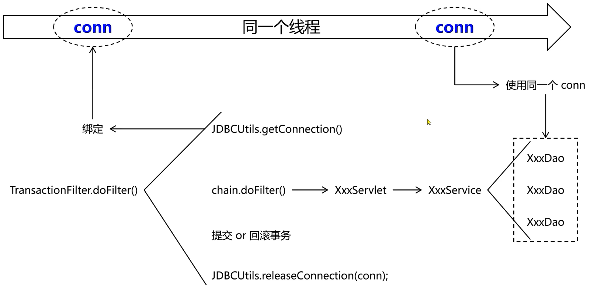

1.创建 Filter 类

```java
package com.sin.imperial.court.filter;
import com.sin.imperial.court.util.JDBCUtils;
import javax.servlet.*;
import javax.servlet.http.HttpServletRequest;
import java.io.IOException;
import java.sql.Connection;
import java.sql.SQLException;
import java.util.HashSet;
import java.util.Set;
public class TransactionFilter implements Filter {

    @Override
    public void init(FilterConfig filterConfig) throws ServletException {

    }

    @Override
    public void doFilter(ServletRequest servletRequest, ServletResponse servletResponse, FilterChain filterChain) throws IOException, ServletException {
        Connection connection = null;
        try {
            // 1.获取数据库链接
            connection = JDBCUtils.getConnection();

            // 重要操作:关闭自动提交功能
            connection.setAutoCommit(false);

            // 2.核心操作
            filterChain.doFilter(servletRequest, servletResponse);

            // 3.提交事务
            connection.commit();
        } catch (Exception e) {
            try {
                // 4.回滚事务
                connection.rollback();
            } catch (SQLException ex) {
                ex.printStackTrace();
            }

            // 页面显示:将这里捕获到的异常发送到指定页面显示
            // 获取异常信息
            String message = e.getMessage();
            // 将异常信息存入请求域
            request.setAttribute("systemMessage", message);
            //  将请求转发到指定页面
            request.getRequestDispatcher("/").forward(request, servletResponse);
        } finally {
            // 5.释放数据库连接
            JDBCUtils.releaseConnection(connection);
        }

    }

    @Override
    public void destroy() {

    }
}
```

2.静态资源扩展名集合

- 静态资源不需要进行事务控制，检测到静态资源就放行。否则会造成性能损耗


```java
package com.sin.imperial.court.filter;

import com.sin.imperial.court.util.JDBCUtils;

import javax.servlet.*;
import javax.servlet.http.HttpServletRequest;
import java.io.IOException;
import java.sql.Connection;
import java.sql.SQLException;
import java.util.HashSet;
import java.util.Set;

public class TransactionFilter implements Filter {


    // 声明集合保存静态资源护展名
    private static final Set<String> staticResourceExtNameset;

    static {
        staticResourceExtNameset = new HashSet<String>();
        staticResourceExtNameset.add(".png");
        staticResourceExtNameset.add(".jpg");
        staticResourceExtNameset.add(".css");
        staticResourceExtNameset.add(".js");
    }

    @Override
    public void init(FilterConfig filterConfig) throws ServletException {

    }

    @Override
    public void doFilter(ServletRequest servletRequest, ServletResponse servletResponse, FilterChain filterChain) throws IOException, ServletException {

        // 前置操作:排除静态资源
        HttpServletRequest request = (HttpServletRequest) servletRequest;
        String servletPath = request.getServletPath();
        if (servletPath.contains(".")) {
            String extName = servletPath.substring(servletPath.lastIndexOf("."));
            if (staticResourceExtNameset.contains(extName)) {
                // 如果检测到当前请求确实是静态资源，则直接放行，不做事务作
                filterChain.doFilter(servletRequest, servletResponse);
                //当前方法立即返回
                return;
            }
        }

        Connection connection = null;
        try {
            // 1.获取数据库链接
            connection = JDBCUtils.getConnection();

            // 重要操作:关闭自动提交功能
            connection.setAutoCommit(false);

            // 2.核心操作
            filterChain.doFilter(servletRequest, servletResponse);

            // 3.提交事务
            connection.commit();
        } catch (Exception e) {
            try {
                // 4.回滚事务
                connection.rollback();
            } catch (SQLException ex) {
                ex.printStackTrace();
            }

            // 页面显示:将这里捕获到的异常发送到指定页面显示
            // 获取异常信息
            String message = e.getMessage();
            // 将异常信息存入请求域
            request.setAttribute("systemMessage", message);
            //  将请求转发到指定页面
            request.getRequestDispatcher("/").forward(request, servletResponse);
        } finally {
            // 5.释放数据库连接
            JDBCUtils.releaseConnection(connection);
        }

    }

    @Override
    public void destroy() {

    }
}
```

3.配置 web.xml

```java
<!DOCTYPE web-app PUBLIC
        "-//Sun Microsystems, Inc.//DTD Web Application 2.3//EN"
        "http://java.sun.com/dtd/web-app_2_3.dtd" >

<web-app>
    <display-name>Archetype Created Web Application</display-name>

    <filter>
        <filter-name>txFilter</filter-name>
        <filter-class>com.sin.imperial.court.filter.TransactionFilter</filter-class>
    </filter>

    <filter-mapping>
        <filter-name>txFilter</filter-name>
        <url-pattern>/*</url-pattern>
    </filter-mapping>


</web-app>
```

4.注意点

- 确保异常回滚：在程序执行的过程中，必须让所有 catch 块都把编译时异常转换为运行时异常抛出。如果不这么做，在TransactionFilter 中 catch 就无法捕获到底层抛出的异常，那么该回滚的时候就无法回滚

- 谨防数据库连接提前释放：由于诸多操作都是在使用同一个数据库连接，那么中间任何一个环节释放数据库连接都会导致后续操作无法正常完成


### 4. 搭建环境：表述层

##### 4.1 前后端交互

后端工程师与前端工程师交互方式：服务器端渲染、前后端分离

服务器端渲染：除了我们熟悉的JSP，还有Velocity、Freemarker、Thymeleaf等视图模板技术。虽然具体语法各不相同。但是它们都有一个共通的特点，就是在固定内容中可以穿插表达式等形式的动态内容。将视图模板中的动态内容转换为对应的Java代码并执行，然后使用计算得到的具体数据替换原来的动态部分。这样整个文件的动态内容就可以作为确定的响应结果返回给浏览器。在这种模式下，前端工程师将前端页面全部开发完成，交给后端程序员加入到项目中。此时不可避免的需要后端程序员根据需要对前端代码进行补充和调整

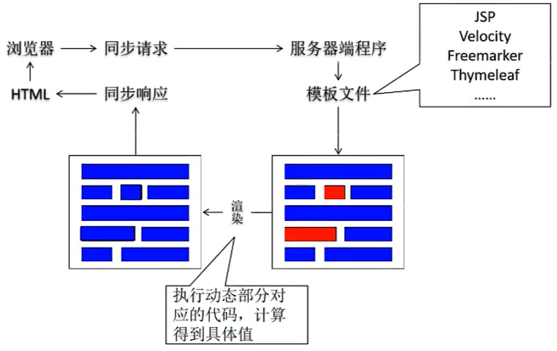

前后端分离：前后端分离模式下，前端程序和后端程序使用JSON格式进行交互，所以项目启动时前端工程和后端工程师需要坐在一起开会，商量确定JSON格式的具体细节。然后分头开发。后端工程师在把后端的代码发布到测试服务器前，前端工程师无法调用后端程序拿到真实数据，所以使用Mockjs生成假数据。直到后端工程师开发完成，后端程序发布到了测试服务器上，前端工程师再从Mockjs切换到实际后端代码

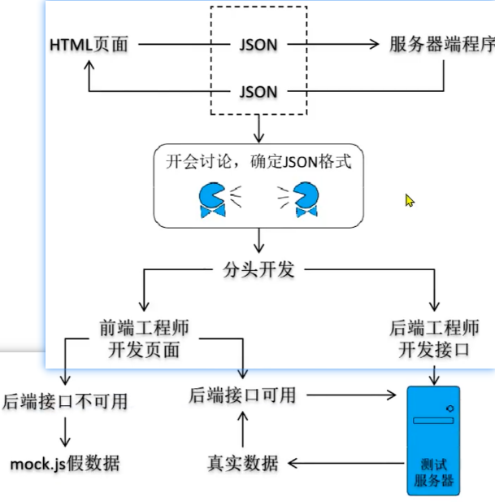


##### 4.2 Thymeleaf 简要工作机制

视图模板技术 Thymeleaf

1.初始化阶段：

- 目标：创建TemplateEngine （模板引擎）对象
- 封装：因为对每一个请求来说，TemplateEngine 对象使用的都是同一个，所以在初始化阶段准备好

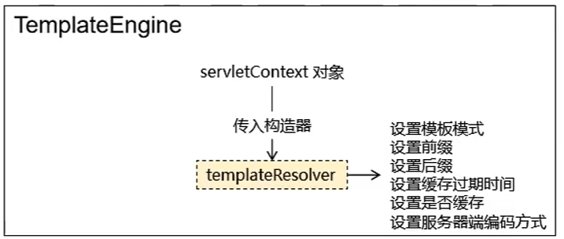

2.请求处理阶段：

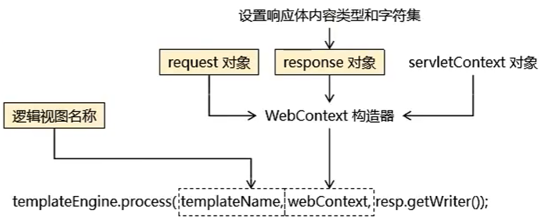

3.逻辑视图与物理视图：

- 假设有下列页面地址，这样的地址可以直接访问到页面本身，称之为物理视图。而将物理视图中前面、后面的固定内容抽取出来让每次请求指定中间变化部分即可，那么中间变化部分就叫逻辑视图

```
/WEB-INF/pages/apple.html
/WEB-INF/pages/banana.html
/WEB-INF/pages/orange.html
/WEB-INF/pages/grape.html
/WEB-INF/pages/egg.html
```

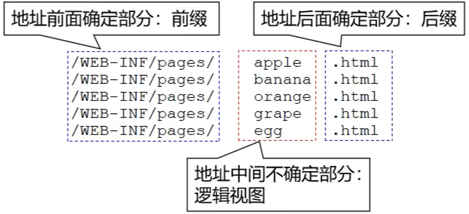

##### 4.3 基类封装 ViewBaseservlet

ViewBaseservlet 完整代码：为了简化视图页面处理过程，我们将 Thymeleaf 模板引擎的初始化和请求处理过程封装到一个 Servet 基类中：ViewBaseServlet。以后负责具体模块业务的 Servlet 继承该基类即可直接使用。特别提醒：这个类不需要掌握，因为以后都被框架封装了

```java
package com.sin.imperial.court.servlet.base;

import org.thymeleaf.TemplateEngine;
import org.thymeleaf.context.WebContext;
import org.thymeleaf.templatemode.TemplateMode;
import org.thymeleaf.templateresolver.ServletContextTemplateResolver;

import javax.servlet.ServletContext;
import javax.servlet.ServletException;
import javax.servlet.http.HttpServlet;
import javax.servlet.http.HttpServletRequest;
import javax.servlet.http.HttpServletResponse;
import java.io.IOException;

/**
 * 处理视图模板文件的 servlet 基类
 */
public class ViewBaseServlet extends HttpServlet {

    private TemplateEngine templateEngine;

    @Override
    public void init() throws ServletException {
        // 1.获取ServletContest对象
        ServletContext servletContext = this.getServletContext();

        // 2.创建ThymeLeaf解析器对象
        ServletContextTemplateResolver templateResolver = new ServletContextTemplateResolver(servletContext);

        // 3.给解析对象设置参数
        // 3.1 HTML是默认模式，明确设置是为了代码更容易理解
        templateResolver.setTemplateMode(TemplateMode.HTML);
        // 3.2 设置前缀
        String viewPrefix = servletContext.getInitParameter("view-prefix");
        templateResolver.setPrefix(viewPrefix);
        // 3.3 设置后缀
        String viewSuffix = servletContext.getInitParameter("view-suffix");
        templateResolver.setSuffix(viewSuffix);
        // 3.4 设置缓存过期时间（毫秒）
        templateResolver.setCacheTTLMs(60000L);
        // 3.5 设置是否缓存
        templateResolver.setCacheable(true);
        // 3.6 设置服务器端编码方式
        templateResolver.setCharacterEncoding("UTF-8");


        // 4.创建模板引擎对象
        templateEngine = new TemplateEngine();
        // 5.给模板引擎对象设贾模板解析器
        templateEngine.setTemplateResolver(templateResolver);
    }


    protected void processTemplate(String templateName, HttpServletRequest req, HttpServletResponse resp) throws IOException {
        // 1.设贾响应体内容类型和字符集
        resp.setContentType("text/html;charset=UTF-8");

        // 2.创建WebContext对象
        WebContext webcontext = new WebContext(req, resp, getServletContext());

        // 3.处理模板数据
        templateEngine.process(templateName, webcontext, resp.getWriter());
    }

}
```

web.xml声明初始化参数：

```xml
<!DOCTYPE web-app PUBLIC
        "-//Sun Microsystems, Inc.//DTD Web Application 2.3//EN"
        "http://java.sun.com/dtd/web-app_2_3.dtd" >


<web-app>
    <display-name>Archetype Created Web Application</display-name>

    <!-- 配置web 应用初始化参数指定视图前缀、后缀 -->
    <!--物理视图举例: webapp/WEB-INF/pages/index.html-->
    <!--对应逻辑视图:index-->
    <context-param>
        <param-name>view-prefix</param-name>
        <param-value>/WEB-INF/pages/</param-value>
    </context-param>
    <context-param>
        <param-name>view-suffix</param-name>
        <param-value>.html</param-value>
    </context-param>
</web-app>
```

2.ModelBaseServlet

需求：

- 根据业务对模块进行划分
- 在web.xml中注册了以后，访问用户模块都是同一个地址，如何区分调用的具体是登录、注册、还是退出登录？ 

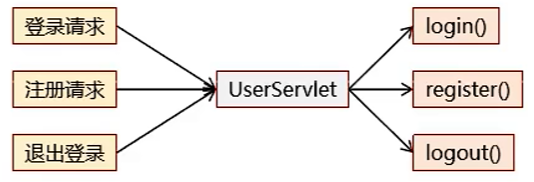

HttpServlet 的局限：

- HttpServlet 只有doGet()方法 和 doPost()方法
- doGet()方法：处理 GET 请求
- doPost()方法：处理 POST 请求

解决方案：

- 对Httpservlet 进行拓展
- 每个请求附带一个请求参数，表明自己要调用的目标方法
- Servet 根据目标方法名通过反射调用目标方法

ModelBaseServlet 完整代码：

```java
package com.sin.imperial.court.servlet.base;
import javax.servlet.ServletException;
import javax.servlet.http.HttpServletRequest;
import javax.servlet.http.HttpServletResponse;
import java.io.IOException;
import java.lang.reflect.Method;

public class ModelBaseServlet extends ViewBaseServlet {

    protected void doGet(HttpServletRequest request, HttpServletResponse response) throws ServletException, IOException {
        // 在doGet()方法中调用doPost()方法，这样就可以在doPost()方法中集中处理所有请求
        doPost(request, response);
    }

    protected void doPost(HttpServletRequest request, HttpServletResponse response) throws ServletException, IOException {

        // 1.在所有request.getParameter()前面设置解析请求体的字符集
        request.setCharacterEncoding("UTF-8");

        // 2.从请求参数中获取method对应的数据
        String method = request.getParameter("method");

        // 3.通过反射调用method对应的方法
        // 3.1 获职Class对象
        Class<? extends ModelBaseServlet> clazz = this.getClass();

        try {
            // 1.获取method对应的Method对象
            Method methodObject = clazz.getDeclaredMethod(method, HttpServletRequest.class, HttpServletResponse.class);

            // 2.打开访问权限
            methodObject.setAccessible(true);

            // 3.通过Method对象调用目标方法
            methodObject.invoke(this, request, response);
        } catch (Exception e) {
            e.printStackTrace();
            // 特别提醒: 为了配合 TransactionFilter 实现事务控制，捕获的异常必须抛出
            throw new RuntimeException(e);
        }
    }

}
```

继承关系：

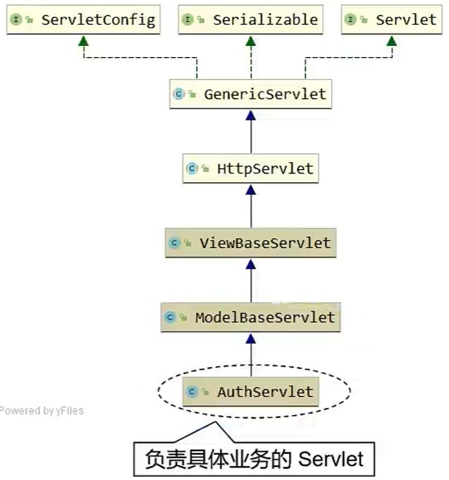

##### 4.4 web.xml补充说明

在 Java Web 项目中，`web.xml` 是一个关键的部署描述文件，它位于 `WEB-INF` 目录下，用于配置和管理 Web 应用程序的各种组件。它的主要作用包括：配置Servlet、过滤器（Filter）配置、监听器（Listener）配置、配置欢迎页面（Welcome File）、

1.配置Servlet：

- `web.xml` 用于定义和配置 Servlet。可以在文件中映射 Servlet 路径和处理的 URL，从而将客户端请求分配给特定的 Servlet 类处理
- 以下代码表示将 `/myServlet` 的请求映射到 `com.example.MyServlet` 类

```xml
<servlet>
    <servlet-name>MyServlet</servlet-name>
    <servlet-class>com.example.MyServlet</servlet-class>
</servlet>
<servlet-mapping>
    <servlet-name>MyServlet</servlet-name>
    <url-pattern>/myServlet</url-pattern>
</servlet-mapping>
```

2.过滤器（Filter）配置：

- `web.xml` 允许配置过滤器，这些过滤器可以在请求到达 Servlet 前或响应返回客户端之前对请求/响应进行处理。例如可以用来做日志记录、身份验证、压缩等操作
- 如下的过滤器 `MyFilter` 将应用于所有路径 (`/*`)

```xml
<filter>
    <filter-name>MyFilter</filter-name>
    <filter-class>com.example.MyFilter</filter-class>
</filter>
<filter-mapping>
    <filter-name>MyFilter</filter-name>
    <url-pattern>/*</url-pattern>
</filter-mapping>
```

3.监听器（Listener）配置：

- `web.xml` 还可以定义监听器，监听器可以在 Web 应用的生命周期内执行特定的操作，如在应用启动时执行某些初始化任务，或在应用关闭时清理资源
- 如下监听器可以监听如 `ServletContext`、`Session` 等的创建和销毁事件

```xml
<listener>
    <listener-class>com.example.MyListener</listener-class>
</listener>
```

4. 配置欢迎页面（Welcome File）：

- `web.xml` 可以设置 Web 应用的欢迎页面，当用户访问 Web 应用的根路径时，自动跳转到指定的欢迎页面
- 如果用户访问 `/`，系统会首先尝试加载 `index.html`，如果不存在则加载 `index.jsp`

```xml
<welcome-file-list>
    <welcome-file>index.html</welcome-file>
    <welcome-file>index.jsp</welcome-file>
</welcome-file-list>
```

5.错误页面配置：

- 通过 `web.xml`，你可以配置自定义的错误页面，用于处理特定的 HTTP 错误代码或 Java 异常
- 这里为 404 错误和所有 `Exception` 异常设置了自定义的错误页面

```xml
<error-page>
    <error-code>404</error-code>
    <location>/error404.jsp</location>
</error-page>
<error-page>
    <exception-type>java.lang.Exception</exception-type>
    <location>/error.jsp</location>
</error-page>
```

6.会话超时（Session Timeout）设置

- 可以在 `web.xml` 中设置会话超时时间，单位为分钟
- 这里设置了会话在 30 分钟后过期

```xml
<session-config>
    <session-timeout>30</session-timeout>
</session-config>
```

7.上下文参数（Context Parameters）配置

- `web.xml` 允许定义全局的上下文参数，这些参数在整个应用中都可以访问，通常用于全局配置，例如数据库连接信息等

```xml
<context-param>
    <param-name>dbURL</param-name>
    <param-value>jdbc:mysql://localhost:3306/mydb</param-value>
</context-param>
```

8.安全性配置：

- 可以在 `web.xml` 中进行基本的安全配置，例如声明访问控制约束，要求某些 URL 只能由特定角色访问
- 以下配置表示只有角色为 `admin` 的用户才能访问 `/admin/` 下的资源

```xml
<security-constraint>
    <web-resource-collection>
        <web-resource-name>Admin Pages</web-resource-name>
        <url-pattern>/admin/*</url-pattern>
    </web-resource-collection>
    <auth-constraint>
        <role-name>admin</role-name>
    </auth-constraint>
</security-constraint>
```

### 5. 搭建环境：辅助功能

1.常量类

```java
package com.sin.imperial.court.constant;
public class ImperialCourtConst {

    public static final String LOGIN_FAILED_MESSAGE = "账号、密码错误，不可进宫!";

    public static final String ACCESS_DENIED_MESSAGE = "宫闱禁地，不得擅入!";

}
```

2.MD5 加密工具方法

```java
package com.sin.imperial.court.util;

import java.math.BigInteger;
import java.security.MessageDigest;
import java.security.NoSuchAlgorithmException;

public class MD5Util {


    /**
     * 针对明文字符串执行MD5加密
     * @param source
     * @return
     */
    public static String encode(String source) {
        // 1.判断明文字符串是否有效
        if (source == null || "".equals(source)) {
            throw new RuntimeException("用于加密的明文不可为空");
        }

        // 2.声明算法名称
        String algorithm = "md5";

        // 3.获取MessageDigest对象
        MessageDigest messageDigest = null;
        try {
            messageDigest = MessageDigest.getInstance(algorithm);
        } catch (NoSuchAlgorithmException e) {
            e.printStackTrace();
            throw new RuntimeException(e);
        }

        // 4.获取明文字符申对应的字节数组
        byte[] input = source.getBytes();

        // 5.执行加密
        byte[] output = messageDigest.digest(input);

        // 6.创建BigInteger对象
        int sigNum = 1;
        BigInteger bigInteger = new BigInteger(sigNum, output);

        // 7.按照16进制将bigInteger的值转换为字符串
        int radix = 16;
        String encoded = bigInteger.toString(radix).toUpperCase();
        return encoded;
    }

}
```

3.日志配置文件：logback.xml

```xml
<?xml version="1.0" encoding="UTF-8"?>
<configuration debug="true">
    <!-- 指定日志输出的位置 -->
    <appender name="STDOUT"
              class="ch.qos.logback.core.ConsoleAppender">
        <encoder>
            <!-- 日志输出的格式 -->
            <!-- 按照顺序分别是：时间、日志级别、线程名称、打印日志的类、日志主体内容、换行 -->
            <pattern>[%d{HH:mm:ss.SSS}] [%-5level] [%thread] [%logger] [%msg]%n</pattern>
            <charset>UTF-8</charset>
        </encoder>
    </appender>

    <!-- 设置全局日志级别。日志级别按顺序分别是：DEBUG、INFO、WARN、ERROR -->
    <!-- 指定任何一个日志级别都只打印当前级别和后面级别的日志。 -->
    <root level="INFO">
        <!-- 指定打印日志的appender，这里通过“STDOUT”引用了前面配置的appender -->
        <appender-ref ref="STDOUT" />
    </root>

    <!-- 专门给某一个包指定日志级别 -->
    <logger name="com.sin" level="DEBUG" additivity="false">
        <appender-ref ref="STDOUT" />
    </logger>

</configuration>
```

### 6. 业务功能：登录

#### 6.1 显示首页

###### 6.1.1 流程图

流程图：

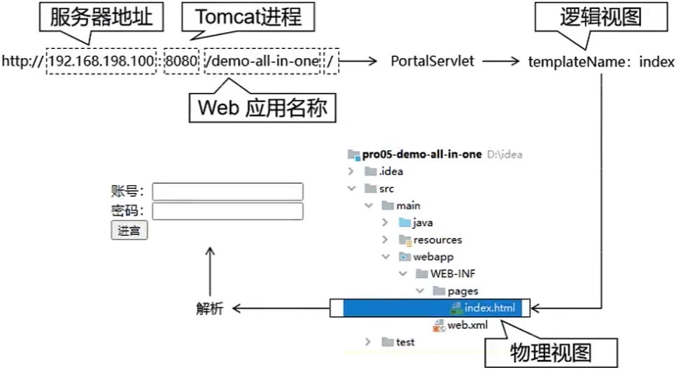

###### 6.1.2 创建并注册 PortalServlet

1.创建PortalServlet 类：

```java
package com.sin.imperial.court.servlet.module;
import com.sin.imperial.court.servlet.base.ViewBaseServlet;
import javax.servlet.ServletException;
import javax.servlet.http.HttpServletRequest;
import javax.servlet.http.HttpServletResponse;
import java.io.IOException;

public class PortalServlet extends ViewBaseServlet {

    @Override
    protected void doGet(HttpServletRequest req, HttpServletResponse resp) throws ServletException, IOException {
        doPost(req, resp);
    }


    @Override
    protected void doPost(HttpServletRequest req, HttpServletResponse resp) throws ServletException, IOException {
        // 声明要访问的首页的逻辑视图
        String templateName = "index";
        // 调用父类的方法根据逻辑视图名称渲染视图
        processTemplate(templateName, req, resp);

    }
}
```

2.注册PortalServlet 类：在`src/main/webapp/WEB-INF/web.xml`中注册PortalServlet 类

```xml
<!DOCTYPE web-app PUBLIC
        "-//Sun Microsystems, Inc.//DTD Web Application 2.3//EN"
        "http://java.sun.com/dtd/web-app_2_3.dtd" >


<web-app>
    <display-name>Archetype Created Web Application</display-name>


    <!-- 配置web 应用初始化参数指定视图前缀、后缀 -->
    <!--物理视图举例: webapp/WEB-INF/pages/index.html-->
    <!--对应逻辑视图:index-->
    <context-param>
        <param-name>view-prefix</param-name>
        <param-value>/WEB-INF/pages/</param-value>
    </context-param>
    <context-param>
        <param-name>view-suffix</param-name>
        <param-value>.html</param-value>
    </context-param>

    <filter>
        <filter-name>txFilter</filter-name>
        <filter-class>com.sin.imperial.court.filter.TransactionFilter</filter-class>
    </filter>

    <filter-mapping>
        <filter-name>txFilter</filter-name>
        <url-pattern>/*</url-pattern>
    </filter-mapping>

    <servlet>
        <servlet-name>portalServlet</servlet-name>
        <servlet-class>com.sin.imperial.court.servlet.module.PortalServlet</servlet-class>
    </servlet>
    <servlet-mapping>
        <servlet-name>portalServlet</servlet-name>
        <url-pattern>/</url-pattern>
    </servlet-mapping>


</web-app>
```

###### 6.1.3 编写登录表单

1.在 index.html 中编写登录表单：`src/main/webapp/WEB-INF/pages/index.html`

```html
<!DOCTYPE html>
<html lang="en" xml:th="http://www.thymeleaf.org">
<head>
    <meta charset="UTF-8">
    <title>乾清宫</title>
</head>
<body>
<!-- @{/auth} 解析后：/demo/auth -->
<form th:action="@{/auth}" method="post">
    <!-- 传递 method 请求参数，目的是为了让当前请求调用 AuthServlet 中的 login() 方法 -->
    <input type="hidden" name="method" value="login" />

    <!-- th:text 解析表达式后会替换标签体 -->
    <!-- ${attrName} 从请求域获取属性名为 attrName 的属性值 -->
    <p style="color: red; font-weight: bold;" th:text="${message}"></p>
    <p style="color: red; font-weight: bold;" th:text="${systemMessage}"></p>

    账号：<input type="text" name="loginAccount"/><br/>
    密码：<input type="password" name="loginPassword"><br/>
    <button type="submit">进宫</button>
</form>
</body>
</html>
```

2.idea中配置tomcat：

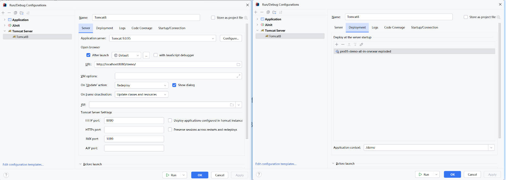

3.启动项目测试页面访问：

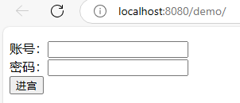


#### 6.2 登录操作

###### 6.2.1流程图

登录流程图：

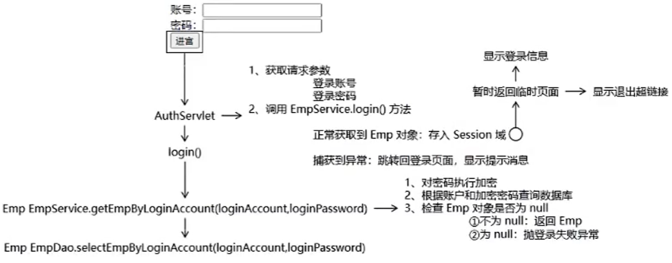

###### 6.2.2创建  EmpDao 和 Empservice

`EmpDao`：

```java
import com.sin.imperial.court.entity.Emp;

public interface EmpDao {
    Emp selectEmpByLoginAccount(String loginAccount, String encodedLoginPassword);
}
```

`EmpDaoImpl`：

```java
import com.sin.imperial.court.dao.BaseDao;
import com.sin.imperial.court.dao.api.EmpDao;
import com.sin.imperial.court.entity.Emp;

public class EmpDaoImpl extends BaseDao<Emp> implements EmpDao {

    @Override
    public Emp selectEmpByLoginAccount(String loginAccount, String encodedLoginPassword) {

        // 1.编写SQL语句
        String sql = "select emp_id empId," +
                "emp_name empName," +
                "emp_position empPosition," +
                "login_account loginAccount," +
                "login_password loginPassword " +
                "from t_emp where login_account = ? and login_password = ? ";

        // 2、调用父类方法查询单个对象
        return super.getSingleBean(sql, Emp.class, loginAccount, encodedLoginPassword);
    }

}
```

`EmpService`：

```java
package com.sin.imperial.court.service.api;
import com.sin.imperial.court.entity.Emp;
public interface EmpService {

    Emp getEmpByLoginAccount(String loginAccount, String loginPassword);
}
```

`EmpServiceImpl`：

```java
import com.sin.imperial.court.constant.ImperialCourtConst;
import com.sin.imperial.court.dao.api.EmpDao;
import com.sin.imperial.court.dao.impl.EmpDaoImpl;
import com.sin.imperial.court.entity.Emp;
import com.sin.imperial.court.exception.LoginFailedException;
import com.sin.imperial.court.service.api.EmpService;
import com.sin.imperial.court.util.MD5Util;
public class EmpServiceImpl implements EmpService {

    private final EmpDao empDao = new EmpDaoImpl();

    @Override
    public Emp getEmpByLoginAccount(String loginAccount, String loginPassword) {

        // 1、对密码执行加密
        String encodedLoginPassword = MD5Util.encode(loginPassword);

        // 2、根据账户和加密密码查询数据库
        Emp emp = empDao.selectEmpByLoginAccount(loginAccount, encodedLoginPassword);

        // 3、检査 Emp 对象是否为 null
        if (emp != null) {
            // 4.不为null
            return emp;
        } else {
            throw new LoginFailedException(ImperialCourtConst.LOGIN_FAILED_MESSAGE);
        }
    }
}
```

###### 6.2.3创建登录失败异常

创建登录失败异常`LoginFailedException`类：

```java
package com.sin.imperial.court.exception;

public class LoginFailedException extends RuntimeException {


    public LoginFailedException(String message) {
        super(message);
    }

    public LoginFailedException(Throwable cause) {
        super(cause);
    }

    public LoginFailedException() {
    }

    public LoginFailedException(String message, Throwable cause) {
        super(message, cause);
    }

    public LoginFailedException(String message, Throwable cause, boolean enableSuppression, boolean writableStackTrace) {
        super(message, cause, enableSuppression, writableStackTrace);
    }
}
```

###### 6.2.4创建并注册 AuthServlet

`AuthServlet`类：

```java
package com.sin.imperial.court.servlet.module;

import com.sin.imperial.court.constant.ImperialCourtConst;
import com.sin.imperial.court.entity.Emp;
import com.sin.imperial.court.exception.LoginFailedException;
import com.sin.imperial.court.service.api.EmpService;
import com.sin.imperial.court.service.impl.EmpServiceImpl;
import com.sin.imperial.court.servlet.base.ModelBaseServlet;

import javax.servlet.ServletException;
import javax.servlet.http.HttpServletRequest;
import javax.servlet.http.HttpServletResponse;
import javax.servlet.http.HttpSession;
import java.io.IOException;

public class AuthServlet extends ModelBaseServlet {

    private final EmpService empService = new EmpServiceImpl();

    protected void login(HttpServletRequest request, HttpServletResponse response) throws ServletException, IOException {
        try {
            // 1、获取请求参数
            String loginAccount = request.getParameter("loginAccount");
            String loginPassword = request.getParameter("loginPassword");


            // 2、调用 EmpService 方法执行登录逻辑  e.getEmpByLoginAccount()
            Emp emp = empService.getEmpByLoginAccount(loginAccount, loginPassword);

            // 3.通过request 获取HttpSession 对象
            HttpSession session = request.getSession();

            // 4.将查询到的 Emp 对象存入 session 域
            session.setAttribute(ImperialCourtConst.LOGIN_EMP_ATTR_NAME, emp);

            // 5.前往指定页面视图
            String templateName = "temp";
            processTemplate(templateName, request, response);
        } catch (Exception e) {
            e.printStackTrace();
            // 6.判断此处捕获到的异常是否是登录失败异常
            if (e instanceof LoginFailedException) {
                // 7.如果是登录失败异常则跳转回登录页面
                // 7.1 将异常信息存入请求域
                request.setAttribute("message", e.getMessage());
                // 7.2 处理视图：index
                processTemplate("index", request, response);
            } else {
                // 8.如果不是登录异常则封装为运行时异常继续抛出
                throw new ServletException(e);
            }
        }
    }

}
```

注册AuthServlet：`src/main/webapp/WEB-INF/web.xml`

```xml
<!DOCTYPE web-app PUBLIC
        "-//Sun Microsystems, Inc.//DTD Web Application 2.3//EN"
        "http://java.sun.com/dtd/web-app_2_3.dtd" >

<web-app>

    <servlet>
        <servlet-name>authServlet</servlet-name>
        <servlet-class>com.sin.imperial.court.servlet.module.AuthServlet</servlet-class>
    </servlet>
    <servlet-mapping>
        <servlet-name>authServlet</servlet-name>
        <url-pattern>/auth</url-pattern>
    </servlet-mapping>

</web-app>
```

3.登录测试：用户：xiaoxuanzi1654、密码：16540504

#### 6.3 退出登录

登录成功后的页面：`src/main/webapp/WEB-INF/pages/temp.html`

```xml
<!DOCTYPE html>
<html lang="en" xml:th="http://www.thymeleaf.org">
<head>
    <meta charset="UTF-8">
    <title>临时</title>
</head>
<body>

<p th:text="${session.loginInfo}"></p>
<a th:href="@{/auth?method=logout}">退朝</a>

</body>
</html>
```

`AuthServlet`：在 Authservlet 编写退出逻辑

```java
import com.sin.imperial.court.constant.ImperialCourtConst;
import com.sin.imperial.court.entity.Emp;
import com.sin.imperial.court.exception.LoginFailedException;
import com.sin.imperial.court.service.api.EmpService;
import com.sin.imperial.court.service.impl.EmpServiceImpl;
import com.sin.imperial.court.servlet.base.ModelBaseServlet;

import javax.servlet.ServletException;
import javax.servlet.http.HttpServletRequest;
import javax.servlet.http.HttpServletResponse;
import javax.servlet.http.HttpSession;
import java.io.IOException;

public class AuthServlet extends ModelBaseServlet {

    private final EmpService empService = new EmpServiceImpl();

    protected void login(HttpServletRequest request, HttpServletResponse response) throws ServletException, IOException {
        try {
            // 1、获取请求参数
            String loginAccount = request.getParameter("loginAccount");
            String loginPassword = request.getParameter("loginPassword");


            // 2、调用 EmpService 方法执行登录逻辑  e.getEmpByLoginAccount()
            Emp emp = empService.getEmpByLoginAccount(loginAccount, loginPassword);

            // 3.通过request 获取HttpSession 对象
            HttpSession session = request.getSession();

            // 4.将查询到的 Emp 对象存入 session 域
            session.setAttribute(ImperialCourtConst.LOGIN_EMP_ATTR_NAME, emp);

            // 5.前往指定页面视图
            String templateName = "temp";
            processTemplate(templateName, request, response);
        } catch (Exception e) {
            e.printStackTrace();
            // 6.判断此处捕获到的异常是否是登录失败异常
            if (e instanceof LoginFailedException) {
                // 7.如果是登录失败异常则跳转回登录页面
                // 7.1 将异常信息存入请求域
                request.setAttribute("message", e.getMessage());
                // 7.2 处理视图：index
                processTemplate("index", request, response);
            } else {
                // 8.如果不是登录异常则封装为运行时异常继续抛出
                throw new ServletException(e);
            }


        }

    }


    protected void logout(HttpServletRequest request, HttpServletResponse response) throws ServletException, IOException {

        // 1、通过request 对象获取 Httpsession 对象
        HttpSession session = request.getSession();


        // 2、将 Httpsession 对象强制失效
        session.invalidate();

        // 3、回到首页
        String templateName = "index";
        processTemplate(templateName, request, response);

    }
}
```

### 7 业务功能：显示奏折列表

##### 7.1 流程图

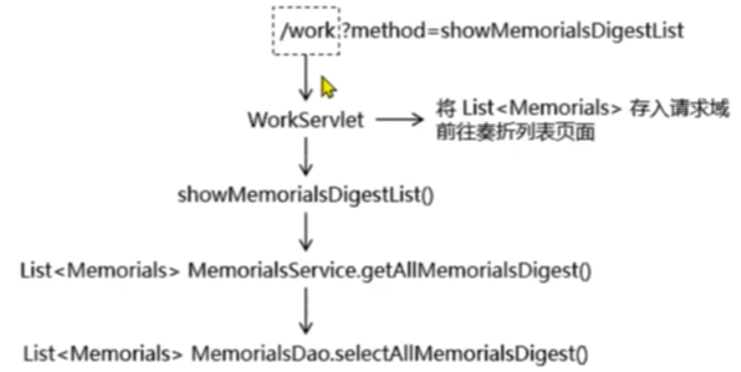

##### 7.2 创建并注册 WorkServlet组件

`WorkServlet`：

```java
package com.sin.imperial.court.servlet.module;
import com.sin.imperial.court.servlet.base.ModelBaseServlet;
public class WorkServlet extends ModelBaseServlet {
}
```

注册组件：`src/main/webapp/WEB-INF/web.xml`

```xml
<!DOCTYPE web-app PUBLIC
        "-//Sun Microsystems, Inc.//DTD Web Application 2.3//EN"
        "http://java.sun.com/dtd/web-app_2_3.dtd" >
<web-app>

    <servlet>
        <servlet-name>workServlet</servlet-name>
        <servlet-class>com.sin.imperial.court.servlet.module.WorkServlet</servlet-class>
    </servlet>
    <servlet-mapping>
        <servlet-name>workServlet</servlet-name>
        <url-pattern>/work</url-pattern>
    </servlet-mapping>

</web-app>
```

##### 7.3 创建 MemorialsDao 和 MemorialsService

`MemorialsDao`：

```java
import com.sin.imperial.court.entity.Memorials;
import java.util.List;
public interface MemorialsDao {

    List<Memorials> selectAllMemorialsDigest();
}
```

`MemorialsDaoImpl`：

```java
package com.sin.imperial.court.dao.impl;
import com.sin.imperial.court.dao.BaseDao;
import com.sin.imperial.court.dao.api.MemorialsDao;
import com.sin.imperial.court.entity.Memorials;
import java.util.List;

public class MemorialsDaoImpl extends BaseDao<Memorials> implements MemorialsDao {

    @Override
    public List<Memorials> selectAllMemorialsDigest() {

/*
        SELECT
                memorials_id as memorialsId,
                memorials_title as memorialsTitle,
                concat(LEFT(memorials_content, 10),"...") as memorialsContent,
                emp_name as empName,
                memorials_emp as memorialsEmp,
                memorials_create_time as memorialsCreateTime,
                feedback_time as feedbackTime,
                feedback_content as feedbackContent,
                memorials_status as memorialsStatus
        FROM
        t_memorials m left join t_emp e on m.memorials_emp = e.emp_id

         */
        String sql = "SELECT\n" +
                "                memorials_id as memorialsId,\n" +
                "                memorials_title as memorialsTitle,\n" +
                "                concat(LEFT(memorials_content, 10),\"...\") as memorialsContent,\n" +
                "                emp_name as empName,\n" +
                "                memorials_emp as memorialsEmp,\n" +
                "                memorials_create_time as memorialsCreateTime,\n" +
                "                feedback_time as feedbackTime,\n" +
                "                feedback_content as feedbackContent,\n" +
                "                memorials_status as memorialsStatus\n" +
                "        FROM\n" +
                "        t_memorials m left join t_emp e on m.memorials_emp = e.emp_id";
        return getBeanList(sql,Memorials.class);
    }

}
```

`MemorialsService`：

```java
import com.sin.imperial.court.entity.Memorials;
import java.util.List;
public interface MemorialsService {

    List<Memorials> getAllMemorialsDigest();

}
```

`MemorialsServiceImpl`：

```java
import com.sin.imperial.court.dao.api.MemorialsDao;
import com.sin.imperial.court.dao.impl.MemorialsDaoImpl;
import com.sin.imperial.court.entity.Memorials;
import com.sin.imperial.court.service.api.MemorialsService;
import java.util.List;
public class MemorialsServiceImpl implements MemorialsService {

    private final MemorialsDao memorialsDao = new MemorialsDaoImpl();

    @Override
    public List<Memorials> getAllMemorialsDigest() {
        return memorialsDao.selectAllMemorialsDigest();
    }
}
```

##### 7.4 WorkServlet 方法实现

`WorkServlet`：WorkServlet 方法实现

```java
package com.sin.imperial.court.servlet.module;
import com.sin.imperial.court.entity.Memorials;
import com.sin.imperial.court.service.api.MemorialsService;
import com.sin.imperial.court.service.impl.MemorialsServiceImpl;
import com.sin.imperial.court.servlet.base.ModelBaseServlet;
import javax.servlet.ServletException;
import javax.servlet.http.HttpServletRequest;
import javax.servlet.http.HttpServletResponse;
import java.io.IOException;
import java.util.List;

public class WorkServlet extends ModelBaseServlet {

    private final MemorialsService memorialsService = new MemorialsServiceImpl();


    protected void showMemorialsDigestList(HttpServletRequest request, HttpServletResponse response) throws ServletException, IOException {

        // 1、调用 Service 万法查询数据
        List<Memorials> memorialsList = memorialsService.getAllMemorialsDigest();

        // 2、将查询得到的数据存入请求域
        request.setAttribute("memorialsList", memorialsList);

        // 3.渲染视图
        String template = "memorials-list";
        processTemplate(template, request, response);


    }
}
```

##### 7.5 页面显示

`src/main/webapp/WEB-INF/pages/memorials-list.html`：

```html
<!DOCTYPE html>
<html lang="en" xml:th="http://www.thymeleaf.org">
<head>
    <meta charset="UTF-8">
    <title>Title</title>
    <style type="text/css">
        table {
            border-collapse: collapse;
            margin: 0px auto 0px auto;
        }

        table th, td {
            border: 1px solid black;
            text-align: center;
        }

        div {
            text-align: right;
        }
    </style>
</head>
<body>

        <!-- 登录信息部分 -->
        <div>
            <span th:if="${session.loginInfo.empPosition == 'emperor'}">恭请皇上圣安</span>
            <span th:if="${session.loginInfo.empPosition == 'minister'}">给<span th:text="${session.loginInfo.empName}">XXX</span>大人请安</span>
            <a th:href="@{/auth?method=logout}">退朝</a>
        </div>

        <!-- 数据显示部分 -->
        <table>
            <thead>
            <tr>
                <th>奏折标题</th>
                <th>内容摘要</th>
                <th>上疏大臣</th>
                <th>上疏时间</th>
                <th>奏折状态</th>
                <th>奏折详情</th>
            </tr>
            </thead>
            <tbody th:if="${#lists.isEmpty(memorialsList)}">
            <tr>
                <td colspan="6">没有人上过折子</td>
            </tr>
            </tbody>
            <tbody th:if="${not #lists.isEmpty(memorialsList)}">
            <tr th:each="memorials : ${memorialsList}">
                <td th:switch="${memorials.memorialsStatus}">
                    <span th:text="${memorials.memorialsTitle}" th:case="0" style="color: red;">奏折标题</span>
                    <span th:text="${memorials.memorialsTitle}" th:case="1" style="color: blue;">奏折标题</span>
                    <span th:text="${memorials.memorialsTitle}" th:case="2">奏折标题</span>
                </td>
                <td th:switch="${memorials.memorialsStatus}">
                    <span th:text="${memorials.memorialsContentDigest}" th:case="0" style="color: red;">内容摘要</span>
                    <span th:text="${memorials.memorialsContentDigest}" th:case="1" style="color: blue;">内容摘要</span>
                    <span th:text="${memorials.memorialsContentDigest}" th:case="2">内容摘要</span>
                </td>
                <td th:switch="${memorials.memorialsStatus}">
                    <span th:text="${memorials.memorialsEmpName}" th:case="0" style="color: red;">上疏大臣</span>
                    <span th:text="${memorials.memorialsEmpName}" th:case="1" style="color: blue;">上疏大臣</span>
                    <span th:text="${memorials.memorialsEmpName}" th:case="2">上疏大臣</span>
                </td>
                <td th:switch="${memorials.memorialsStatus}">
                    <span th:text="${memorials.memorialsCreateTime}" th:case="0" style="color: red;">上疏时间</span>
                    <span th:text="${memorials.memorialsCreateTime}" th:case="1" style="color: blue;">上疏时间</span>
                    <span th:text="${memorials.memorialsCreateTime}" th:case="2">上疏时间</span>
                </td>
                <td th:switch="${memorials.memorialsStatus}">
                    <span th:case="0" style="color: red;">未读</span>
                    <span th:case="1" style="color: blue;">已读</span>
                    <span th:case="2">已批示</span>
                </td>

                <td>
                    <a th:href="@{/work?method=detail}">奏折详情</a>
                </td>
            </tr>
            </tbody>
        </table>
</body>
</html>
```

##### 7.6 登录跳转

`AuthServlet`：

```java
package com.sin.imperial.court.servlet.module;

import com.sin.imperial.court.constant.ImperialCourtConst;
import com.sin.imperial.court.entity.Emp;
import com.sin.imperial.court.exception.LoginFailedException;
import com.sin.imperial.court.service.api.EmpService;
import com.sin.imperial.court.service.impl.EmpServiceImpl;
import com.sin.imperial.court.servlet.base.ModelBaseServlet;

import javax.servlet.ServletException;
import javax.servlet.http.HttpServletRequest;
import javax.servlet.http.HttpServletResponse;
import javax.servlet.http.HttpSession;
import java.io.IOException;

public class AuthServlet extends ModelBaseServlet {

    private final EmpService empService = new EmpServiceImpl();

    protected void login(HttpServletRequest request, HttpServletResponse response) throws ServletException, IOException {
        try {
            // 1、获取请求参数
            String loginAccount = request.getParameter("loginAccount");
            String loginPassword = request.getParameter("loginPassword");


            // 2、调用 EmpService 方法执行登录逻辑  e.getEmpByLoginAccount()
            Emp emp = empService.getEmpByLoginAccount(loginAccount, loginPassword);

            // 3.通过request 获取HttpSession 对象
            HttpSession session = request.getSession();

            // 4.将查询到的 Emp 对象存入 session 域
            session.setAttribute(ImperialCourtConst.LOGIN_EMP_ATTR_NAME, emp);

            // 5.前往指定页面视图

//            // 前往临时页面
//            String templateName = "memorials-list";
//            processTemplate(templateName, request, response);

            // 前往正式的目标地址
            String templateName = "memorials-list";
            response.sendRedirect(request.getContextPath() + "/work?method=showMemorialsDigestList");
        } catch (Exception e) {
            e.printStackTrace();
            // 6.判断此处捕获到的异常是否是登录失败异常
            if (e instanceof LoginFailedException) {
                // 7.如果是登录失败异常则跳转回登录页面
                // 7.1 将异常信息存入请求域
                request.setAttribute("message", e.getMessage());
                // 7.2 处理视图：index
                processTemplate("index", request, response);
            } else {
                // 8.如果不是登录异常则封装为运行时异常继续抛出
                throw new ServletException(e);
            }
        }
    }
}
```

##### 7.7 测试

登陆后显示如下数据列表：

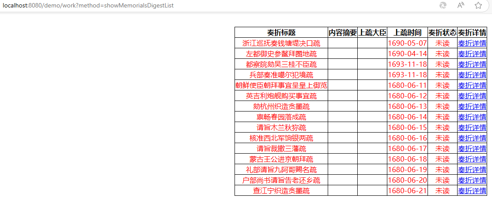

### 8. 业务功能：显示奏折详情

#####  8.1 流程图

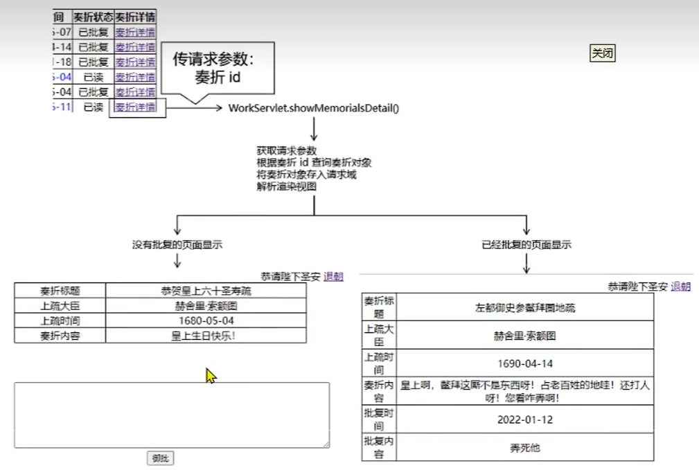

##### 8.2 调整奏折列表页面的超链接

```html
<td>
    <!--                    <a th:href="@{/work?method=detail}">奏折详情</a>-->
    <a th:href="@{/work(method='showMemorialsDetail',memorialsId=${memorials.memorialsId})}">奏折详情</a>
</td>
```


##### 8.3 创建 MemorialsDao 和 MemorialsService

`MemorialsDao`：

```java
import com.sin.imperial.court.entity.Memorials;
import java.util.List;
public interface MemorialsDao {

    Memorials selectMemorialsById(String memorialsId);

    void updateMemorialsStatusToRead(String memorialsId);
}
```

`MemorialsDaoImpl`：

```java
import com.sin.imperial.court.dao.BaseDao;
import com.sin.imperial.court.dao.api.MemorialsDao;
import com.sin.imperial.court.entity.Memorials;
import java.util.List;

public class MemorialsDaoImpl extends BaseDao<Memorials> implements MemorialsDao {

    @Override
    public List<Memorials> selectAllMemorialsDigest() {

    @Override
    public Memorials selectMemorialsById(String memorialsId) {
        String sql = "select memorials_id memorialsId,\n" +
                "       memorials_title memorialsTitle,\n" +
                "       memorials_content memorialsContent,\n" +
                "       emp_name memorialsEmpName,\n" +
                "       memorials_create_time memorialsCreateTime,\n" +
                "       memorials_status memorialsStatus,\n" +
                "       feedback_time feedbackTime,\n" +
                "       feedback_content feedbackContent\n" +
                "from t_memorials m left join  t_emp e on m.memorials_emp=e.emp_id " +
                "where memorials_id=?;";
        return getSingleBean(sql, Memorials.class, memorialsId);
    }


    @Override
    public void updateMemorialsStatusToRead(String memorialsId) {
        String sql = "update t_memorials set memorials_status=1 where memorials_id=?";
        update(sql, memorialsId);
    }

}
```

`MemorialsService`：

```java
public interface MemorialsService {
    Memorials getMemorialsDetailById(String memorialsId);

    void updateMemorialsStatusToRead(String memorialsId);
}
```

`MemorialsServiceImpl`：

```java
public class MemorialsServiceImpl implements MemorialsService {

    private final MemorialsDao memorialsDao = new MemorialsDaoImpl();

    @Override
    public Memorials getMemorialsDetailById(String memorialsId) {
        return memorialsDao.selectMemorialsById(memorialsId);
    }


    @Override
    public void updateMemorialsStatusToRead(String memorialsId) {
        memorialsDao.updateMemorialsStatusToRead(memorialsId);
    }
}
```

##### 8.4 创建WorkServlet 方法

`WorkServlet`：显示详情。一份未读奏折，点击查看后，需要从未读变成已读

```java
package com.sin.imperial.court.servlet.module;
import com.sin.imperial.court.entity.Memorials;
import com.sin.imperial.court.service.api.MemorialsService;
import com.sin.imperial.court.service.impl.MemorialsServiceImpl;
import com.sin.imperial.court.servlet.base.ModelBaseServlet;
import javax.servlet.ServletException;
import javax.servlet.http.HttpServletRequest;
import javax.servlet.http.HttpServletResponse;
import java.io.IOException;
import java.util.List;

public class WorkServlet extends ModelBaseServlet {

    private final MemorialsService memorialsService = new MemorialsServiceImpl();

    protected void showMemorialsDetail(HttpServletRequest request, HttpServletResponse response) throws ServletException, IOException {
        // 1、从请求参数读取 memorialsId
        String memorialsId = request.getParameter("memorialsId");

        // 2、根据 memorialsId 从 Service 中查询 Memorials 对象
        Memorials memorials = memorialsService.getMemorialsDetailById(memorialsId);


        // **********************补充功能**********************
        // 获取当前奏折对象的状态
        Integer memorialsStatus = memorials.getMemorialsStatus();

        // 判断奏折状态
        if (memorialsStatus == 0) {
            // 更新奏折状态：数据库修改
            memorialsService.updateMemorialsStatusToRead(memorialsId);

            // 更新奏折状态：当前对象修改
            memorials.setMemorialsStatus(1);
        }
        // **********************补充功能**********************


        // 3、将 Memorials 对象存入请求域
        request.setAttribute("memorials", memorials);

        // 4、解析渲染视图
        String templateName = "memorials_detail";
        processTemplate(templateName, request, response);
    }
}
```

##### 8.5 详情页

```html
<!DOCTYPE html>
<html lang="en" xml:th="http://www.thymeleaf.org">
<head>
    <meta charset="UTF-8">
    <title>奏折详情</title>
    <style type="text/css">
        table {
            border-collapse: collapse;
            margin: 0px auto 0px auto;
            width: 70%;
        }

        table th, td {
            border: 1px solid black;
            text-align: center;
        }

        div {
            text-align: right;
        }
    </style>
</head>
<body>

<!-- 登录信息部分 -->
<div>
    <span th:if="${session.loginInfo.empPosition == 'emperor'}">恭请皇上圣安</span>
    <span th:if="${session.loginInfo.empPosition == 'minister'}">给<span th:text="${session.loginInfo.empName}">XXX</span>大人请安</span>
    <a th:href="@{/auth?method=logout}">退朝</a>
</div>

<table>
    <tr>
        <td>奏折标题</td>
        <td th:text="${memorials.memorialsTitle}"></td>
    </tr>
    <tr>
        <td>上疏大臣</td>
        <td th:text="${memorials.memorialsEmpName}"></td>
    </tr>
    <tr>
        <td>上疏时间</td>
        <td th:text="${memorials.memorialsCreateTime}"></td>
    </tr>
    <tr>
        <td>奏折内容</td>
        <td th:text="${memorials.memorialsContent}"></td>
    </tr>
    <tr th:if="${memorials.memorialsStatus == 2}">
        <td>批复时间</td>
        <td th:text="${memorials.feedbackTime}"></td>
    </tr>
    <tr th:if="${memorials.memorialsStatus == 2}">
        <td>批复内容</td>
        <td th:text="${memorials.feedbackContent}"></td>
    </tr>
</table>

<div style="margin: 0 auto 0 auto;width: 60%;" th:if="${memorials.memorialsStatus != 2}">
    <form th:action="@{/work}" method="post">

        <input type="hidden" name="method" value="feedBack" />
        <input type="hidden" name="memorialsId" th:value="${memorials.memorialsId}"/>

        <textarea name="feedbackContent" style="width: 500px;height: 200px"></textarea>

        <button type="submit">御批</button>

    </form>
</div>

<a th:href="@{/work?method=showMemorialsDigestList}">返回列表</a>

</body>
</html>
```

### 9 业务功能：批复奏折

实现：提交表单，更新数据

##### 9.1 实现 MemorialsDao 和 MemorialsService 

`MemorialsDao`：

```java
import com.sin.imperial.court.entity.Memorials;
import java.util.List;
public interface MemorialsDao {

    void updateMemorialsFeedBack(String memorialsId, String feedbackContent);
}
```

`MemorialsDaoImpl`：

```java
import com.sin.imperial.court.dao.BaseDao;
import com.sin.imperial.court.dao.api.MemorialsDao;
import com.sin.imperial.court.entity.Memorials;
import java.text.SimpleDateFormat;
import java.util.Date;
import java.util.List;

public class MemorialsDaoImpl extends BaseDao<Memorials> implements MemorialsDao {

    @Override
    public void updateMemorialsFeedBack(String memorialsId, String feedbackContent) {
        String feedbackTime = new SimpleDateFormat("yyyy-MM-dd").format(new Date());
        String sql = "update t_memorials set memorials_status=2,feedback_content=?,feedback_time=? where memorials_id=?";
        update(sql, feedbackContent, feedbackTime, memorialsId);
    }

}
```

`MemorialsService`：

```java
public interface MemorialsService {

    void updateMemorialsFeedBack(String memorialsId, String feedbackContent);
}
```

`MemorialsServiceImpl`：

```java
import com.sin.imperial.court.dao.api.MemorialsDao;
import com.sin.imperial.court.dao.impl.MemorialsDaoImpl;
import com.sin.imperial.court.entity.Memorials;
import com.sin.imperial.court.service.api.MemorialsService;
import java.util.List;
public class MemorialsServiceImpl implements MemorialsService {

    private final MemorialsDao memorialsDao = new MemorialsDaoImpl();

    @Override
    public void updateMemorialsFeedBack(String memorialsId, String feedbackContent) {
        memorialsDao.updateMemorialsFeedBack(memorialsId, feedbackContent);
    }
}
```

##### 9.2 WorkServlet 方法

`WorkServlet`：

```java
import com.sin.imperial.court.entity.Memorials;
import com.sin.imperial.court.service.api.MemorialsService;
import com.sin.imperial.court.service.impl.MemorialsServiceImpl;
import com.sin.imperial.court.servlet.base.ModelBaseServlet;
import javax.servlet.ServletException;
import javax.servlet.http.HttpServletRequest;
import javax.servlet.http.HttpServletResponse;
import java.io.IOException;
import java.util.List;
public class WorkServlet extends ModelBaseServlet {

    private final MemorialsService memorialsService = new MemorialsServiceImpl();

    protected void feedBack(HttpServletRequest request, HttpServletResponse response) throws ServletException, IOException {
        // 获取表单提交的请求参数
        String memorialsId = request.getParameter("memorialsId");
        String feedbackContent = request.getParameter("feedbackContent");
        // 执行更新
        memorialsService.updateMemorialsFeedBack(memorialsId, feedbackContent);
        // 重定向回显示奏折列表页面
        response.sendRedirect(request.getContextPath() + "/work?method=showMemorialsDigestList");
    }
}
```

### 10. 业务功能：登录检查

 1.流程图：

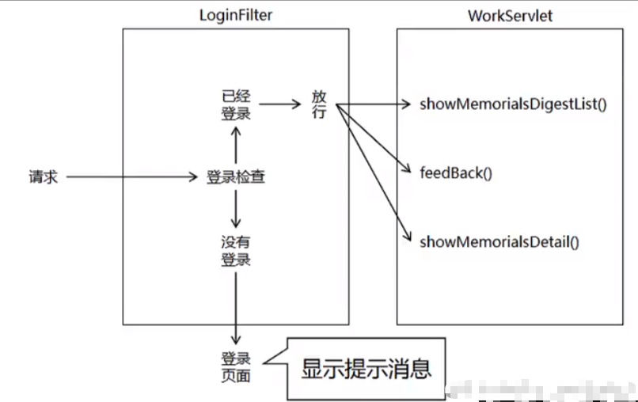


2.`LoginFilter`：`LoginFilter`过滤器，登录检查实现

```java
import com.sin.imperial.court.constant.ImperialCourtConst;
import javax.servlet.*;
import javax.servlet.http.HttpServletRequest;
import javax.servlet.http.HttpSession;
import java.io.IOException;

public class LoginFilter implements Filter {
    @Override
    public void init(FilterConfig filterConfig) throws ServletException {
    }

    @Override
    public void doFilter(ServletRequest servletRequest, ServletResponse servletResponse, FilterChain filterChain) throws IOException, ServletException {
        // 1、获取 HttpSession 对象
        HttpServletRequest request = (HttpServletRequest) servletRequest;
        HttpSession session = request.getSession();
        // 2、尝试从 Session 域获取已登录的对象
        Object loginEmp = session.getAttribute(ImperialCourtConst.LOGIN_EMP_ATTR_NAME);
        // 3、判断 loginEmp 是否为空
        if (loginEmp != null) {
            // 4、若不为空则说明当前请求已登录，直接放行
            filterChain.doFilter(request, servletResponse);
            return;
        }
        // 5、若为空说明尚未登录，则回到登录页面
        request.setAttribute("systemMessage", ImperialCourtConst.ACCESS_DENIED_MESSAGE);
        request.getRequestDispatcher("/").forward(request, servletResponse);
    }

    @Override
    public void destroy() {
    }
}
```

3.`src/main/webapp/WEB-INF/web.xml`：注册loginFilter。把 LoginFilter 放在 Transactionfilter 前面声明，原因是：如果登录检查失败不放行，直接跳转到页面，此时将不必执行 TransactionFilter 中的事务操作。可以节约性能

```xml
<web-app>
    
    <!--登录的filter 先于 事务的filter 先执行 更加合理-->
    <filter>
        <filter-name>loginFilter</filter-name>
        <filter-class>com.sin.imperial.court.filter.LoginFilter</filter-class>
    </filter>
    <filter-mapping>
        <filter-name>loginFilter</filter-name>
        <url-pattern>/work</url-pattern>
    </filter-mapping>

    <filter>
        <filter-name>txFilter</filter-name>
        <filter-class>com.sin.imperial.court.filter.TransactionFilter</filter-class>
    </filter>

    <filter-mapping>
        <filter-name>txFilter</filter-name>
        <url-pattern>/*</url-pattern>
    </filter-mapping>

</web-app>
```

4.测试：没有登录的情况下，直接在浏览器访问如下链接后会被拦截

```
http://localhost:8080/demo/work?method=showMemorialsDigestList
http://localhost:8080/demo/work?method=showMemorialsDetail&memorialsId=11
```

### 11. 打包部署

1.适配部署环境：MySQL连接信息中，IP 地址部分需要改成对应的Mysql服务器

2.指定最终 **war** 包名称：

```xml
<project xmlns="http://maven.apache.org/POM/4.0.0" xmlns:xsi="http://www.w3.org/2001/XMLSchema-instance"
  xsi:schemaLocation="http://maven.apache.org/POM/4.0.0 http://maven.apache.org/maven-v4_0_0.xsd">
  <modelVersion>4.0.0</modelVersion>
  <groupId>com.sin.maven</groupId>
  <artifactId>pro05-demo-all-in-one</artifactId>
  <packaging>war</packaging>
  <version>1.0-SNAPSHOT</version>
  <name>pro05-demo-all-in-one Maven Webapp</name>
  <url>http://maven.apache.org</url>

  <dependencies>
      <!--省略-->
  </dependencies>


<!--  <build>-->
<!--    <finalName>pro05-demo-all-in-one</finalName>-->
<!--  </build>-->

    <!-- 对构建过程进行自己的定制 -->
    <build>
        <!-- 当前工程在构建过程中使用的最终名称 -->
        <finalName>demo-me</finalName>
    </build>

</project>
```

3.跳过测试打包：运行如下命令生成打包文件`demo-me`

```sh
mvn clean package -Dmaven.test.skip=true
```

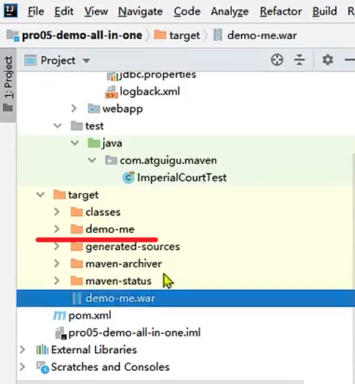

5.上传 war 包`demo-me`：上传到tomcat的`webapps`目录下

6.启动 Tomcat

```sh
# 命令：启动 Tomcat
/opt/apache-tomcat-8.5.75/bin/startup.sh
```

7.访问测试

